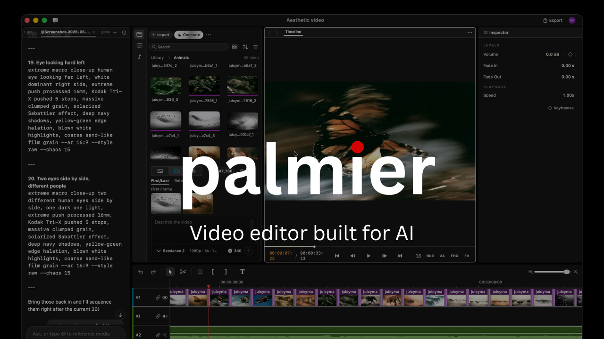
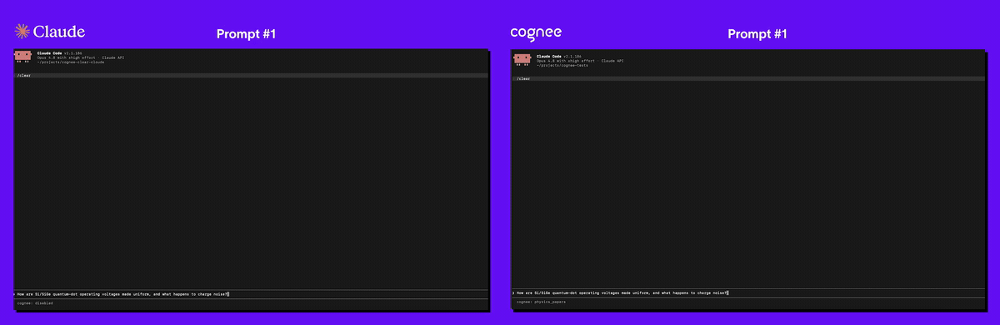
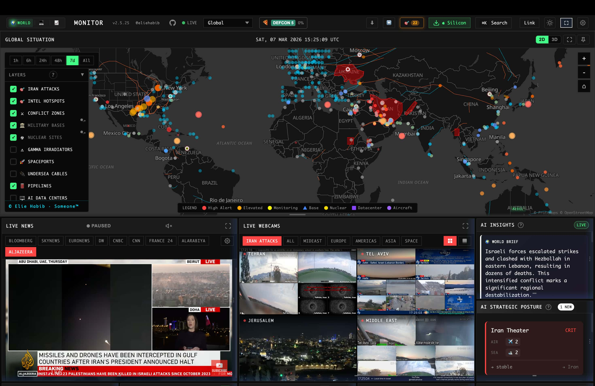
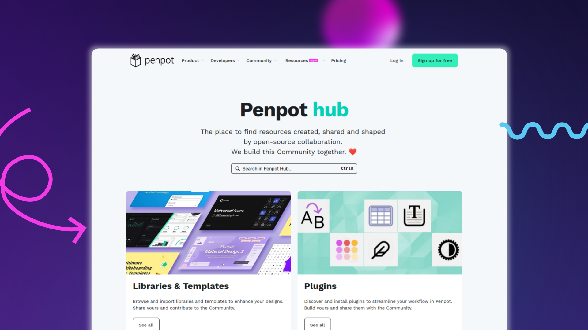
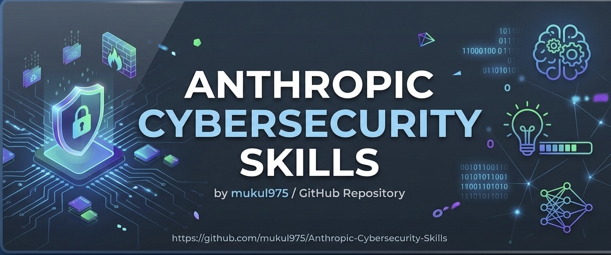

# GitHub 一周热点 · 第 2 期

> 📅 2026-06-29 ｜ 数据来源：GitHub Trending（本周）

## AI / 大模型

### [calesthio/OpenMontage](https://github.com/calesthio/OpenMontage)

- ⭐ 总 star 28,596
- 🔥 本周 star 17,483 stars this week
- 💻 Python
- 🔗 官网：https://github.com/calesthio/OpenMontage

首个开源的、基于代理的视频制作系统，包含 12 个流水线、52 个工具和超过 500 个代理技能。它能将你的 AI 编程助手转变为一个完整的视频制作工作室，从脚本、素材生成到最终合成，完成端到端视频制作。

`#视频生成` `#代理` `#开源` `#媒体创作` `#AI 工具`

### [interviewstreet/hiring-agent](https://github.com/interviewstreet/hiring-agent)

- ⭐ 总 star 3,791
- 🔥 本周 star 2,233 stars this week
- 💻 Python

一个 AI 代理，用于从简历 PDF 中提取结构化数据，通过 GitHub 个人资料和仓库信息进行丰富，并最终生成客观、可解释的评估分数。支持使用 Ollama 本地模型或 Google Gemini 运行。

`#招聘` `#AI 代理` `#简历解析` `#评分系统`

### [ZhuLinsen/daily_stock_analysis](https://github.com/ZhuLinsen/daily_stock_analysis)

- ⭐ 总 star 51,834
- 🔥 本周 star 6,297 stars this week
- 💻 Python
- 🔗 官网：https://dsa.zhulinsen.tech

由 LLM 驱动的多市场股票智能分析系统，聚合多源行情、实时新闻，生成决策仪表盘并支持自动推送到多个通讯平台。支持 A 股、港股、美股、日股、韩股，提供零成本 GitHub Actions 定时运行方案。

`#股票分析` `#LLM` `#AI Agent` `#金融` `#量化`

### [palmier-io/palmier-pro](https://github.com/palmier-io/palmier-pro)

- ⭐ 总 star 9,544
- 🔥 本周 star 2,797 stars this week
- 💻 Swift
- 🔗 官网：https://palmier.io

为 AI 构建的 macOS 视频编辑器，内置 Seedance、Kling 等生成式 AI 模型，并可通过 MCP 服务器与 Claude、Codex、Cursor 等 AI 代理连接，实现人机协作的视频编辑。

`#视频编辑器` `#macOS` `#MCP` `#生成式 AI` `#Swift`

### [jamiepine/voicebox](https://github.com/jamiepine/voicebox)

- ⭐ 总 star 35,921
- 🔥 本周 star 3,884 stars this week
- 💻 TypeScript
- 🔗 官网：https://voicebox.sh

开源的 AI 语音工作室，提供语音克隆、语音生成、全局听写等功能，支持本地运行。内置 7 个 TTS 引擎和多个语音特效，并通过 MCP 服务器让 AI 代理也能发声。

`#语音合成` `#语音克隆` `#AI` `#本地优先` `#Tauri`

## 开发工具

### [DeusData/codebase-memory-mcp](https://github.com/DeusData/codebase-memory-mcp)

- ⭐ 总 star 21,477
- 🔥 本周 star 9,899 stars this week
- 💻 C
- 🔗 官网：https://deusdata.github.io/codebase-memory-mcp/

高性能的代码智能 MCP 服务器，利用 tree-sitter 和 Hybrid LSP 将代码库索引为持久化的知识图谱。平均仓库索引仅需毫秒，支持 158 种语言，亚毫秒级查询，能大幅减少 AI 代理的 token 消耗。

`#MCP` `#代码分析` `#知识图谱` `#高性能` `#开发者工具`

### [google-labs-code/design.md](https://github.com/google-labs-code/design.md)

- ⭐ 总 star 23,200
- 🔥 本周 star 7,104 stars this week
- 💻 TypeScript
- 🔗 官网：https://stitch.withgoogle.com/docs/design-md/specification

谷歌推出的、用于向编码代理描述视觉身份的格式规范。它通过 YAML 前言中的机器可读设计令牌和 Markdown 中的人类可读设计说明，让代理对设计系统有持久、结构化的理解。

`#设计系统` `#规范` `#设计令牌` `#AI 代理`

### [kunchenguid/no-mistakes](https://github.com/kunchenguid/no-mistakes)

- ⭐ 总 star 4,338
- 🔥 本周 star 2,677 stars this week
- 💻 Go
- 🔗 官网：https://kunchenguid.github.io/no-mistakes/

一个 git push 代理，在将你的代码推送到远程仓库前，会启动一个临时工作树，运行由 AI 驱动的验证流水线，确保所有检查通过后才创建 PR。支持与 Claude、Codex、Copilot 等多种代理集成。

`#Git` `#代码质量` `#代理` `#自动化` `#CI/CD`

### [JCodesMore/ai-website-cloner-template](https://github.com/JCodesMore/ai-website-cloner-template)

- ⭐ 总 star 23,498
- 🔥 本周 star 5,937 stars this week
- 💻 TypeScript
- 🔗 官网：https://dsc.gg/jcodesmore

一个可复用的模板，利用 AI 编程代理（推荐 Claude Code）将任意网站反向工程为现代化的 Next.js 代码库。代理会分析目标网站，提取设计令牌和资产，并行构建组件，最终组装成一个可运行的应用。

`#网站克隆` `#AI 代理` `#Next.js` `#前端开发` `#反向工程`

### [stablyai/orca](https://github.com/stablyai/orca)

- ⭐ 总 star 9,112
- 🔥 本周 star 3,047 stars this week
- 💻 TypeScript
- 🔗 官网：https://onOrca.dev

为「百倍建设者」设计的 AI 协调器（ADE）。支持并行运行 Codex、Claude Code、OpenCode 等多个编码代理，每个代理在独立的 git 工作树中操作，并提供统一的桌面和移动端管理界面。

`#代理 IDE` `#并行开发` `#Git 工作树` `#桌面应用` `#Y Combinator`

### [Panniantong/Agent-Reach](https://github.com/Panniantong/Agent-Reach)

- ⭐ 总 star 45,795
- 🔥 本周 star 7,928 stars this week
- 💻 Python

为 AI 代理提供互联网访问能力的工具层。它负责选择、安装、配置和路由最稳定的接入方式，让代理能免费读取 Twitter、Reddit、YouTube、Bilibili、小红书等多个平台的内容，无需繁琐的 API 配置。

`#AI Agent` `#网络爬虫` `#多平台` `#CLI` `#免费 API`

### [BuilderIO/agent-native](https://github.com/BuilderIO/agent-native)

- ⭐ 总 star 3,091
- 🔥 本周 star 1,679 stars this week
- 💻 TypeScript
- 🔗 官网：https://agent-native.com

一个用于构建「AI 原生」应用的框架。它提供共享操作、SQL 支持的状态、身份、工具、技能等原语，使得 UI 和 AI 代理可以共享数据库和状态，实现真正的协作。提供多个完整的模板应用。

`#AI 原生` `#框架` `#React` `#Agent` `#应用开发`

### [aws/agent-toolkit-for-aws](https://github.com/aws/agent-toolkit-for-aws)

- ⭐ 总 star 1,606
- 🔥 本周 star 648 stars this week
- 💻 Python

AWS 官方支持的 AI 编码代理工具包，提供 MCP 服务器、技能和插件，帮助 AI 代理在 AWS 上构建、部署和管理应用。支持 Claude Code、Codex、Cursor 等平台，覆盖云服务选择、CDK、无服务器、数据分析等场景。

`#AWS` `#MCP` `#云服务` `#开发者工具` `#插件`

## Web / 前端

### [alibaba/page-agent](https://github.com/alibaba/page-agent)

- ⭐ 总 star 20,619
- 🔥 本周 star 1,858 stars this week
- 💻 TypeScript
- 🔗 官网：https://alibaba.github.io/page-agent/

一个运行在网页内的 JavaScript GUI 代理，允许用户通过自然语言控制 Web 界面。无需浏览器扩展或 Python，只需在页面中集成脚本，即可实现智能表单填写、无障碍访问等功能。

`#浏览器自动化` `#GUI 代理` `#自然语言` `#JavaScript` `#阿里巴巴`

## 基础设施 / 平台

### [simplex-chat/simplex-chat](https://github.com/simplex-chat/simplex-chat)

- ⭐ 总 star 16,602
- 🔥 本周 star 4,847 stars this week
- 💻 Haskell
- 🔗 官网：https://simplex.chat

首个不依赖任何用户标识符的即时通讯网络，旨在提供 100% 的隐私保护。它使用一次性邀请链接建立连接，所有用户数据仅存储在客户端设备上，服务器不存储任何用户记录或消息。

`#隐私` `#加密通讯` `#端到端加密` `#安全` `#协议`

### [topoteretes/cognee](https://github.com/topoteretes/cognee)

- ⭐ 总 star 25,672
- 🔥 本周 star 6,335 stars this week
- 💻 Python
- 🔗 官网：https://www.cognee.ai

一个开源的 AI 记忆平台，为 AI 代理提供跨会话的持久化长期记忆。它能摄取任何格式的数据，构建一个自托管的知识图谱，并让代理能够回忆、连接和行动，拥有完整的上下文。

`#AI 记忆` `#知识图谱` `#Agent` `#开源` `#上下文管理`

### [NanmiCoder/MediaCrawler](https://github.com/NanmiCoder/MediaCrawler)

- ⭐ 总 star 54,269
- 🔥 本周 star 2,642 stars this week
- 💻 Python
- 🔗 官网：https://nanmicoder.github.io/MediaCrawler/

一个功能强大的多平台自媒体数据采集工具，支持小红书、抖音、快手、B站、微博、贴吧、知乎等主流平台的公开信息抓取。基于 Playwright 浏览器自动化，无需 JS 逆向。

`#爬虫` `#数据采集` `#自媒体` `#Playwright` `#多平台`

### [Stirling-Tools/Stirling-PDF](https://github.com/Stirling-Tools/Stirling-PDF)

- ⭐ 总 star 85,211
- 🔥 本周 star 2,717 stars this week
- 💻 Java
- 🔗 官网：https://stirling.com

GitHub 上排名第一的 PDF 应用程序，提供超过 50 种 PDF 工具，可在任何设备上编辑、合并、分割、签名、转换 PDF。支持作为桌面应用、浏览器 UI 或自托管服务器运行，提供 REST API。

`#PDF` `#编辑器` `#开源` `#自托管` `#Java`

### [koala73/worldmonitor](https://github.com/koala73/worldmonitor)

- ⭐ 总 star 60,929
- 🔥 本周 star 2,397 stars this week
- 💻 TypeScript
- 🔗 官网：https://worldmonitor.app

一个实时全球情报仪表板，提供 AI 驱动的新闻聚合、地缘政治监控和基础设施跟踪。包含 500 多个精选新闻源、双地图引擎、国家不稳定指数、金融雷达等功能，可本地运行。

`#情报` `#仪表板` `#地缘政治` `#新闻聚合` `#AI`

### [penpot/penpot](https://github.com/penpot/penpot)

- ⭐ 总 star 54,593
- 🔥 本周 star 1,950 stars this week
- 💻 Clojure
- 🔗 官网：https://penpot.app

一个开源的设计与代码协作平台。它完全基于开放标准（SVG、CSS、HTML），支持自托管和实时协作，并提供强大的设计令牌、MCP 服务器和插件系统，连接设计与开发工作流。

`#设计工具` `#开源` `#协作` `#设计系统` `#MCP`

## 安全 / 加密

### [mukul975/Anthropic-Cybersecurity-Skills](https://github.com/mukul975/Anthropic-Cybersecurity-Skills)

- ⭐ 总 star 23,094
- 🔥 本周 star 4,735 stars this week
- 💻 Python
- 🔗 官网：https://mahipal.engineer/Anthropic-Cybersecurity-Skills/

为 AI 代理构建的、最大的开源网络安全技能库。包含 817 个结构化技能，映射到 MITRE ATT&CK、NIST CSF 2.0 等 6 大安全框架，覆盖 29 个安全领域，可直接用于 Claude Code 等 26+ 个平台。

`#网络安全` `#AI Agent` `#MITRE ATT&CK` `#技能库` `#安全框架`
