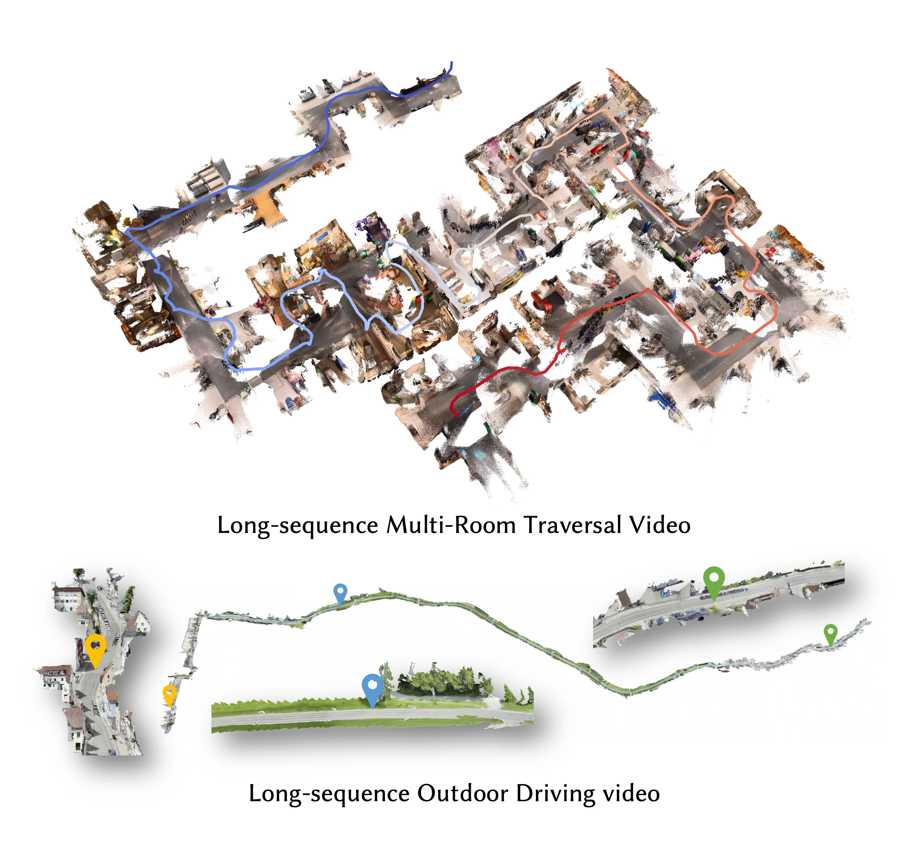
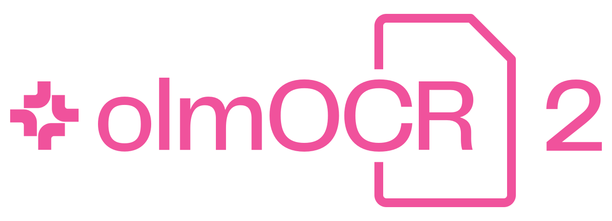
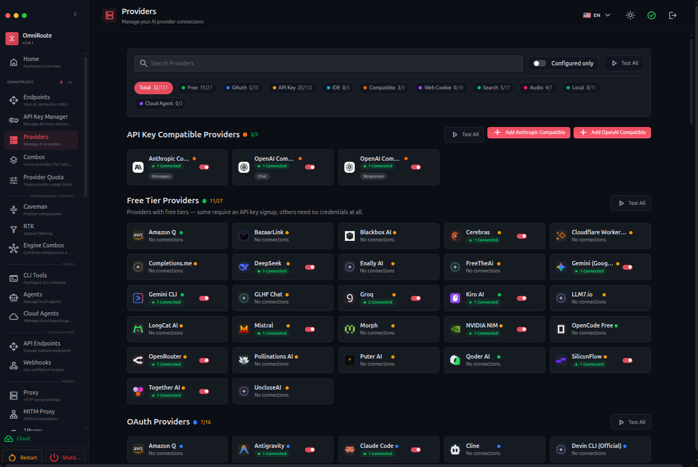
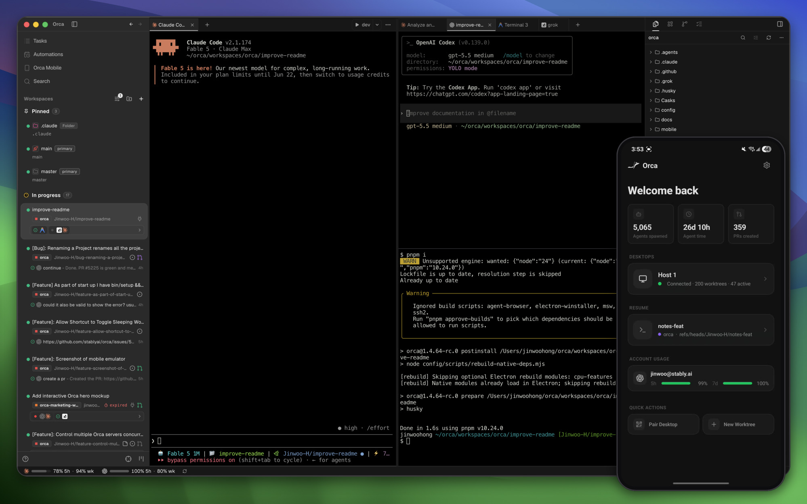
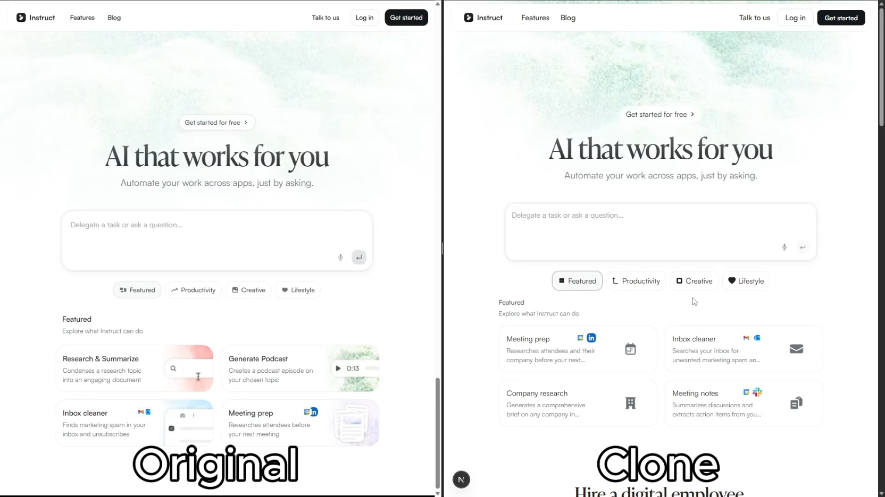
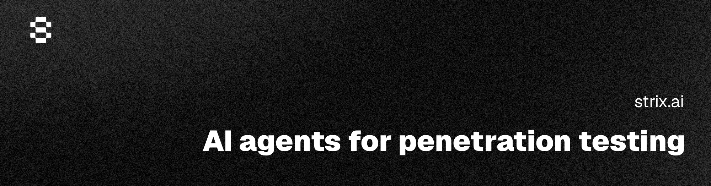
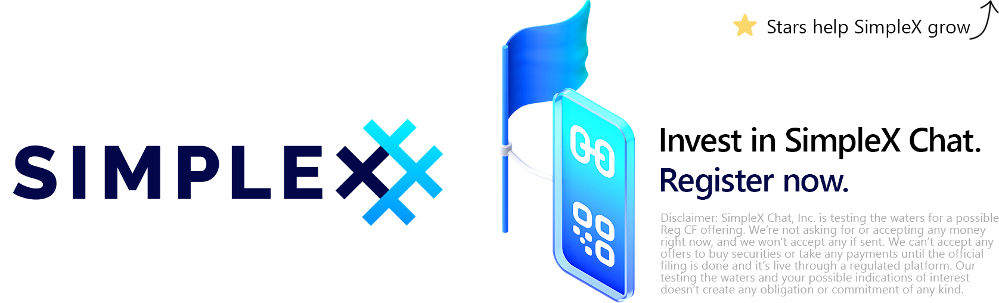

# GitHub 一周热点 · 第 3 期

> 📅 2026-07-06 ｜ 数据来源：GitHub Trending（本周）

## AI / 大模型

### [Robbyant/lingbot-map](https://github.com/Robbyant/lingbot-map)

- ⭐ 总 star 9,899
- 🔥 本周 star 1,875 stars this week
- 💻 Python

几何上下文 Transformer（GCT），用于流式 3D 场景重建。它通过锚定上下文、位姿参考窗口和轨迹记忆，实现从视频流中实时生成高质量点云，本周值得关注，因为它展示了端到端的 3D 重建基础模型在实际序列上的强大性能。

`#3d-reconstruction` `#transformer` `#computer-vision` `#streaming-inference`

### [alibaba/page-agent](https://github.com/alibaba/page-agent)

- ⭐ 总 star 23,903
- 🔥 本周 star 3,151 stars this week
- 💻 TypeScript
- 🔗 官网：https://alibaba.github.io/page-agent/

一个运行在网页中的 JavaScript GUI 代理，允许通过自然语言控制网页界面。无需浏览器扩展或 Python，直接在页面内操作 DOM，本周值得关注，因为它为构建 SaaS AI 副驾驶和智能表单填写提供了便捷的客户端集成方案。

`#ai-agent` `#browser-automation` `#javascript` `#web`

### [browser-use/video-use](https://github.com/browser-use/video-use)

- ⭐ 总 star 15,038
- 🔥 本周 star 4,288 stars this week
- 💻 Python

使用 AI 编码代理（如 Claude Code）编辑视频的工具。它通过分析音频转录和视觉合成层，实现字级精度的剪辑、调色和字幕生成，本周值得关注，因为它将复杂的视频后期流程抽象为自然语言指令，极大地简化了视频制作。

`#ai-video-editing` `#claude-code` `#ffmpeg` `#media-production`

### [calesthio/OpenMontage](https://github.com/calesthio/OpenMontage)

- ⭐ 总 star 33,674
- 🔥 本周 star 7,353 stars this week
- 💻 Python
- 🔗 官网：https://github.com/calesthio/OpenMontage

首个开源的智能视频制作系统，包含 12 个制作管线、52 个工具和 500 多个代理技能。它能将你的 AI 编码助手转变为完整的视频制作工作室，从研究、脚本到成片全流程自动化，本周值得关注，因为它展示了 AI 在端到端内容创作中的强大整合能力。

`#agentic-ai` `#video-generation` `#open-source` `#production-pipeline`

### [allenai/olmocr](https://github.com/allenai/olmocr)

- ⭐ 总 star 18,795
- 🔥 本周 star 1,212 stars this week
- 💻 Python

用于将 PDF 等文档线性化为 LLM 数据集的工具包。基于 7B 参数的视觉语言模型，能高效地将包含表格、公式、手写体的复杂文档转换为干净的 Markdown，本周值得关注，因为它为大规模构建高质量训练数据提供了高效的解决方案。

`#document-processing` `#ocr` `#vlm` `#dataset`

### [topoteretes/cognee](https://github.com/topoteretes/cognee)

- ⭐ 总 star 27,124
- 🔥 本周 star 2,699 stars this week
- 💻 Python
- 🔗 官网：https://www.cognee.ai

为 AI 代理提供持久化长期记忆的开源平台。通过摄入数据构建自托管的知识图谱，让代理能够跨会话回忆、连接信息并采取行动，本周值得关注，因为它为解决 AI 代理的上下文记忆问题提供了一个强大的图 RAG 基础设施。

`#ai-memory` `#knowledge-graph` `#ai-agents` `#graph-rag`

## 开发工具

### [diegosouzapw/OmniRoute](https://github.com/diegosouzapw/OmniRoute)

- ⭐ 总 star 11,886
- 🔥 本周 star 4,411 stars this week
- 💻 TypeScript
- 🔗 官网：https://omniroute.online

免费的 AI 网关，通过单一端点连接 237+ 个 AI 提供商（其中 90+ 个提供免费额度）。支持自动故障转移、令牌压缩和 MCP/A2A 协议，本周值得关注，因为它为开发者提供了一个低成本、高可用的统一 AI 接入层。

`#ai-gateway` `#llm-proxy` `#token-saver` `#free-ai`

### [ogulcancelik/herdr](https://github.com/ogulcancelik/herdr)

- ⭐ 总 star 12,081
- 🔥 本周 star 3,937 stars this week
- 💻 Rust
- 🔗 官网：https://herdr.dev

一个运行在终端中的代理多路复用器，允许在一个终端窗口中同时运行和管理多个 AI 编码代理（如 Claude Code、Codex）。支持工作区、标签页和窗格分割，并能实时显示各代理的工作状态，本周值得关注，因为它为并行使用多个 AI 编码助手提供了优雅的终端解决方案。

`#terminal-multiplexer` `#ai-agents` `#developer-tools` `#cli`

### [logto-io/logto](https://github.com/logto-io/logto)

- ⭐ 总 star 13,826
- 🔥 本周 star 1,575 stars this week
- 💻 TypeScript
- 🔗 官网：https://logto.io

为 SaaS 和 AI 应用构建的现代开源身份认证和授权基础设施。基于 OIDC 和 OAuth 2.1，内置多租户、企业级 SSO 和 RBAC，本周值得关注，因为它为开发者提供了一个功能全面、易于集成的开源身份解决方案。

`#authentication` `#authorization` `#sso` `#oauth2` `#rbac`

### [apache/maven](https://github.com/apache/maven)

- ⭐ 总 star 5,286
- 🔥 本周 star 173 stars this week
- 💻 Java
- 🔗 官网：https://maven.apache.org/ref/current

Apache Maven 核心项目，一个基于项目对象模型（POM）的软件项目管理和构建工具。本周出现在 Trending 上，可能是因为有新的版本发布或重要的社区活动，持续为 Java 生态提供稳定的构建支持。

`#build-management` `#java` `#apache` `#maven`

### [openai/codex-plugin-cc](https://github.com/openai/codex-plugin-cc)

- ⭐ 总 star 25,486
- 🔥 本周 star 3,405 stars this week
- 💻 JavaScript

一个允许在 Claude Code 中使用 Codex 的插件。提供了代码审查、任务委派、会话转移等斜杠命令，本周值得关注，它打通了两大主流 AI 编码工具之间的协作流程，让开发者可以更灵活地利用不同模型的优势。

`#claude-code` `#codex` `#ai-plugin` `#code-review`

### [DeusData/codebase-memory-mcp](https://github.com/DeusData/codebase-memory-mcp)

- ⭐ 总 star 26,737
- 🔥 本周 star 7,945 stars this week
- 💻 C
- 🔗 官网：https://deusdata.github.io/codebase-memory-mcp/

高性能的代码智能 MCP 服务器。使用 tree-sitter 将代码库快速索引为持久化的知识图谱，支持 158 种语言和亚毫秒查询，本周值得关注，它极大地提升了 AI 代理理解大型代码库的效率，减少了 token 消耗。

`#code-intelligence` `#mcp-server` `#knowledge-graph` `#tree-sitter`

### [stablyai/orca](https://github.com/stablyai/orca)

- ⭐ 总 star 12,381
- 🔥 本周 star 3,783 stars this week
- 💻 TypeScript
- 🔗 官网：https://onOrca.dev

为并行代理设计的 AI 开发环境（ADE）。支持同时运行 Codex、Claude Code、OpenCode 等多种代理，每个代理在独立的 Git 工作树中操作，并提供移动端伴侣应用，本周值得关注，它为“百倍效率构建者”提供了强大的代理编排和管理界面。

`#agent-ide` `#parallel-agents` `#orchestration` `#developer-tools`

### [JCodesMore/ai-website-cloner-template](https://github.com/JCodesMore/ai-website-cloner-template)

- ⭐ 总 star 25,844
- 🔥 本周 star 3,246 stars this week
- 💻 TypeScript
- 🔗 官网：https://dsc.gg/jcodesmore

使用 AI 编码代理克隆任何网站的模板。只需指向一个 URL 运行 `/clone-website`，代理就会自动分析设计、提取资产并重建为现代的 Next.js 代码库，本周值得关注，它为网站迁移和逆向学习提供了一个高度自动化的解决方案。

`#website-clone` `#ai-agents` `#nextjs` `#template`

## 隐私与安全

### [usestrix/strix](https://github.com/usestrix/strix)

- ⭐ 总 star 37,145
- 🔥 本周 star 10,338 stars this week
- 💻 Python
- 🔗 官网：https://strix.ai

开源的 AI 渗透测试工具，使用自主 AI 代理发现并修复应用程序漏洞。集成到 CI/CD 流程中，可自动生成修复补丁和合规报告，本周值得关注，因为它展示了 AI 在自动化安全测试中的最新应用。

`#ai-penetration-testing` `#ai-security` `#cybersecurity` `#penetration-testing`

### [simplex-chat/simplex-chat](https://github.com/simplex-chat/simplex-chat)

- ⭐ 总 star 17,923
- 🔥 本周 star 3,572 stars this week
- 💻 Haskell
- 🔗 官网：https://simplex.chat

首个不使用任何类型用户标识符的消息平台，100% 隐私优先设计。提供 iOS、Android 和桌面应用，支持端到端加密和后量子密钥交换，本周值得关注，因为它在隐私保护技术上持续创新，提供了无与伦比的元数据防护。

`#messaging` `#privacy` `#encryption` `#security`

## 效率工具

### [Zackriya-Solutions/meetily](https://github.com/Zackriya-Solutions/meetily)

- ⭐ 总 star 17,054
- 🔥 本周 star 2,972 stars this week
- 💻 Rust
- 🔗 官网：https://meetily.ai

一款注重隐私的 AI 会议助手，所有处理均在本地完成。支持使用 Parakeet/Whisper 进行 4 倍速实时转录、说话人分离和基于 Ollama 的会议摘要生成，本周值得关注，它为需要数据主权的企业和个人提供了强大的本地化会议解决方案。

`#ai-meeting-assistant` `#local-ai` `#whisper` `#privacy-focused`

### [Starmel/OpenSuperWhisper](https://github.com/Starmel/OpenSuperWhisper)

- ⭐ 总 star 1,809
- 🔥 本周 star 532 stars this week
- 💻 Swift

一个 macOS 上的实时音频转录应用。支持全局快捷键触发、鼠标按钮触发和拖放转录，使用 Whisper 和 Parakeet 两种转录引擎，本周值得关注，它提供了一个轻量、高效且注重隐私的本地语音输入方案。

`#dictation` `#macos` `#whisper` `#parakeet`

## AI 代理框架

### [msitarzewski/agency-agents](https://github.com/msitarzewski/agency-agents)

- ⭐ 总 star 127,518
- 🔥 本周 star 10,637 stars this week
- 💻 Shell

一个完整的 AI 代理团队集合，包含从工程、设计到营销等多个领域的数百个专业化代理。每个代理都有独特的个性、工作流程和可交付成果，本周值得关注，它为构建复杂的多代理系统提供了丰富的即用型角色和模板。

`#ai-agents` `#agent-personality` `#multi-agent` `#workflow`

## AI 金融应用

### [xbtlin/ai-berkshire](https://github.com/xbtlin/ai-berkshire)

- ⭐ 总 star 10,322
- 🔥 本周 star 5,038 stars this week
- 💻 Python
- 🔗 官网：https://github.com/xbtlin/ai-berkshire#readme

基于 Claude Code/Codex 的价值投资研究框架，融合了巴菲特、芒格、段永平、李录四位大师的方法论。通过多代理并行研究，生成结构化的投资决策报告，本周值得关注，它展示了 AI 如何系统性地提升专业投资研究的深度和效率。

`#value-investing` `#ai-research` `#multi-agent` `#financial-analysis`

### [ZhuLinsen/daily_stock_analysis](https://github.com/ZhuLinsen/daily_stock_analysis)

- ⭐ 总 star 54,711
- 🔥 本周 star 3,806 stars this week
- 💻 Python
- 🔗 官网：https://dsa.zhulinsen.tech

LLM 驱动的多市场股票智能分析系统。聚合 A 股、港股、美股等市场的多源行情和实时新闻，生成包含核心结论、评分和买卖点位的决策仪表盘，并支持自动推送到企业微信、飞书等渠道，本周值得关注，它为个人投资者提供了近乎零成本的专业级每日分析服务。

`#stock-analysis` `#ai-agent` `#a-stock` `#quantitative-finance`
