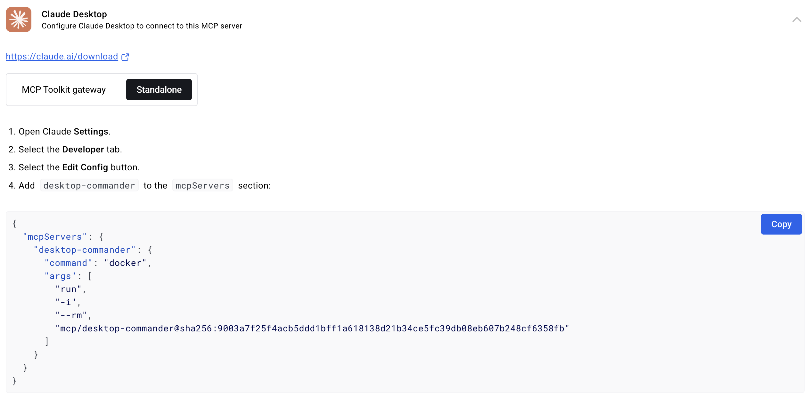
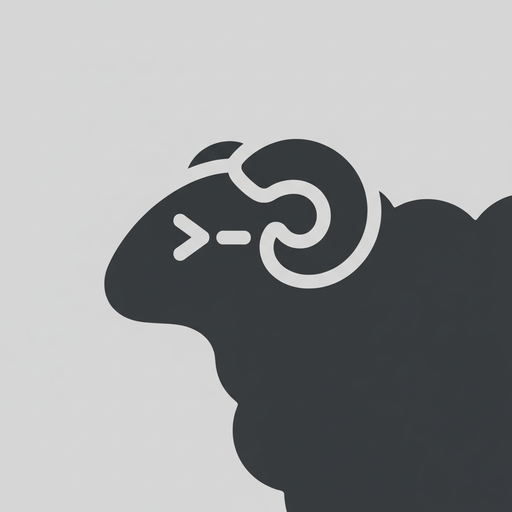
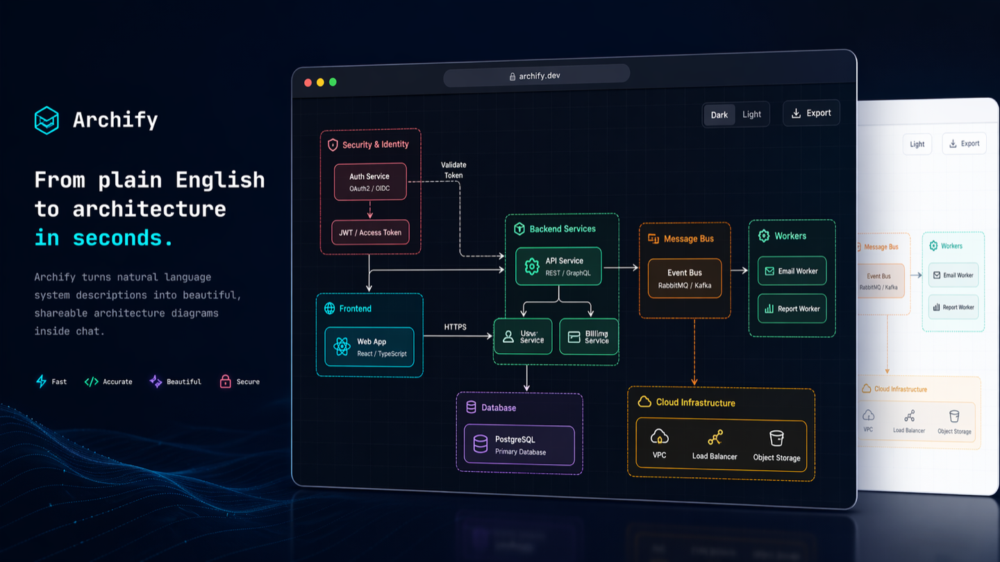
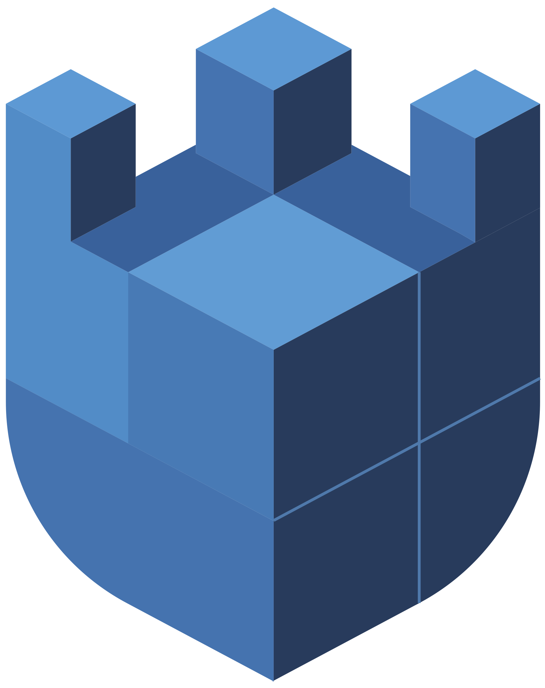
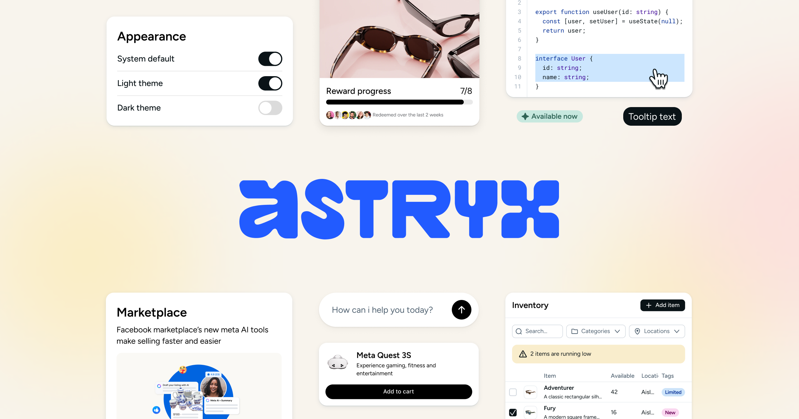
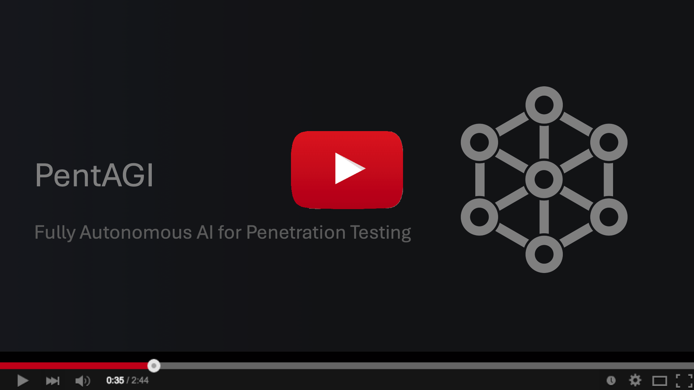

# GitHub 一周热点 · 第 4 期

> 📅 2026-07-13 ｜ 数据来源：GitHub Trending（本周）

## AI 开发工具

### [Zackriya-Solutions/meetily](https://github.com/Zackriya-Solutions/meetily)

- ⭐ 总 star 23,589
- 🔥 本周 star 7,440 stars this week
- 💻 Rust
- 🔗 官网：https://meetily.ai

一款隐私优先的 AI 会议助手，核心转录与摘要处理完全在本地进行，无需云端依赖。本周值得关注，因其强调了数据主权与开源方案，适合对隐私和合规有高要求的企业与专业人士。

`#ai-meeting-assistant` `#privacy-focused` `#rust` `#local-ai` `#whisper` `#self-hosted`

### [wonderwhy-er/DesktopCommanderMCP](https://github.com/wonderwhy-er/DesktopCommanderMCP)

- ⭐ 总 star 7,991
- 🔥 本周 star 1,678 stars this week
- 💻 TypeScript
- 🔗 官网：https://desktopcommander.app/

一个为 Claude 等 AI 编码代理设计的 Model Context Protocol (MCP) 服务器，赋予其终端控制、文件搜索与差异化编辑能力，让 AI 能直接在用户电脑上操作。

`#mcp` `#claude` `#terminal` `#filesystem` `#ai-agents`

### [openai/codex-plugin-cc](https://github.com/openai/codex-plugin-cc)

- ⭐ 总 star 28,063
- 🔥 本周 star 2,803 stars this week
- 💻 JavaScript

OpenAI 官方发布的 Claude Code 插件，允许用户在 Claude Code 工作流内直接调用 Codex 进行代码审查或委派任务，实现了两大 AI 编码工具的无缝协作。

`#claude-code` `#codex` `#plugin` `#code-review`

### [ogulcancelik/herdr](https://github.com/ogulcancelik/herdr)

- ⭐ 总 star 15,794
- 🔥 本周 star 3,928 stars this week
- 💻 Rust
- 🔗 官网：https://herdr.dev

一个用 Rust 编写的终端代理多路复用器，可在一个终端中管理所有 AI 编码代理（如 Claude Code、Codex），实时显示其工作状态，并支持持久化会话与远程连接。

`#agent-orchestration` `#terminal` `#multiplexer` `#rust` `#tmux`

### [diegosouzapw/OmniRoute](https://github.com/diegosouzapw/OmniRoute)

- ⭐ 总 star 16,231
- 🔥 本周 star 4,506 stars this week
- 💻 TypeScript
- 🔗 官网：https://omniroute.online

一个免费的 AI 网关，通过单一端点聚合了 200 多个提供商（含大量免费额度），支持自动故障转移与 token 压缩，旨在帮助开发者无缝连接各种 AI 工具并节省成本。

`#ai-gateway` `#free-ai` `#mcp` `#token-saver` `#multi-provider`

### [stablyai/orca](https://github.com/stablyai/orca)

- ⭐ 总 star 17,014
- 🔥 本周 star 4,481 stars this week
- 💻 TypeScript
- 🔗 官网：https://onOrca.dev

一个面向“百倍效能构建者”的 AI 编排桌面应用，允许用户并行运行 Codex、Claude Code 等多个代理，每个在独立的工作树中，并提供移动端伴侣应用进行监控。

`#ai-ide` `#parallel-agents` `#orchestration` `#terminal` `#mobile-app`

### [bradautomates/claude-video](https://github.com/bradautomates/claude-video)

- ⭐ 总 star 7,837
- 🔥 本周 star 4,353 stars this week
- 💻 Python

一个 Claude Code 技能，赋予 Claude “观看”视频的能力。它通过下载、提取帧、转录音频并将所有信息交予 Claude 处理，从而让 AI 能够分析视频内容。

`#claude-code` `#video-analysis` `#skill` `#ffmpeg`

### [iOfficeAI/OfficeCLI](https://github.com/iOfficeAI/OfficeCLI)

- ⭐ 总 star 15,436
- 🔥 本周 star 6,978 stars this week
- 💻 C#
- 🔗 官网：https://officecli.ai

世界上首个专为 AI 代理设计的 Office 套件，以单一命令行二进制文件形式提供，无需安装 Office，即可让 AI 代理读取、编辑和自动化 Word、Excel 和 PowerPoint 文件。

`#office` `#ai-agents` `#cli` `#docx` `#xlsx` `#pptx`

### [tt-a1i/archify](https://github.com/tt-a1i/archify)

- ⭐ 总 star 3,921
- 🔥 本周 star 1,180 stars this week
- 💻 JavaScript
- 🔗 官网：https://tt-a1i.github.io/archify/

一个用于生成美观架构、流程和序列图的 AI 技能，支持明暗主题切换及 PNG/JPEG/WebP/SVG 导出，可直接在对话中使用，无需设计技能。

`#architecture-diagram` `#claude-skill` `#mermaid-alternative` `#diagram-as-code`

### [alibaba/page-agent](https://github.com/alibaba/page-agent)

- ⭐ 总 star 26,224
- 🔥 本周 star 2,666 stars this week
- 💻 TypeScript
- 🔗 官网：https://alibaba.github.io/page-agent/

一个运行在网页内的 JavaScript GUI 代理，可通过自然语言控制网页界面，无需浏览器扩展或无头浏览器，专注于客户端网页增强，为 SaaS 产品集成 AI 助手提供了简便方案。

`#browser-automation` `#ai-agents` `#mcp` `#web`

### [alirezarezvani/claude-skills](https://github.com/alirezarezvani/claude-skills)

- ⭐ 总 star 22,384
- 🔥 本周 star 1,993 stars this week
- 💻 Python
- 🔗 官网：https://alirezarezvani.medium.com/

一个庞大的 Claude Code 技能与插件集合，涵盖工程、营销、产品、合规等多个领域，支持 Claude Code、Codex、Cursor 等 13 种编码工具，提供模块化的专业知识包。

`#claude-code` `#agent-skills` `#plugins` `#prompt-engineering`

### [JuliusBrussee/caveman](https://github.com/JuliusBrussee/caveman)

- ⭐ 总 star 88,547
- 🔥 本周 star 3,992 stars this week
- 💻 JavaScript
- 🔗 官网：https://caveman.so/

一个 Claude Code 技能，通过让 AI 代理以“穴居人”风格说话，在保持技术准确性的同时，平均减少 65% 的输出 token，从而节省成本并提升可读性。

`#claude-code` `#token-saving` `#prompt-engineering` `#skill`

## 开发工具与基础设施

### [TencentCloud/CubeSandbox](https://github.com/TencentCloud/CubeSandbox)

- ⭐ 总 star 9,808
- 🔥 本周 star 2,490 stars this week
- 💻 Rust
- 🔗 官网：https://cubesandbox.com

腾讯云开源的高性能轻量级沙盒服务，基于 RustVMM 和 KVM 构建，支持毫秒级启动和硬件级隔离，专为 AI 代理提供安全、可扩展的代码执行环境。

`#sandbox` `#ai-agents` `#rust` `#kvm` `#security`

### [abseil/abseil-cpp](https://github.com/abseil/abseil-cpp)

- ⭐ 总 star 17,946
- 🔥 本周 star 600 stars this week
- 💻 C++
- 🔗 官网：https://abseil.io

Google 开源的 C++ 通用库集合，旨在增强 C++ 标准库，提供了容器、字符串处理、时间处理等经过大规模生产环境检验的代码。

`#c++` `#library` `#google` `#open-source`

### [ChromeDevTools/chrome-devtools-mcp](https://github.com/ChromeDevTools/chrome-devtools-mcp)

- ⭐ 总 star 46,770
- 🔥 本周 star 872 stars this week
- 💻 TypeScript
- 🔗 官网：https://npmjs.org/package/chrome-devtools-mcp

一个将 Chrome DevTools 的能力暴露给 AI 编码代理的 Model Context Protocol (MCP) 服务器，让代理能控制浏览器、分析性能、调试网络请求，实现可靠的网页自动化与调试。

`#mcp` `#chrome` `#debugging` `#browser` `#devtools`

## Web 与前端

### [facebook/astryx](https://github.com/facebook/astryx)

- ⭐ 总 star 8,190
- 🔥 本周 star 2,397 stars this week
- 💻 TypeScript
- 🔗 官网：http://astryx.atmeta.com

Meta 开源的设计系统，内含 150 多个无障碍组件、主题定制和 CLI 工具，其独特之处在于 API、文档和 CLI 均为人与 AI 助手协同构建而设计。

`#design-system` `#react` `#stylex` `#open-source`

### [pbakaus/impeccable](https://github.com/pbakaus/impeccable)

- ⭐ 总 star 45,984
- 🔥 本周 star 2,272 stars this week
- 💻 JavaScript
- 🔗 官网：https://impeccable.style

一个为 AI 编码代理提供的前端设计指导技能，包含 23 条设计命令和 46 条确定性检测规则，旨在帮助 AI 生成更美观、专业的前端设计，避免常见 AI 生成设计的缺陷。

`#frontend-design` `#ai-coding-agent` `#design-guidance` `#skill`

## 安全

### [usestrix/strix](https://github.com/usestrix/strix)

- ⭐ 总 star 40,860
- 🔥 本周 star 4,143 stars this week
- 💻 Python
- 🔗 官网：https://strix.ai

一个开源的 AI 渗透测试工具，利用自主 AI 黑客代理查找和修复应用漏洞，支持多代理协作，并能生成实际的漏洞利用证明，而不仅仅是误报。

`#penetration-testing` `#ai-security` `#ethical-hacking`

### [vxcontrol/pentagi](https://github.com/vxcontrol/pentagi)

- ⭐ 总 star 20,175
- 🔥 本周 star 1,989 stars this week
- 💻 Go
- 🔗 官网：https://pentagi.com

一个全自主的 AI 渗透测试系统，集成了多代理架构、专业安全工具套件和智能记忆系统，能在隔离的 Docker 环境中自动执行复杂的渗透测试任务。

`#penetration-testing` `#ai-agents` `#security-tools` `#autonomous-agents`

## IoT 与传感

### [ruvnet/RuView](https://github.com/ruvnet/RuView)

- ⭐ 总 star 80,258
- 🔥 本周 star 3,763 stars this week
- 💻 Rust
- 🔗 官网：https://Cognitum.One/RuView

一个利用普通 WiFi 信号实现实时空间感知、生命体征监测和存在检测的平台，通过分析信道状态信息（CSI），无需摄像头或可穿戴设备即可感知人员位置、呼吸、心跳等活动。

`#wifi` `#spatial-intelligence` `#vital-signs` `#iot` `#esp32`

## 编程学习与资源

### [asgeirtj/system_prompts_leaks](https://github.com/asgeirtj/system_prompts_leaks)

- ⭐ 总 star 56,734
- 🔥 本周 star 7,155 stars this week
- 💻 JavaScript

一个持续更新的文档集合，旨在记录并公开主流 AI 聊天机器人（如 Claude、ChatGPT、Gemini 等）的系统提示指令，为研究和教育目的提供了透明度。

`#prompt-engineering` `#system-prompts` `#ai` `#chatgpt` `#claude`
