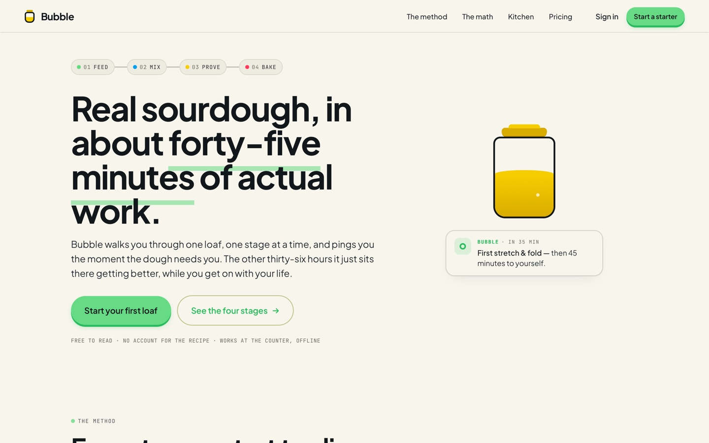
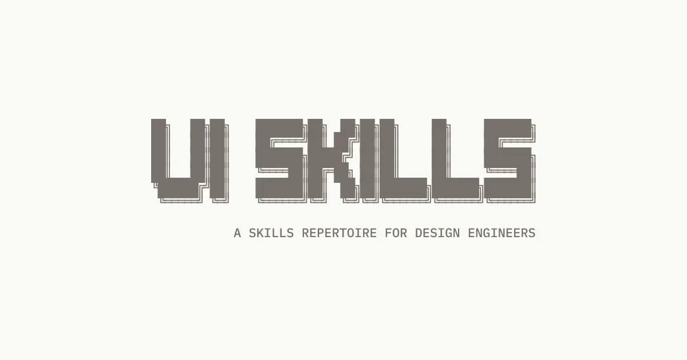
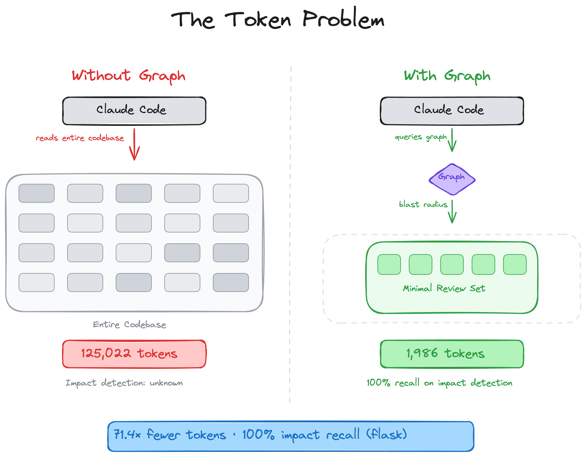
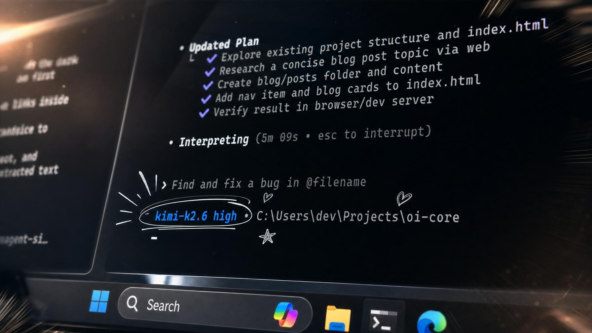
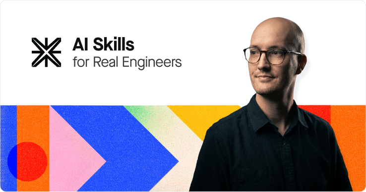

# GitHub 一周热点 · 第 5 期

> 📅 2026-07-20 ｜ 数据来源：GitHub Trending（本周）

## 开发与创作工具

### [Nutlope/hallmark](https://github.com/Nutlope/hallmark)

- ⭐ 总 star 13,463
- 🔥 本周 star 9,193 stars this week
- 💻 CSS
- 🔗 官网：https://www.usehallmark.com/

一个为 Claude Code、Cursor 等 AI 编码工具设计的设计技能，旨在生成不像是 AI 创造的 UI。它包含二十套主题和五十多项反模式测试，确保生成的页面结构各异，避免模板化。

`#ai-tools` `#ui-design` `#coding-agent` `#css` `#anti-slop`

### [OpenCut-app/OpenCut](https://github.com/OpenCut-app/OpenCut)

- ⭐ 总 star 75,945
- 🔥 本周 star 12,743 stars this week
- 💻 TypeScript
- 🔗 官网：https://opencut.app

一个开源的视频编辑器替代品，目标是提供一个免费、开源的 CapCut。项目正在用 Rust 核心从头重写，计划支持桌面、移动和浏览器端。

`#video-editor` `#open-source` `#typescript`

### [iOfficeAI/OfficeCLI](https://github.com/iOfficeAI/OfficeCLI)

- ⭐ 总 star 19,723
- 🔥 本周 star 4,269 stars this week
- 💻 C#
- 🔗 官网：https://officecli.ai

首个为 AI 代理设计的 Office 套件，通过单个命令行二进制文件即可让 AI 代理读取、编辑和自动化 Word、Excel 和 PowerPoint 文件，无需安装 Office 软件。

`#office` `#cli` `#ai-agent` `#docx` `#xlsx` `#pptx`

### [ibelick/ui-skills](https://github.com/ibelick/ui-skills)

- ⭐ 总 star 5,465
- 🔥 本周 star 1,669 stars this week
- 💻 TypeScript
- 🔗 官网：https://www.ui-skills.com/

为设计工程师（Design Engineers）提供的 AI 代理技能集，通过 `npx ui-skills start` 命令可以引导代理选择适合任务的 UI 技能包。

`#ui-skills` `#design-engineers` `#cli`

### [tirth8205/code-review-graph](https://github.com/tirth8205/code-review-graph)

- ⭐ 总 star 21,462
- 🔥 本周 star 1,103 stars this week
- 💻 Python
- 🔗 官网：https://code-review-graph.com

一个本地优先的代码智能图谱工具，使用 Tree-sitter 解析代码库并构建知识图谱。它能为 AI 编码工具（如 Claude Code）提供精确的上下文，通过分析代码影响范围来大幅减少审查时所需的 token 数量。

`#code-review` `#knowledge-graph` `#mcp` `#static-analysis` `#python`

## 知识与教育工具

### [kangarooking/cangjie-skill](https://github.com/kangarooking/cangjie-skill)

- ⭐ 总 star 3,867
- 🔥 本周 star 1,284 stars this week
- 💻 Python

一个将书籍、长视频、播客等高价值内容中可执行的方法论蒸馏成 AI 可调用技能（Agent Skills）的流水线。它使用 RIA-TV++ 方法论，经过理解、提取、验证、构造和测试等七个阶段，生成结构化的技能包。

`#knowledge-distillation` `#ai-skills` `#prompt-engineering` `#agent-workflows`

### [HKUDS/DeepTutor](https://github.com/HKUDS/DeepTutor)

- ⭐ 总 star 27,997
- 🔥 本周 star 2,375 stars this week
- 💻 Python
- 🔗 官网：http://arxiv.org/abs/2604.26962

一个名为“终身个性化辅导”的 AI 学习工作空间，将辅导、解题、测验生成、研究、可视化和练习连接在一个可扩展的系统中。它支持连接本地的 Claude Code 或 Codex 作为合作伙伴，并提供可检查的个人记忆。

`#ai-tutor` `#rag` `#multi-agent-systems` `#interactive-learning`

## 量化交易与金融

### [HKUDS/Vibe-Trading](https://github.com/HKUDS/Vibe-Trading)

- ⭐ 总 star 25,337
- 🔥 本周 star 5,228 stars this week
- 💻 Python
- 🔗 官网：https://vibetrading.wiki/

一个综合性的个人交易代理，旨在通过一条命令赋予 AI 代理全面的交易能力。它支持回测、实时数据、多代理协作和 MCP 服务器集成，并覆盖了广泛的金融数据源和因子库。

`#algorithmic-trading` `#ai-agent` `#multi-agent` `#fintech` `#quantitative-finance`

## 编程代理与 AI 助手

### [openai/codex](https://github.com/openai/codex)

- ⭐ 总 star 99,745
- 🔥 本周 star 2,361 stars this week
- 💻 Rust

OpenAI 推出的在终端中运行的轻量级编程代理。它可以通过 ChatGPT 计划或 API 密钥使用，提供本地化的代码生成和编辑能力。

`#coding-agent` `#cli` `#rust`

### [openinterpreter/openinterpreter](https://github.com/openinterpreter/openinterpreter)

- ⭐ 总 star 66,854
- 🔥 本周 star 2,498 stars this week
- 💻 Rust
- 🔗 官网：http://openinterpreter.com/

一个为低成本模型（如 Kimi K3、DeepSeek）优化的 Rust 编程代理。它是 OpenAI Codex 的一个分支，专注于模拟能发挥低成本模型最佳性能的代理工具，并兼容 ACP 和 Codex SDK。

`#coding-agent` `#rust` `#deepseek` `#kimi` `#qwen`

### [earendil-works/pi](https://github.com/earendil-works/pi)

- ⭐ 总 star 72,843
- 🔥 本周 star 2,854 stars this week
- 💻 TypeScript

一个 AI 代理工具包，提供统一的 LLM API、代理运行时和交互式编程代理 CLI。它支持多种 LLM 提供商，并包含一个终端 UI 库。

`#coding-agent` `#tui` `#llm` `#agent-core`

## 开发基础设施

### [Shubhamsaboo/awesome-llm-apps](https://github.com/Shubhamsaboo/awesome-llm-apps)

- ⭐ 总 star 124,614
- 🔥 本周 star 6,211 stars this week
- 💻 Python
- 🔗 官网：https://www.theunwindai.com

一个收集了超过 100 个可实际运行的 AI 代理、技能和 RAG 应用的模板集合。项目涵盖了从入门到高级的多种应用场景，如旅行代理、金融分析、多代理团队等，并提供了快速启动代码。

`#rag` `#agents` `#llms` `#python` `#templates`

### [mattpocock/skills](https://github.com/mattpocock/skills)

- ⭐ 总 star 177,679
- 🔥 本周 star 10,983 stars this week
- 💻 Shell

一套为资深工程师设计的 AI 代理技能集，旨在解决 AI 辅助编码中的常见问题，如需求不对齐、输出冗长和代码质量不佳。包含了用于明确需求、建立领域语言、测试驱动开发和代码库架构优化的多种技能。

`#engineering-skills` `#productivity` `#claude-code` `#best-practices`

### [anthropics/cwc-workshops](https://github.com/anthropics/cwc-workshops)

- ⭐ 总 star 1,776
- 🔥 本周 star 317 stars this week
- 💻 TypeScript

Anthropic 举办的“Code with Claude”工作坊的材料集合。包含了关于模型选择、多代理系统构建、AI 辅助产品开发流程、托管代理开发等多个主题的实践教程。

`#workshops` `#claude` `#agent-development` `#evaluation`
