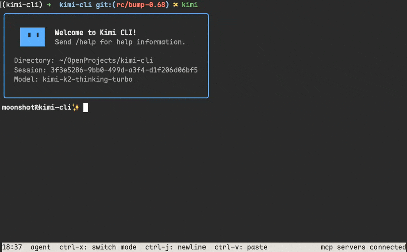
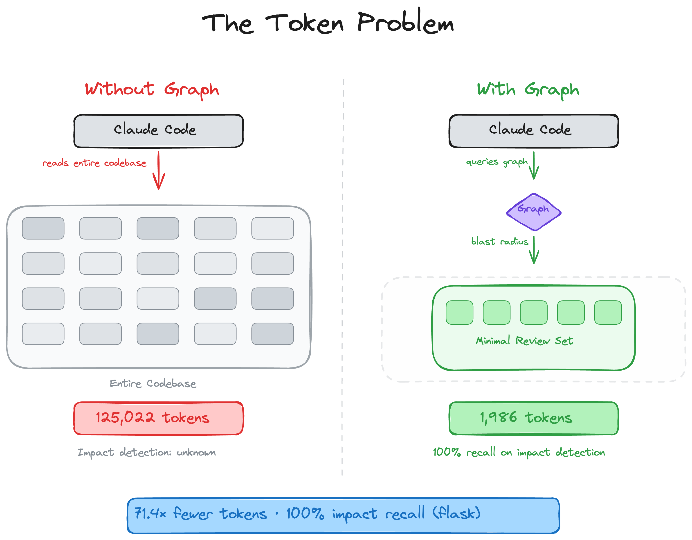
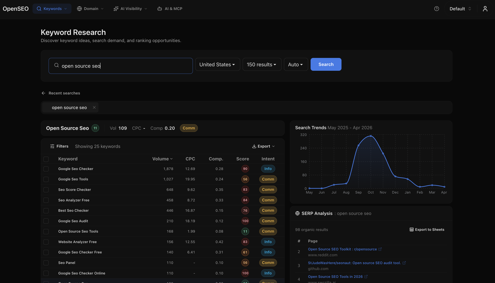
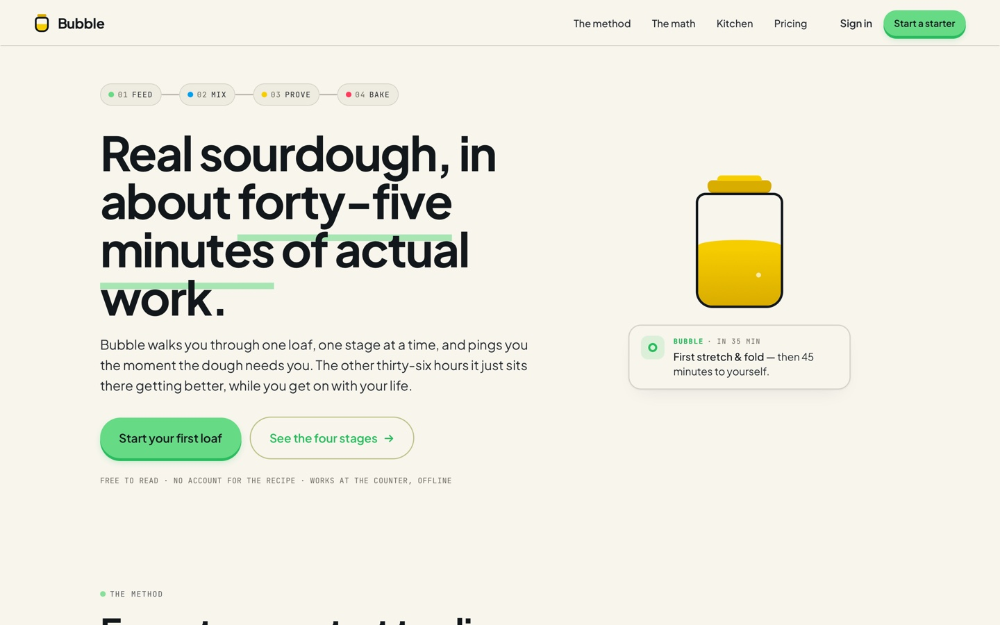
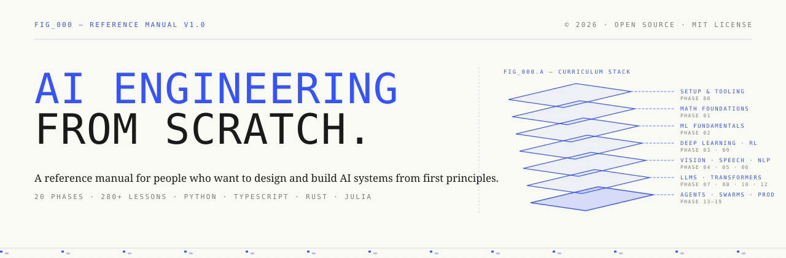
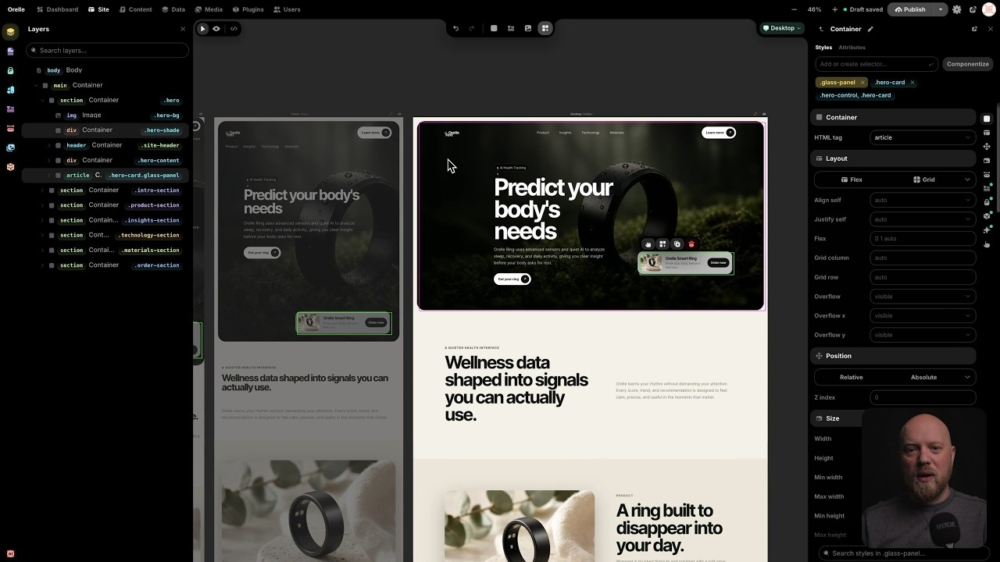

# GitHub 一周热点 · 第 6 期

> 📅 2026-07-27 ｜ 数据来源：GitHub Trending（本周）

## AI / 大模型应用

### [bojieli/ai-agent-book](https://github.com/bojieli/ai-agent-book)

- ⭐ 总 star 20,907
- 🔥 本周 star 15,909 stars this week
- 💻 Python

这是一本围绕 AI Agent 设计原理与工程实践的开源书籍，全书围绕核心公式“Agent = LLM + 上下文 + 工具”展开，提供了 92 个配套实验代码，覆盖了从基础概念到生产部署的完整知识体系。

`#ai-agent` `#llm` `#book` `#rag` `#multi-agent`

### [MoonshotAI/kimi-code](https://github.com/MoonshotAI/kimi-code)

- ⭐ 总 star 5,194
- 🔥 本周 star 1,380 stars this week
- 💻 TypeScript
- 🔗 官网：https://moonshotai.github.io/kimi-code/

Kimi Code CLI 是一个运行在终端中的 AI 编码代理，可读取和编辑代码、运行命令，并基于 Kimi 模型工作。它提供了快速启动、视频输入、AI 原生的 MCP 配置和丰富的插件生态系统。

`#coding-agent` `#cli` `#ai` `#tui`

### [MoonshotAI/kimi-cli](https://github.com/MoonshotAI/kimi-cli)

- ⭐ 总 star 10,896
- 🔥 本周 star 1,200 stars this week
- 💻 Python
- 🔗 官网：https://moonshotai.github.io/kimi-cli/

Kimi CLI 是一个在终端中运行的 AI 代理，可帮助完成软件开发和终端操作。它具备读取/编辑代码、执行命令、搜索网页等功能，并支持通过 ACP 协议与 IDE 集成。项目正逐步演进为 Kimi Code CLI。

`#ai-agent` `#cli` `#terminal` `#coding`

### [earendil-works/pi](https://github.com/earendil-works/pi)

- ⭐ 总 star 78,097
- 🔥 本周 star 5,389 stars this week
- 💻 TypeScript

Pi 是一个包含统一 LLM API、代理运行时和编码代理 CLI 的 AI 代理工具包。它提供了交互式编码代理、代理核心运行时以及支持多提供商的 AI API。

`#ai-agent` `#coding-agent` `#llm` `#toolkit`

### [1jehuang/jcode](https://github.com/1jehuang/jcode)

- ⭐ 总 star 11,670
- 🔥 本周 star 2,909 stars this week
- 💻 Rust
- 🔗 官网：https://jcode.sh

jcode 是一个高性能的编码代理工具，支持多会话工作流、无限自定义。它通过语义向量嵌入实现了类人记忆系统，并提供了内存高效、极速启动的终端界面，以及 Swarm 多代理协作功能。

`#ai-coding-agent` `#rust` `#cli` `#tui` `#performance`

### [tirth8205/code-review-graph](https://github.com/tirth8205/code-review-graph)

- ⭐ 总 star 26,616
- 🔥 本周 star 6,006 stars this week
- 💻 Python
- 🔗 官网：https://code-review-graph.com

code-review-graph 为代码审查构建了持久的智能图谱。它使用 Tree-sitter 解析代码库，通过增量更新维护代码结构图，并在 MCP 和 CLI 中为 AI 编码工具提供精确上下文，显著减少 token 消耗。

`#code-review` `#knowledge-graph` `#mcp` `#static-analysis`

### [HKUDS/DeepTutor](https://github.com/HKUDS/DeepTutor)

- ⭐ 总 star 30,094
- 🔥 本周 star 2,199 stars this week
- 💻 Python
- 🔗 官网：http://arxiv.org/abs/2604.26962

DeepTutor 是一个面向终身个性化辅导的智能工作区，它将辅导、解题、测验生成、研究和可视化等能力集成在一个可扩展的系统中。它支持多引擎知识检索、子代理和可检查的记忆系统。

`#ai-tutor` `#rag` `#ai-agents` `#interactive-learning`

### [ruvnet/RuView](https://github.com/ruvnet/RuView)

- ⭐ 总 star 86,653
- 🔥 本周 star 5,497 stars this week
- 💻 Rust
- 🔗 官网：https://Cognitum.One/RuView

π RuView 利用普通 WiFi 信号实现空间智能、生命体征监测和存在检测，无需任何摄像头。它基于 ESP32 传感器和预训练模型，在边缘设备上实时工作，并支持集成到智能家居系统。

`#wifi-sensing` `#iot` `#edge-ai` `#pose-estimation`

### [diegosouzapw/OmniRoute](https://github.com/diegosouzapw/OmniRoute)

- ⭐ 总 star 31,065
- 🔥 本周 star 10,912 stars this week
- 💻 TypeScript
- 🔗 官网：https://omniroute.online

OmniRoute 是一个开源的 AI 网关，通过一个端点连接 290+ 个提供商和 500+ 个模型。它提供配额感知的自动回退、RTK+Caveman 压缩以节省 token，并兼容 Claude Code、Codex、Cursor 等主流 AI 工具。

`#ai-gateway` `#llm-gateway` `#token-saver` `#mcp`

### [every-app/open-seo](https://github.com/every-app/open-seo)

- ⭐ 总 star 8,244
- 🔥 本周 star 3,639 stars this week
- 💻 TypeScript
- 🔗 官网：https://openseo.so

OpenSEO 是 Semrush 和 Ahrefs 的开源替代方案，它提供关键词研究、排名跟踪、竞争对手分析等一站式 SEO 工具。它设计为按使用量付费，并暴露了 MCP 服务器以供 AI 代理直接操作 SEO 数据。

`#seo` `#mcp` `#seo-tools` `#open-source`

### [Nutlope/hallmark](https://github.com/Nutlope/hallmark)

- ⭐ 总 star 18,255
- 🔥 本周 star 4,932 stars this week
- 💻 CSS
- 🔗 官网：https://www.usehallmark.com/

Hallmark 是一个为 Claude Code、Cursor 和 Codex 设计的反 AI 流水线设计技能。它通过 57 项反模式测试和独特的宏观结构，生成不显得像 AI 生成的独特网站设计。

`#design` `#ai-skill` `#ui` `#claude-code`

### [ComposioHQ/awesome-claude-skills](https://github.com/ComposioHQ/awesome-claude-skills)

- ⭐ 总 star 70,910
- 🔥 本周 star 2,820 stars this week
- 💻 Python

这是一个精选的 1000+ 个 Claude 技能、资源和工具的列表，旨在定制 Claude AI 工作流。它涵盖了文档处理、开发工具、数据分析、自动化等多个类别，并提供了连接 1000+ 个应用的快速入门指南。

`#awesome-list` `#claude` `#ai-skills` `#mcp` `#developer-tools`

## 开发工具与平台

### [koala73/worldmonitor](https://github.com/koala73/worldmonitor)

- ⭐ 总 star 74,777
- 🔥 本周 star 12,615 stars this week
- 💻 TypeScript
- 🔗 官网：https://worldmonitor.app

World Monitor 是一个实时的全球情报仪表盘，提供 AI 驱动的新闻聚合、地缘政治监测和基础设施追踪。它集成了 500+ 个新闻源、双地图引擎和本地 AI 支持，适用于多种情景分析场景。

`#dashboard` `#monitoring` `#osint` `#geopolitics`

### [mattpocock/skills](https://github.com/mattpocock/skills)

- ⭐ 总 star 189,632
- 🔥 本周 star 12,238 stars this week
- 💻 Shell

这是 Matt Pocock 为日常真实工程实践开发的代理技能集合。技能旨在小而易用、可组合，解决代理对齐、代码冗长、代码质量等问题，包括 /grill-me、/tdd、/code-review 等核心工作流。

`#ai-skills` `#engineering` `#workflow` `#best-practices`

### [pingdotgg/t3code](https://github.com/pingdotgg/t3code)

- ⭐ 总 star 15,051
- 🔥 本周 star 793 stars this week
- 💻 TypeScript
- 🔗 官网：https://t3.codes

T3 Code 是一个为编码代理（目前支持 Codex、Claude、Cursor、OpenCode）提供的最小化 Web 图形界面。它允许用户通过浏览器与多种 AI 编码工具进行交互。

`#web-gui` `#coding-agent` `#ui` `#open-source`

## 专项工具与应用

### [rohitg00/ai-engineering-from-scratch](https://github.com/rohitg00/ai-engineering-from-scratch)

- ⭐ 总 star 43,776
- 🔥 本周 star 4,317 stars this week
- 💻 Python
- 🔗 官网：https://aiengineeringfromscratch.com

这是一套从零开始学习 AI 工程的完整课程体系，包含 503 节课程和 20 个阶段。课程设计强调从基础数学到构建完整代理的完整流程，每节课都会产出一个可重用的产物，如提示、技能或 MCP 服务器。

`#course` `#ai-engineering` `#tutorial` `#agents`

### [Pumpkin-MC/Pumpkin](https://github.com/Pumpkin-MC/Pumpkin)

- ⭐ 总 star 10,014
- 🔥 本周 star 1,883 stars this week
- 💻 Rust
- 🔗 官网：https://pumpkinmc.org/

Pumpkin 是一个完全用 Rust 编写的 Minecraft 服务器，旨在提供快速、高效的体验。它支持最新的 Java 和基岩版服务器版本，优先考虑性能和玩家享受，并提供了高度可配置的选项。

`#minecraft` `#rust` `#game-server` `#networking`

### [schollz/croc](https://github.com/schollz/croc)

- ⭐ 总 star 38,668
- 🔥 本周 star 2,993 stars this week
- 💻 Go
- 🔗 官网：https://getcroc.com

croc 是一个允许两台计算机之间安全传输文件和文件夹的工具。它支持端到端加密、跨平台传输、多文件传输、断点续传，且无需本地服务器或端口转发。

`#file-sharing` `#data-transfer` `#p2p` `#encryption`

### [shiyu-coder/Kronos](https://github.com/shiyu-coder/Kronos)

- ⭐ 总 star 34,175
- 🔥 本周 star 1,768 stars this week
- 💻 Python

Kronos 是一个用于金融市场 K 线语言的开源基础模型。它采用两阶段框架：首先将多维 K 线数据量化为分层离散 token，然后在这些 token 上预训练一个自回归 Transformer，以作为统一的量化任务模型。

`#finance` `#foundation-model` `#time-series` `#forecasting`

### [earthtojake/text-to-cad](https://github.com/earthtojake/text-to-cad)

- ⭐ 总 star 10,550
- 🔥 本周 star 2,169 stars this week
- 💻 JavaScript
- 🔗 官网：https://www.cadskills.xyz

CAD Skills 是一个用于 CAD、机器人和硬件设计的代理技能库。它提供了一系列技能，用于从自然语言请求生成和编辑 CAD 模型、创建 2D DXF 图纸、编写机器人描述文件（URDF/SDF）等。

`#cad` `#robotics` `#ai-agents` `#engineering`

### [CoreBunch/Instatic](https://github.com/CoreBunch/Instatic)

- ⭐ 总 star 5,679
- 🔥 本周 star 1,893 stars this week
- 💻 TypeScript
- 🔗 官网：https://instatic.com

Instatic 是一个自托管的开源 CMS，是 Webflow、Framer 和 WordPress 的替代方案。它将可视化编辑器、内容引擎和发布器集成在一个 Bun 服务器中，并输出干净、可读的静态页面。

`#cms` `#static-site` `#page-builder` `#self-hosted`

## 其他项目

### [agegr/pi-web](https://github.com/agegr/pi-web)

- ⭐ 总 star 2,876
- 🔥 本周 star 1,551 stars this week
- 💻 TypeScript

Web UI for the pi coding agent

### [stablyai/orca](https://github.com/stablyai/orca)

- ⭐ 总 star 29,749
- 🔥 本周 star 7,392 stars this week
- 💻 TypeScript
- 🔗 官网：https://onOrca.dev

Orca is the ADE for working with a fleet of parallel agents. Run any coding agent with your own subscription. Available on desktop, mobile and VPS.
