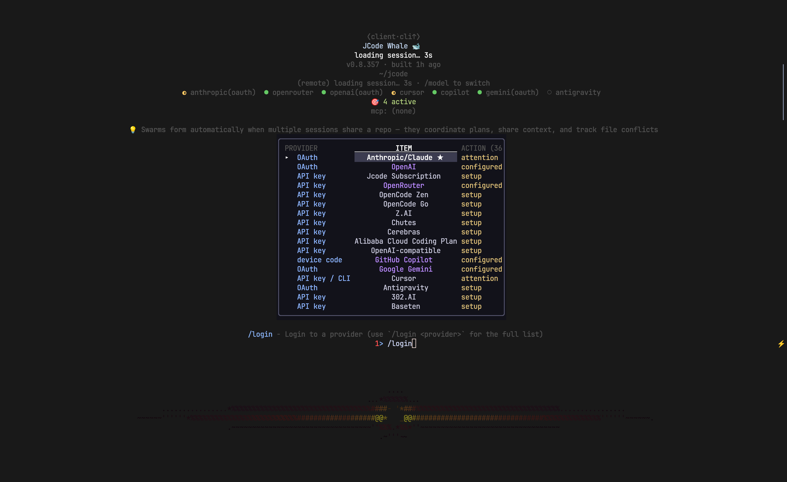
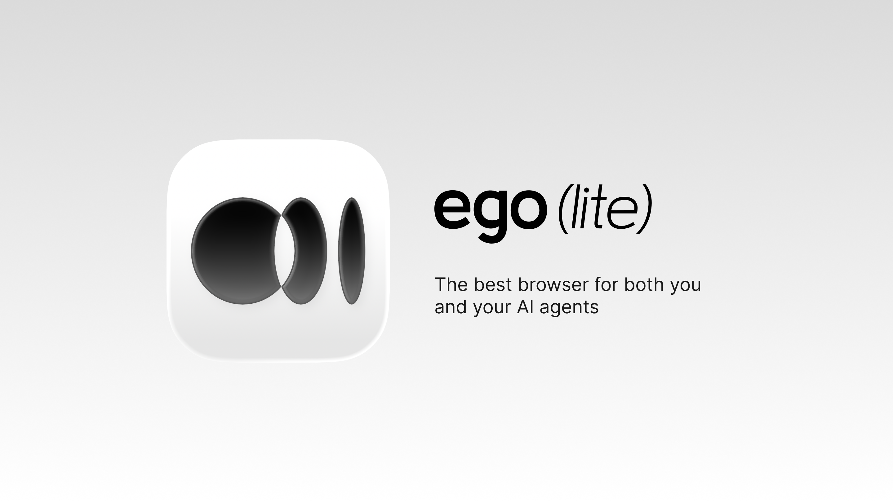
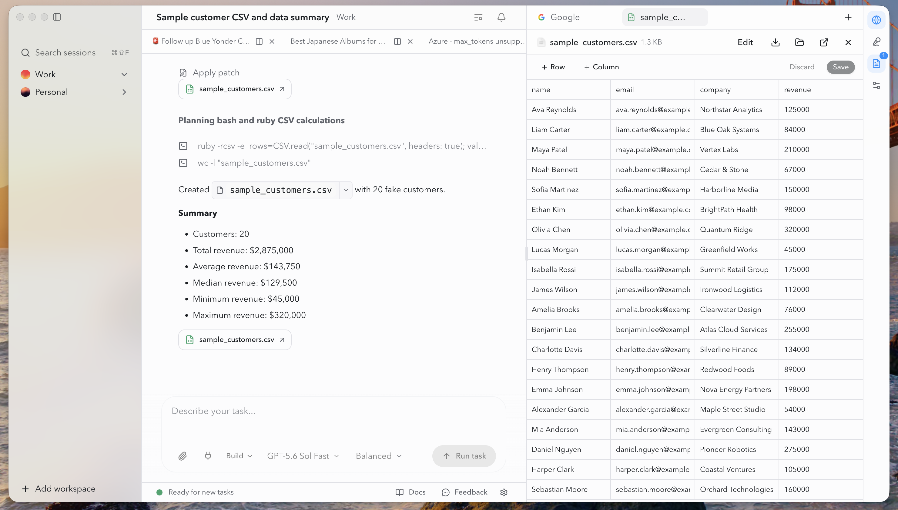
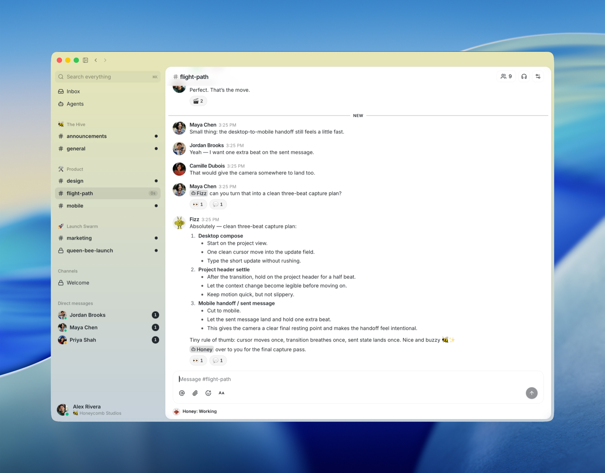
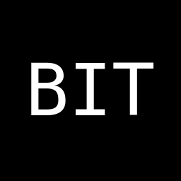
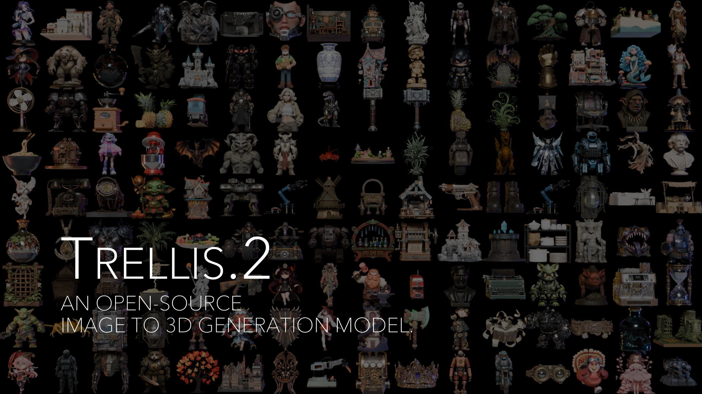

# GitHub 一周热点 · 第 7 期

> 📅 2026-08-03 ｜ 数据来源：GitHub Trending（本周）

> 本期周刊共收录 19 个项目。AI 领域以 AI 代理开发框架和编码工具为主，涉及自动化代码审查与技能生成；开发工具方面，涉及自托管协作平台与地理空间分析工具；通信基础设施则关注基于蓝牙网格和 Nostr 协议的去中心化消息应用。

## AI 大模型应用与框架

### [virgiliojr94/book-to-skill](https://github.com/virgiliojr94/book-to-skill)

- ⭐ 累计 Star：15,369
- 🔥 本周新增 Star：5,223
- 💻 Python

一个 Python 工具，能将技术书籍、文档或文件夹（如 PDF、EPUB）转换为结构化的 AI 代理技能。它提取内容并生成如 SKILL.md 的结构化文件，以便在 GitHub Copilot CLI、Amp 或 Claude Code 中按需加载，避免直接注入整本书带来的 token 浪费和幻觉问题。

**简单说：** 它就像一个智能“笔记整理器”，把技术书变成 AI 能快速理解和调用的卡片，让你在写代码时能直接问 AI 相关内容，而不用担心它胡说八道。

`#ai-agent` `#knowledge-management` `#technical-books` `#python` `#skills`

### [ayghri/i-have-adhd](https://github.com/ayghri/i-have-adhd)

- ⭐ 累计 Star：15,698
- 🔥 本周新增 Star：5,225
- 💻 Python

一个 Claude Code 插件，通过 10 条规则使编码代理的输出更直接、行动优先，采用 ADHD 友好的风格。它致力于避免冗长的回答，直接给出解决方案和下一步操作。

**简单说：** 它解决的是 AI 编码助手回答太啰嗦、不直接的问题，让开发者能快速获取关键信息，特别适合需要集中注意力的开发者使用。

`#adhd` `#claude-code` `#claude-skills` `#developer-tools` `#productivity`

### [1jehuang/jcode](https://github.com/1jehuang/jcode)

- ⭐ 累计 Star：15,276
- 🔥 本周新增 Star：3,620
- 💻 Rust
- 🔗 官网：https://jcode.sh

一个用 Rust 编写的高性能 AI 编码代理框架，以极低的内存占用和快速启动著称。它支持自动记忆系统、多代理协作（Swarm）、丰富的终端 UI 功能，并能连接本地（如 Ollama）或远程的 LLM 服务。

**简单说：** jcode 就像一个更轻、更快的 AI 编程助手终端，让你能同时开多个会话而不拖慢电脑，还能自动记住之前的对话内容。

`#ai` `#cli` `#terminal` `#rust` `#llm` `#multi-agent`

### [alibaba/open-code-review](https://github.com/alibaba/open-code-review)

- ⭐ 累计 Star：17,900
- 🔥 本周新增 Star：4,365
- 💻 Go
- 🔗 官网：https://open-codereview.ai

阿里巴巴开源的免费代码审查工具，经过大规模生产环境验证。它采用确定性工程流程与大语言模型代理相结合的混合架构，能够生成精确到行级的审查评论，并内置了多语言安全规则集。

**简单说：** 这个工具通过 AI 自动分析代码变更，检查潜在缺陷和安全问题，就像一个智能代码审查助手，帮助开发者在提交代码前发现问题。

`#code-review` `#agent` `#security` `#go` `#developer-tools`

### [moeru-ai/airi](https://github.com/moeru-ai/airi)

- ⭐ 累计 Star：46,548
- 🔥 本周新增 Star：3,431
- 💻 TypeScript
- 🔗 官网：https://airi.moeru.ai/docs/

一个自托管的 AI 伴侣平台，旨在创建用户自有的数字生命，提供实时语音交互和玩 Minecraft、Factorio 等游戏的能力。它集成了多种 AI 提供商后端，支持 Web、macOS 和 Windows 平台。

**简单说：** 它让开发者可以搭建自己的 AI 虚拟伴侣，像 Neuro-sama 那样能聊天、玩游戏，适合用于直播娱乐或个人助手开发。

`#ai-companion` `#digital-life` `#vtuber` `#typescript` `#webgpu`

### [andrewyng/aisuite](https://github.com/andrewyng/aisuite)

- ⭐ 累计 Star：15,901
- 🔥 本周新增 Star：576
- 💻 Python

一个轻量级 Python 库，旨在为多种生成式 AI 提供商（如 OpenAI、Anthropic、Google）提供统一的聊天补全接口。它原生集成了 MCP 协议，并提供高级 Agents API 用于构建工具调用和代理系统。

**简单说：** aisuite 解决了开发者需要同时使用多个 AI 服务提供商时接口不统一的问题，通过一个通用库简化代码编写。

`#llm` `#python` `#chat-completions` `#agents` `#mcp`

### [citrolabs/ego-lite](https://github.com/citrolabs/ego-lite)

- ⭐ 累计 Star：7,678
- 🔥 本周新增 Star：3,582
- 💻 JavaScript
- 🔗 官网：https://lite.ego.app

专为 AI 代理设计的浏览器自动化工具，允许用户与 AI 代理（如 Codex 或 Claude Code）共享登录状态，并行工作而不互相干扰。它通过独立空间实现任务隔离，并提供高质量页面快照。

**简单说：** 它解决了 AI 代理操作浏览器时与用户争抢标签页的问题，让开发者能用同一个浏览器让代理自动执行网页任务，自己继续正常使用。

`#ai-agent` `#browser` `#automation` `#codex` `#claude-code`

### [pingdotgg/t3code](https://github.com/pingdotgg/t3code)

- ⭐ 累计 Star：16,349
- 🔥 本周新增 Star：1,431
- 💻 TypeScript
- 🔗 官网：https://t3.codes

一个 AI 代理控制面，通过移动、Web 和桌面应用提供对 Claude Code、Codex 等代理的统一控制，支持远程访问和多代理管理。项目处于早期阶段，旨在为开发者提供更好的代理开发体验。

**简单说：** 它让开发者可以用手机或另一台电脑远程控制和管理多个 AI 编程代理，集中操作不同的编程工具。

`#ai-agent` `#control-surface` `#remote-access` `#development-tools`

### [diegosouzapw/OmniRoute](https://github.com/diegosouzapw/OmniRoute)

- ⭐ 累计 Star：37,913
- 🔥 本周新增 Star：7,141
- 💻 TypeScript
- 🔗 官网：https://omniroute.online

一个免费的 MIT 许可 AI 网关，通过单一端点整合了 290 多个 AI 服务提供商和 500 多个模型。它具备配额感知自动回退功能以避免限额耗尽，并使用压缩技术节省令牌成本。

**简单说：** 这个项目就像一个智能路由器，当你的 AI 编码工具遇到某个服务额度用完或故障时，会自动切换到其他可用模型，让你不用中断工作。

`#ai-gateway` `#llm-gateway` `#token-saver` `#claude` `#openai`

### [different-ai/openwork](https://github.com/different-ai/openwork)

- ⭐ 累计 Star：20,324
- 🔥 本周新增 Star：2,925
- 💻 TypeScript
- 🔗 官网：https://openworklabs.com

一款免费、开源的桌面应用，旨在分享和复用 AI 工作流，是 Claude Cowork 的开源替代品。它通过 MCP 协议，允许用户在 Codex、Claude Code、Cursor 等不同的 AI 智能体之间共享技能、插件和已连接的服务。

**简单说：** 它解决的核心问题是如何在不同的 AI 开发工具之间，方便地共享和复用一套已经配置好的技能或工作流，就像一个“技能包”可以安装到各种工具里。

`#AI` `#MCP` `#desktop-app` `#workflow-sharing` `#open-source`

### [earthtojake/text-to-cad](https://github.com/earthtojake/text-to-cad)

- ⭐ 累计 Star：12,524
- 🔥 本周新增 Star：2,063
- 💻 JavaScript
- 🔗 官网：https://www.texttocad.dev

一个面向 CAD、CAE 和 CAM 的代理技能库，旨在通过 AI 代理自动化硬件设计流程。它支持从自然语言或图像请求生成 CAD 模型，并提供 STEP、STL 等格式导出。

**简单说：** 它让 AI 代理能用文字命令创建 3D 模型，就像给设计师配了个智能助手，帮助快速将想法变成工程文件。

`#cad` `#ai-agents` `#robotics` `#text-to-cad` `#mechanical-engineering`

## 开发工具与平台

### [block/buzz](https://github.com/block/buzz)

- ⭐ 累计 Star：21,111
- 🔥 本周新增 Star：8,217
- 💻 Rust

一个基于 Nostr 协议的自托管工作区，允许人类和 AI 代理在同一个环境中协作。它提供频道、线程、媒体评论和 Git 事件集成，所有交互通过签名事件记录在单一日志中，确保可审计性。

**简单说：** Buzz 是一个让团队和 AI 代理在同一空间工作的协作平台，解决了工具分散的问题，主要用于软件开发团队进行日常协作和自动化任务。

`#nostr` `#rust` `#self-hosted` `#ai-agents` `#collaboration` `#git`

### [opengeos/GeoLibre](https://github.com/opengeos/GeoLibre)

- ⭐ 累计 Star：4,980
- 🔥 本周新增 Star：2,933
- 💻 TypeScript
- 🔗 官网：https://geolibre.app

一个轻量级、云原生的 GIS 平台，用于可视化、探索和分析地理空间数据。它内置超过 1000 个地理处理工具，全部在浏览器中通过 WebAssembly 运行，支持 Web、桌面、移动和 Jupyter 环境。

**简单说：** GeoLibre 让开发者能像使用在线地图工具一样，在浏览器里直接处理复杂的地理数据分析，数据不离开本地电脑。

`#geospatial` `#gis` `#webassembly` `#tauri-app` `#data-science`

### [pascalorg/editor](https://github.com/pascalorg/editor)

- ⭐ 累计 Star：20,748
- 🔥 本周新增 Star：3,163
- 💻 TypeScript
- 🔗 官网：https://editor.pascal.app

一个基于 React Three Fiber 和 WebGPU 的 3D 建筑编辑器，用于在浏览器中创建和分享建筑项目。它采用 Turborepo 单体仓库架构，使用节点系统和渲染器高效处理建筑元素的几何生成和交互操作。

**简单说：** 这个项目让开发者和设计师能在网页上直接构建和编辑 3D 建筑模型，类似一个在线的、可定制的建筑工具。

`#3D` `#architecture` `#webgpu` `#react-three-fiber` `#editor` `#plugin`

## 通信基础设施

### [permissionlesstech/bitchat](https://github.com/permissionlesstech/bitchat)

- ⭐ 累计 Star：34,157
- 🔥 本周新增 Star：4,942
- 💻 Swift

一款去中心化点对点消息应用，采用蓝牙网格网络进行离线通信和 Nostr 协议实现全球覆盖的双传输架构。它支持端到端加密、基于位置的地理频道和 IRC 风格命令，无需账户或中央服务器。

**简单说：** BitChat 解决了在没有网络或需要私密聊天时仍能通信的问题，类似于一个无服务器的、注重隐私的群聊工具。

`#bluetooth` `#decentralized` `#messaging` `#mesh-network` `#nostr` `#swift`

### [permissionlesstech/bitchat-android](https://github.com/permissionlesstech/bitchat-android)

- ⭐ 累计 Star：7,259
- 🔥 本周新增 Star：928
- 💻 Kotlin

bitchat 的 Android 原生应用，同样采用蓝牙 Mesh 和 Nostr 协议的双传输架构。它在离线状态下通过蓝牙 Mesh 网络实现多设备间聊天，支持多跳中继；在线时通过 Nostr 进行全球通信，并提供基于地理坐标的频道。

**简单说：** 这是 BitChat 的安卓版，功能类似，让你在没有互联网时也能靠设备间蓝牙互相发消息，同时也能连接全球网络。

`#decentralized` `#peer-to-peer` `#messaging` `#nostr` `#bluetooth-mesh` `#kotlin`

## 3D 生成与可视化

### [microsoft/TRELLIS.2](https://github.com/microsoft/TRELLIS.2)

- ⭐ 累计 Star：10,166
- 🔥 本周新增 Star：1,106
- 💻 Python

微软开发的一个参数量达 40 亿的大型 3D 生成模型，专注于从单张图像生成高保真、带完整 PBR 材理的 3D 资产。它采用创新的 O-Voxel 稀疏体素结构，能处理复杂拓扑并支持高分辨率生成。

**简单说：** 这个项目就像一个智能的 3D 建模助手，你给它一张图片，它就能自动生成对应的高质量 3D 模型，适合游戏开发、虚拟现实等场景。

`#3D生成` `#图像到3D` `#PBR材料` `#稀疏体素` `#大型模型`

## 学习资源与文档

### [microsoft/AI-For-Beginners](https://github.com/microsoft/AI-For-Beginners)

- ⭐ 累计 Star：59,063
- 🔥 本周新增 Star：5,601
- 💻 Jupyter Notebook

一个由微软提供的 12 周、24 课 AI 入门课程，涵盖神经网络、深度学习、计算机视觉、自然语言处理和 AI 伦理等内容。课程通过 Jupyter Notebook 提供交互式学习，并支持多语言。

**简单说：** 这是一个免费的 AI 入门教程，教你从零开始系统学习人工智能，适合对 AI 感兴趣但不知如何入门的开发者或学生。

`#ai` `#deep-learning` `#machine-learning` `#tutorial` `#microsoft`

### [bojieli/ai-agent-book](https://github.com/bojieli/ai-agent-book)

- ⭐ 累计 Star：29,937
- 🔥 本周新增 Star：9,298
- 💻 Python

开源书籍《深入理解 AI Agent：设计原理与工程实践》的主仓库，提供全书正文、编译版 PDF 及按章配套的 95 个实验代码。全书围绕“Agent = LLM + 上下文 + 工具”展开，系统性讲解从基础原理到生产实践的设计。

**简单说：** 这其实是一本带完整实验代码的 AI Agent 教科书，专门给想要深入理解并动手实践如何构建 AI Agent 的开发者和研究者使用。

`#ai-agent` `#book` `#context-engineering` `#mcp` `#rag` `#coding-agent`
