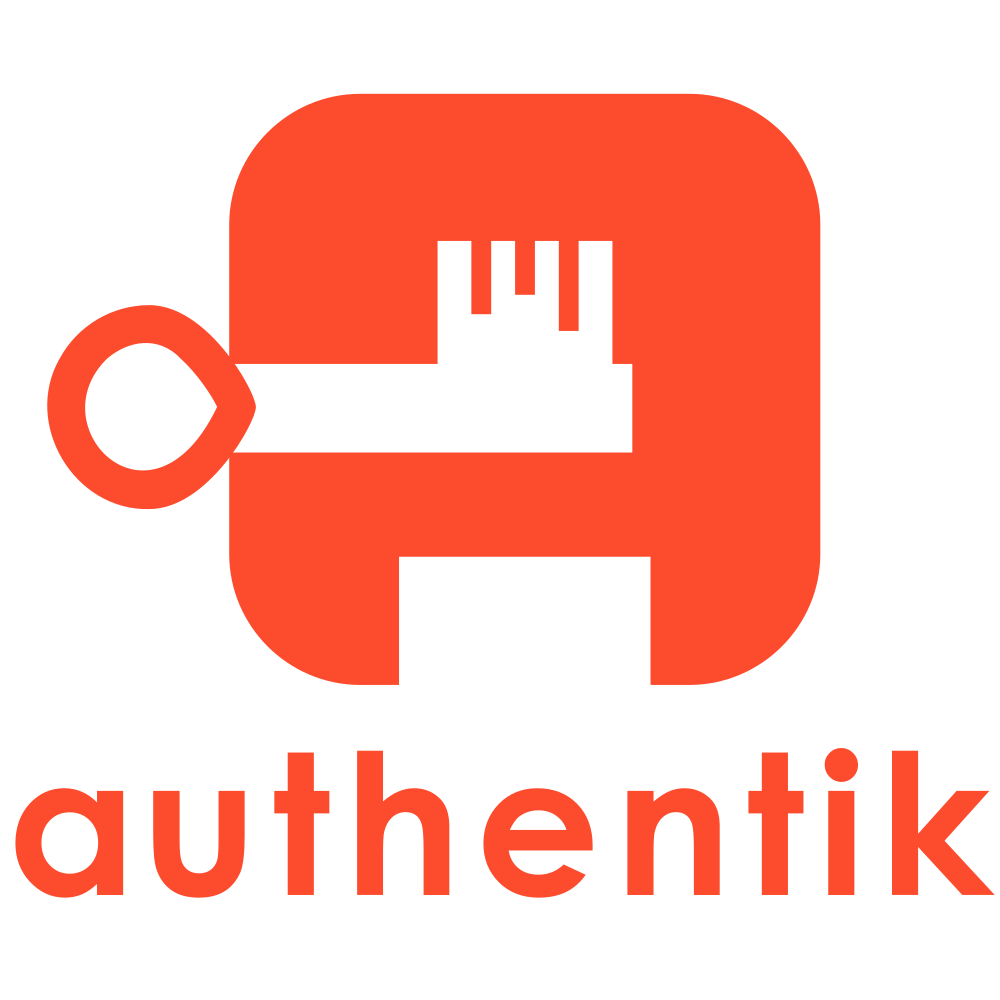
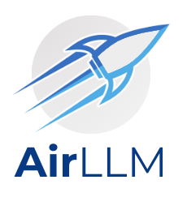
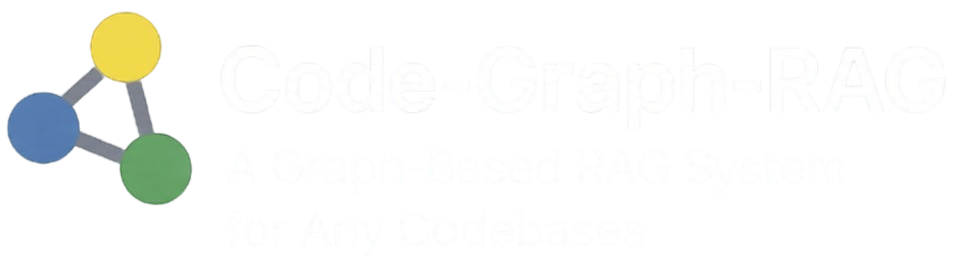
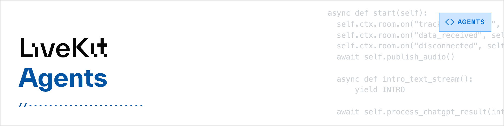
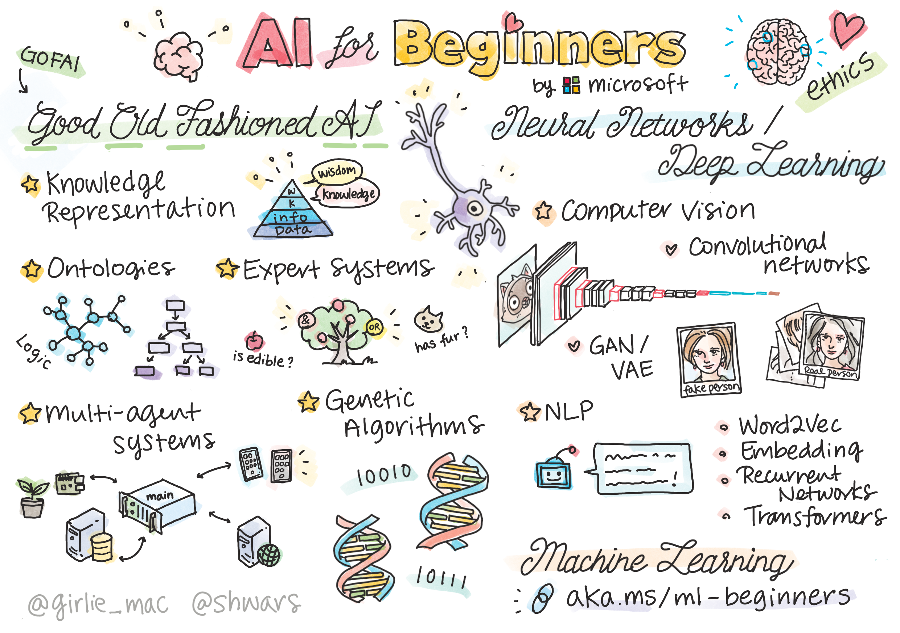

# GitHub 一周热点 · 第 8 期

> 📅 2026-08-10 ｜ 数据来源：GitHub Trending（本周）

> 本期周刊共收录 18 个项目。AI 领域以代理开发框架和模型优化工具为主，涵盖记忆管理、推理加速和多代理协调；安全与运维方向聚焦网络安全技能和身份认证；开发工具与平台涉及项目管理与数据库设计工具。

## 文档处理与提取

### [firecrawl/pdf-inspector](https://github.com/firecrawl/pdf-inspector)

- ⭐ 累计 Star：13,869
- 🔥 本周新增 Star：8,641
- 💻 Rust
- 🔗 官网：https://firecrawl.github.io/pdf-inspector/

pdf-inspector 是一个用 Rust 编写的快速 PDF 处理库，专注于智能分类和文本提取。它能检测 PDF 是文本型还是扫描型，并直接提取文本生成 Markdown，无需 OCR 服务，处理速度通常在 200 毫秒内。支持 Python、Node.js 和 WebAssembly 绑定，适用于需要高效处理大量 PDF 的管道场景。

**简单说：** 这个工具帮助开发者快速判断 PDF 是否可以直接提取文本，避免不必要的 OCR 处理，从而节省时间和费用。特别适合处理报告、论文、财务文档等文本 PDF。

`#pdf` `#pdf-classification` `#pdf-extraction` `#rust` `#markdown` `#text-extraction`

## 安全与运维

### [zhaoxuya520/reverse-skill](https://github.com/zhaoxuya520/reverse-skill)

- ⭐ 累计 Star：22,488
- 🔥 本周新增 Star：9,784
- 💻 PowerShell

reverse-skill 是一个面向 AI 代理的网络安全技能路由包，专为逆向工程、授权渗透测试和安全研究设计。它通过 AI 自动路由机制，将任务引导至正确的方法论、工具链和工作流，避免 AI 盲目尝试命令。支持 Claude Code、Cursor 等多种 AI 编码客户端，适用于 APK 分析、二进制逆向、CTF 挑战、渗透测试等 20 多种安全场景。

**简单说：** 这个工具就像给 AI 助手装了一个安全任务导航系统，让它知道面对不同漏洞或逆向问题时该用哪个工具和方法，避免瞎猜。主要用在安全研究、渗透测试或 CTF 比赛中，帮助开发者或安全工程师提高效率。

`#reverse-engineering` `#penetration-testing` `#security` `#AI-routing` `#tools` `#cybersecurity`

### [goauthentik/authentik](https://github.com/goauthentik/authentik)

- ⭐ 累计 Star：24,271
- 🔥 本周新增 Star：1,579
- 💻 Python
- 🔗 官网：https://goauthentik.io

authentik 是一个开源身份提供者，专注于单点登录（SSO），支持多种认证协议如 SAML、OAuth2 和 OIDC。它设计用于自托管，从小型测试环境到大规模生产集群都能部署。适用于需要替换现有 IdP 或实现统一认证的团队。

**简单说：** 它就像是一个‘登录中心’，让多个应用共享同一个账号系统，用户只需登录一次，适合管理多个服务的公司或团队。

`#sso` `#authentication` `#oauth2` `#oidc` `#saml` `#security`

## AI 大模型应用

### [TencentCloud/TencentDB-Agent-Memory](https://github.com/TencentCloud/TencentDB-Agent-Memory)

- ⭐ 累计 Star：18,752
- 🔥 本周新增 Star：8,003
- 💻 TypeScript

TencentDB Agent Memory 是一个面向 AI Agents 的团队级记忆中枢，将对话、文档和代码转化为可重用的记忆资产，包括 Chat Memory、Skill、Wiki 和 CodeGraph。它通过 Memory Hub 实现记忆资产的治理、共享和跨框架装备，支持自动提取、冷启动和精细的权限控制。该项目旨在减少 Agent 重复工作，让团队经验得以积累和传递，适用于需要构建高效、可协作 Agent 团队的开发者和组织。

**简单说：** 这个项目让 AI Agent 能记住并共享之前的工作经验，避免每次新任务都从头学习，主要用于多人多 Agent 协作的开发场景，比如自动化工作流或智能助手构建。

`#agent` `#ai-agent` `#memory` `#llm` `#long-term-memory` `#vector-search`

### [lyogavin/airllm](https://github.com/lyogavin/airllm)

- ⭐ 累计 Star：30,371
- 🔥 本周新增 Star：5,129
- 💻 Jupyter Notebook

AirLLM 是一个开源项目，通过逐层加载技术大幅降低大语言模型的推理内存需求。它允许在单张 4GB 显存 GPU 上运行 70B 参数模型，甚至支持 671B 的 DeepSeek-V3 在约 12GB 显存下运行。该工具兼容 Llama、Qwen 等主流模型，无需量化或蒸馏，适用于资源有限的开发者在消费级硬件上实验或部署大模型。

**简单说：** 它让昂贵的大语言模型能在普通电脑的显卡上跑，就像把大文件拆成小块逐个加载一样，解决了显存不足导致无法运行大模型的问题。没有高端 GPU 的开发者或小团队可以用它来快速测试或应用大模型。

`#llm` `#open-source` `#generative-ai` `#llama` `#inference` `#optimization`

### [esengine/DeepSeek-Reasonix](https://github.com/esengine/DeepSeek-Reasonix)

- ⭐ 累计 Star：33,442
- 🔥 本周新增 Star：4,709
- 💻 Go
- 🔗 官网：http://reasonix.io/

DeepSeek-Reasonix 是一个专为 DeepSeek 设计的 AI 编码代理，可在终端中长时间运行。它采用配置驱动架构，支持多模型和插件扩展，并具有缓存感知的上下文维护功能，以提升运行稳定性。开发者可以通过 CLI、桌面应用或编辑器集成等多种界面来使用，以自动化代码编写和调试任务。

**简单说：** 这是一个可以在终端里运行的 AI 编程助手，专门帮开发者写代码，就像一个能长时间工作的编程伙伴，能理解上下文并自动执行任务。

`#ai-coding` `#coding-agent` `#deepseek` `#cli` `#llm` `#prompt-caching`

### [virgiliojr94/book-to-skill](https://github.com/virgiliojr94/book-to-skill)

- ⭐ 累计 Star：19,435
- 🔥 本周新增 Star：4,121
- 💻 Python

该项目是一个将技术书籍、文档或来源材料转换为 AI 代理技能的工具。它通过提取和生成结构化文件，如 SKILL.md 和章节文件，使 AI 助手能按需加载内容，减少 token 使用并避免幻觉。适用于使用 GitHub Copilot CLI、Amp 或 Claude Code 的开发者，方便在工作中高效参考技术资料。

**简单说：** 这个工具把你的技术书或文档变成 AI 助手可以随时查看的智能摘要，这样你就不用每次都让 AI 从头读整本书或担心它瞎猜了。适合经常需要翻阅技术资料的程序员或团队使用。

`#Agent Skills` `#PDF` `#AI` `#Documentation` `#Python`

### [google/skills](https://github.com/google/skills)

- ⭐ 累计 Star：17,221
- 🔥 本周新增 Star：1,626
- 💻 Python

这是 Google 官方维护的 Agent 技能仓库，提供针对 Google 产品和技术的预构建技能模块。技能涵盖 Google Cloud 入门、AI/ML 平台管理、基础设施配置等多个领域，开发者可以通过 npm 命令快速安装。该仓库旨在帮助用户在 AI 代理中高效集成和使用 Google 服务。

**简单说：** 它就像一个技能包，开发者安装后可以让 AI 代理轻松操作 Google 云服务，比如部署应用或管理数据，从而省去从零编写代码的麻烦。主要面向那些在开发 AI 代理或需要简化 Google Cloud 操作的程序员。

`#google` `#googlecloud` `#skills` `#agent` `#cloud` `#ai`

### [unclebob/swarm-forge](https://github.com/unclebob/swarm-forge)

- ⭐ 累计 Star：2,051
- 🔥 本周新增 Star：562
- 💻 Clojure

SwarmForge 是一个基于 tmux 的轻量级协调平台，用于将多个 AI 代理组织成可靠的软件工程团队。它通过配置文件定义角色和工作流，使用 git 工作树隔离工作，并支持 Codex、Claude 等多种 AI 后端。该平台提供从快速编码到完整规范的多种工作流模式，适用于需要多代理协作的本地开发项目。

**简单说：** SwarmForge 让多个 AI 代理能在同一项目中协作开发，通过 tmux 和 git 分离工作，避免互相干扰。它适合使用 AI 工具进行软件开发的程序员，简化多代理协调。

`#AI agents` `#orchestration` `#tmux` `#git` `#software engineering` `#multi-agent`

### [Comfy-Org/ComfyUI](https://github.com/Comfy-Org/ComfyUI)

- ⭐ 累计 Star：125,504
- 🔥 本周新增 Star：2,018
- 💻 Python
- 🔗 官网：https://www.comfy.org/

ComfyUI 是一个模块化的扩散模型 GUI、API 和后端，支持节点式工作流构建。它兼容多种 AI 加速硬件，如 Ascend NPUs 和 Cambricon MLUs，并提供 ComfyUI-Manager 扩展来管理自定义节点。项目支持多种开源和闭源扩散模型，可本地或云端运行，并通过 API 集成到生产流程中，适用于构建图像、视频、3D 和音频生成工作流。

**简单说：** ComfyUI 让用户通过连接可视化节点来搭建 AI 内容生成流程，就像用积木拼图一样，解决了内容创作中需要自定义参数和工作流的问题，适合设计师、艺术家和开发者使用。

`#ai` `#comfyui` `#stable-diffusion` `#image-generation` `#workflow` `#python`

### [vitali87/code-graph-rag](https://github.com/vitali87/code-graph-rag)

- ⭐ 累计 Star：2,979
- 🔥 本周新增 Star：236
- 💻 Python
- 🔗 官网：https://code-graph-rag.com

Code-Graph-RAG 是一个基于 AI 的检索增强生成系统，专为多语言 monorepo 设计。它使用 Tree-sitter 解析代码库，将结构关系构建为知识图谱并存储在 Memgraph 中，支持用户通过自然语言查询、编辑和优化代码。系统兼容 Python、TypeScript 等多种语言，并作为 MCP 服务器提供集成，适用于需要高效代码理解和维护的开发者。

**简单说：** 它就像一个智能代码助手，能读懂整个代码库的结构，让你用日常语言提问或修改代码，特别适合管理大型或多语言项目的开发团队。

`#ai` `#rag` `#knowledge-graph` `#code-analysis` `#multi-language` `#mcp`

### [livekit/agents](https://github.com/livekit/agents)

- ⭐ 累计 Star：12,819
- 🔥 本周新增 Star：1,138
- 💻 Python
- 🔗 官网：https://docs.livekit.io/agents

LiveKit Agents 是一个开源的 Python 框架，专为构建能够实时交互的语音 AI 代理而设计。它集成了语音识别、大语言模型和语音合成等技术，支持语音、视频和文本等多模态通信。框架提供灵活的组件配置、内置的任务调度和测试工具，适用于开发者快速搭建智能语音助手或客服系统。

**简单说：** 这个框架让开发者可以轻松创建能通过语音、视频和文本与用户实时交流的 AI 代理，比如智能客服或语音助手。

`#agents` `#ai` `#real-time` `#voice` `#video` `#openai`

### [embabel/embabel-agent](https://github.com/embabel/embabel-agent)

- ⭐ 累计 Star：4,058
- 🔥 本周新增 Star：195
- 💻 Kotlin
- 🔗 官网：https://hub.embabel.com

Embabel Agent Framework 是一个专为 JVM 设计的 AI 代理框架，允许开发者通过注解或 Kotlin DSL 定义代理流程，将大语言模型提示与代码和领域模型无缝集成。它采用基于目标的智能规划算法（如 GOAP），支持动态决策、扩展性和强类型，并构建在 Spring 生态之上，适用于 Java 和 Kotlin 开发者构建企业级代理应用。

**简单说：** 它帮助 Java/Kotlin 开发者更容易构建能自主决策的 AI 应用，例如自动完成任务或智能交互，就像在游戏 AI 中使用的规划算法，但用于企业软件开发。

`#agent` `#ai-agents` `#java` `#kotlin` `#spring` `#llms`

## 开发工具与平台

### [usekaneo/kaneo](https://github.com/usekaneo/kaneo)

- ⭐ 累计 Star：7,896
- 🔥 本周新增 Star：1,952
- 💻 TypeScript
- 🔗 官网：https://kaneo.app/

Kaneo 是一个开源项目管理工具，旨在通过简洁设计和高效性能帮助团队专注于实际工作。它强调“少即是多”，提供清晰界面、自托管能力和快速部署支持。工具内置 MCP 集成，允许 AI 工具管理任务，适合寻求 Jira 或 Linear 替代品的开发者团队。

**简单说：** Kaneo 就像一个轻量版的 Jira 或 Linear，让团队不用被复杂工具拖累，而是专心搞开发。开发者可以通过 Docker 或 Kubernetes 自己部署，数据完全自主控制。

`#project-management` `#self-hosted` `#typescript` `#react` `#kanban` `#issue-tracker`

### [drawdb-io/drawdb](https://github.com/drawdb-io/drawdb)

- ⭐ 累计 Star：38,632
- 🔥 本周新增 Star：331
- 💻 JavaScript
- 🔗 官网：https://drawdb.app

DrawDB 是一个免费、简单、直观的在线数据库模式编辑器和 SQL 生成器。用户可以在浏览器中通过点击创建实体关系图，支持导出 SQL 脚本和生成迁移，无需注册账户。项目基于 JavaScript 和 React 构建，提供本地开发和 Docker 部署选项。

**简单说：** DrawDB 让开发者在浏览器中拖拽绘制数据库关系图，并自动生成 SQL 代码，省去手动编写建表语句的麻烦，适合快速设计和团队协作。

`#database-schema` `#diagram-editor` `#sql` `#erd` `#javascript` `#react`

## 学习资源与示例

### [microsoft/AI-For-Beginners](https://github.com/microsoft/AI-For-Beginners)

- ⭐ 累计 Star：64,030
- 🔥 本周新增 Star：5,514
- 💻 Jupyter Notebook

这是微软推出的 AI 初学者课程，设计为 12 周 24 节课的结构化学习路径。课程覆盖 AI 基础、神经网络、计算机视觉、自然语言处理等多个主题，通过 Jupyter Notebook 和 PyTorch、TensorFlow 等框架提供交互式学习。适合初学者，包含实验和测验以巩固知识。

**简单说：** 这是一个免费的 AI 入门教程，教你从零开始学习人工智能，适合对 AI 感兴趣但不知如何入门的开发者或学生。

`#ai` `#deep-learning` `#machine-learning` `#tutorial` `#microsoft` `#jupyter`

### [donnemartin/system-design-primer](https://github.com/donnemartin/system-design-primer)

- ⭐ 累计 Star：362,709
- 🔥 本周新增 Star：2,724
- 💻 Python

这是一个专注于大规模系统设计的学习资源库，旨在帮助开发者掌握系统设计原则并准备技术面试。项目整合了丰富的学习材料，包括设计模式、面试问题及解决方案，并提供 Anki 闪卡辅助记忆。它适用于希望提升架构能力或应对系统设计面试的工程师和程序员。

**简单说：** 它就像一本系统设计的实战手册，帮助程序员在面试中展示设计大型系统的能力，适合准备技术面试的工程师使用。

`#design` `#interview` `#system` `#distributed-systems` `#learning` `#python`

## Web 与客户端应用

### [iv-org/invidious](https://github.com/iv-org/invidious)

- ⭐ 累计 Star：22,544
- 🔥 本周新增 Star：778
- 💻 Crystal
- 🔗 官网：https://invidious.io

Invidious 是一个开源的 YouTube 替代前端，提供无广告、无跟踪的视频观看体验。它使用 Crystal 语言开发，支持自定义主页和订阅管理，无需 JavaScript 即可运行。适用于希望保护隐私或摆脱 Google 生态的用户。

**简单说：** 它就像 YouTube 的‘干净版’，让你看视频时不被广告打扰，也不追踪你的行为，适合不想被谷歌监控的人。

`#youtube` `#video` `#alternative` `#privacy` `#open-source` `#crystal`
