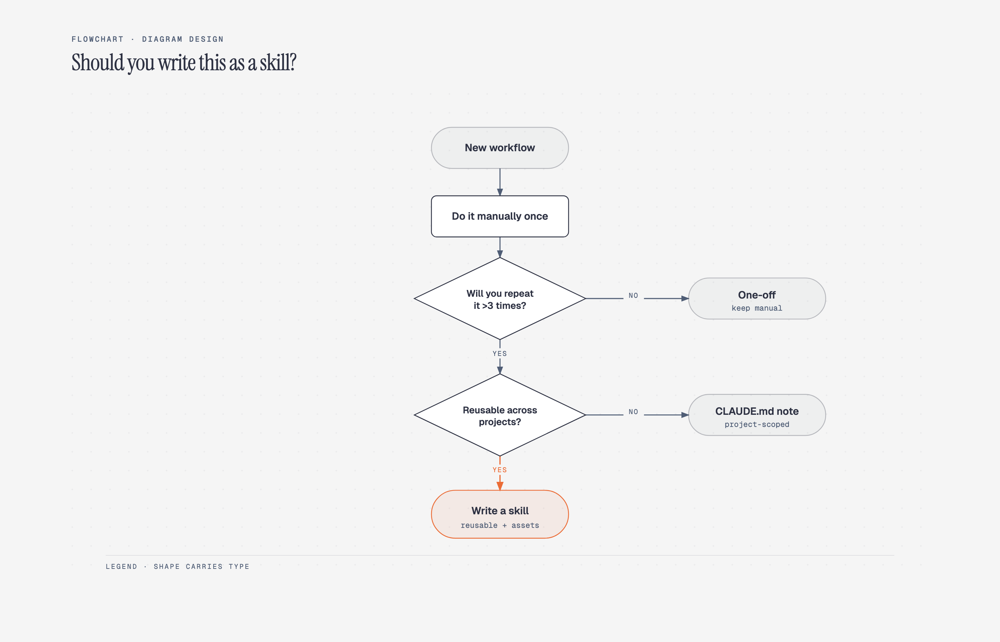
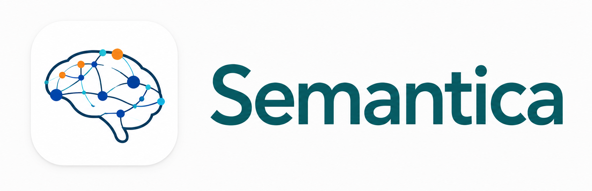
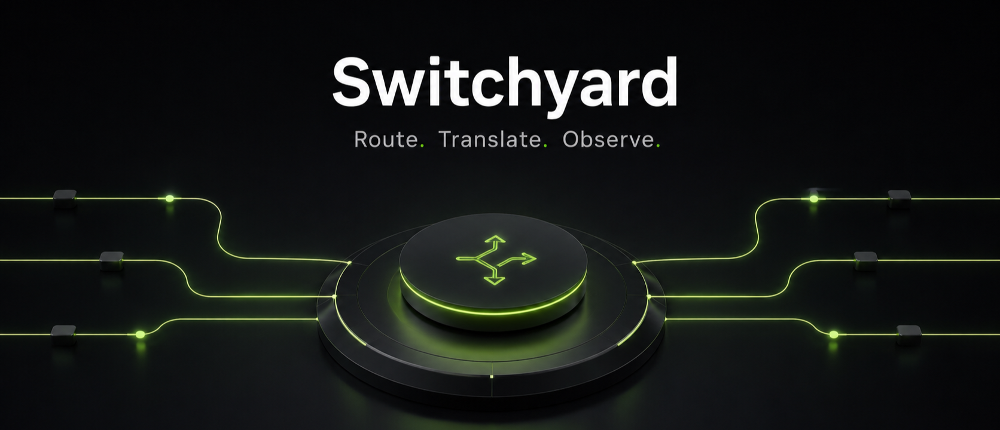
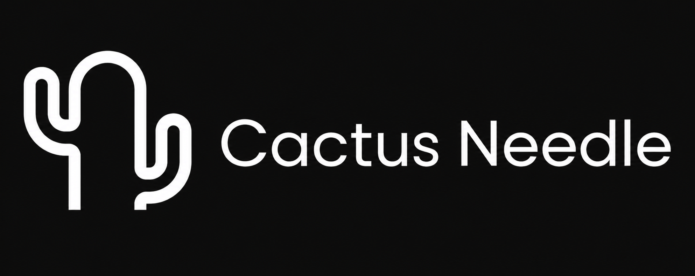
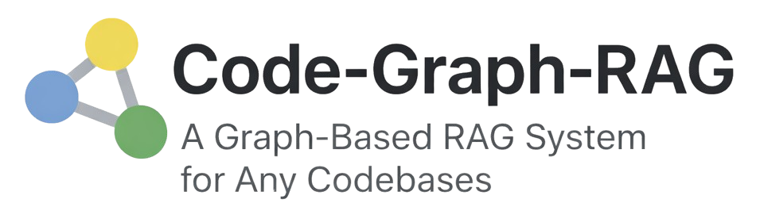
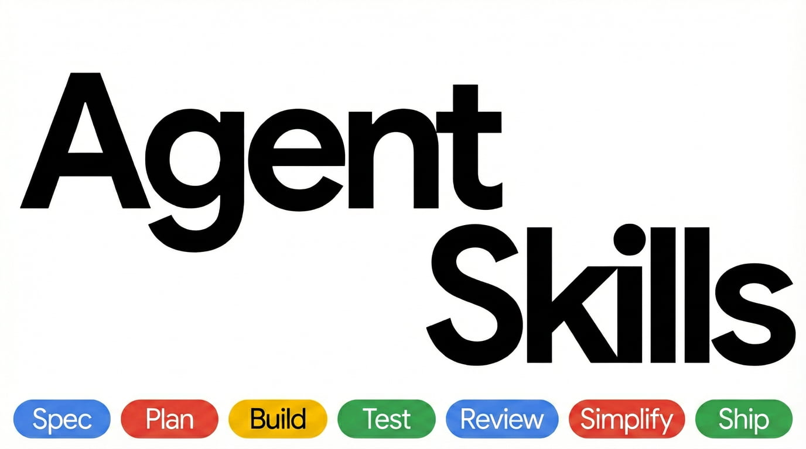
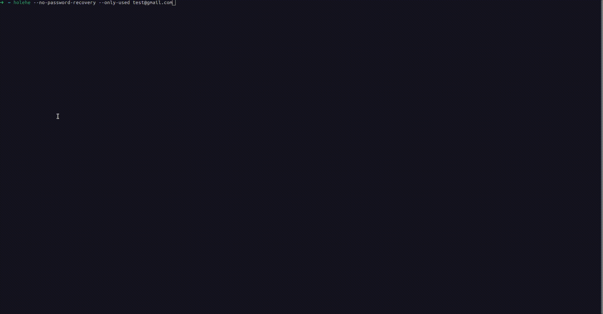
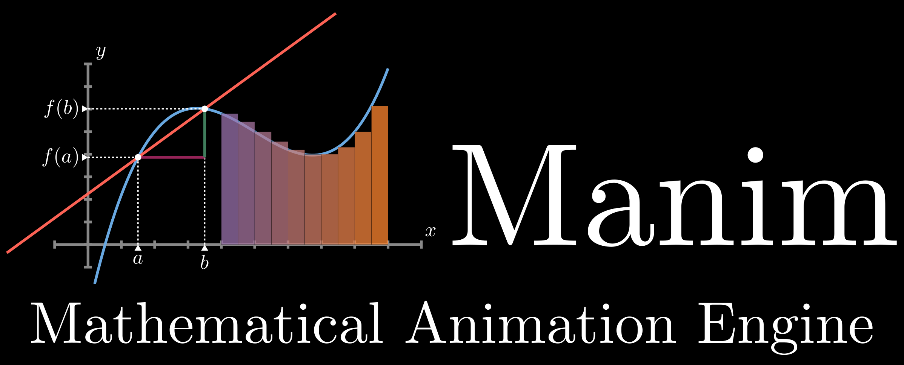

# GitHub 一周热点 · 第 9 期

> 📅 2026-08-17 ｜ 数据来源：GitHub Trending（本周）

> 本期周刊共收录 16 个项目。AI 领域项目主要围绕AI代理框架和大模型工具展开，涉及图表生成、知识图谱和流量路由等方向。开发工具方面，提供了一体化工作平台和低代码解决方案。安全运维方向则聚焦于开源情报工具，用于安全调查。

## AI / 大模型应用

### [cathrynlavery/diagram-design](https://github.com/cathrynlavery/diagram-design)

- ⭐ 累计 Star：19,501
- 🔥 本周新增 Star：14,735
- 💻 HTML

这是一个为 AI 代理（如 Claude Code）设计的图表生成技能，提供 29 种编辑级别的图表类型。它输出自包含的 HTML 和 SVG 文件，支持自动提取网站品牌颜色和字体进行个性化匹配，允许从 draw.io 或 Mermaid 导入并重绘图表，同时确保可访问性支持。

**简单说：** 它解决 AI 生成图表时样式通用、不匹配品牌的问题，让开发者能像设计师一样快速生成美观的图表，适合制作技术文档、演示或博客图表。

`#diagram generation` `#AI agent skill` `#HTML SVG` `#brand matching` `#accessibility` `#draw.io import`

### [semantica-agi/semantica](https://github.com/semantica-agi/semantica)

- ⭐ 累计 Star：8,173
- 🔥 本周新增 Star：5,339
- 💻 Python
- 🔗 官网：https://getsemantica.ai

Semantica 是一个开源的图原生基础设施，专为构建上下文丰富且可问责的 AI 系统而设计。它通过摄取企业数据构建上下文图谱和知识图谱，提供决策智能和确定性推理能力，并内嵌完整的审计溯源功能，适用于金融、医疗等受监管领域。

**简单说：** 它就像给 AI 代理装上了一个可追溯的“记忆本”，让每个决策都有记录和因果链，方便监管人员事后追问，主要用于开发需要审计合规的 AI 应用。

`#ai` `#knowledge-graph` `#explainable-ai` `#decision-intelligence` `#agent-memory` `#ontology`

### [PrimeIntellect-ai/prime-agent](https://github.com/PrimeIntellect-ai/prime-agent)

- ⭐ 累计 Star：16,561
- 🔥 本周新增 Star：8,488
- 💻 TypeScript

Prime Agent 是一个开源的编码和研究代理，专注于长时间运行的自主任务。它基于递归语言模型（RLM）和 Continual Harness 两个核心抽象，提供持久 REPL 环境和可更新的状态管理，支持内置子代理、可执行技能和后台会话。

**简单说：** 它帮助开发者自动化处理编码任务，尤其适合需要连续运行几小时或几天的项目，如代码生成或研究实验，可以类比为一个智能助手。

`#coding-agent` `#autonomous-agent` `#rlm` `#python` `#research`

### [NVIDIA-NeMo/Switchyard](https://github.com/NVIDIA-NeMo/Switchyard)

- ⭐ 累计 Star：1,682
- 🔥 本周新增 Star：1,326
- 💻 Rust

Switchyard 是一个用 Rust 编写的 LLM 流量路由代理，支持在 OpenAI 和 Anthropic API 之间进行协议翻译。它提供多种路由策略，如随机路由和 LLM 分类器路由，允许灵活选择模型后端，适用于跨提供商流量路由、基准测试或成本性能优化。

**简单说：** 它相当于一个智能路由器，让 LLM 应用可以轻松切换不同的模型提供商，同时保持 API 兼容，帮助开发者在不同模型之间做测试或省钱。

`#llm-proxy` `#routing` `#rust` `#api-translation` `#benchmarking`

### [cactus-compute/needle](https://github.com/cactus-compute/needle)

- ⭐ 累计 Star：6,551
- 🔥 本周新增 Star：2,488
- 💻 Python
- 🔗 官网：https://cactuscompute.com

Needle 2 是一个开源的 45M 参数基础模型，专为工具调用、设备使用和结构化数据提取设计。它压缩至 14MB 的单个二进制文件，在约 28MB 的 RAM 中运行完整会话，适用于手机、可穿戴设备等小型设备，支持 Python 包进行推理、LoRA 微调和导出。

**简单说：** 这个项目让开发者能在资源有限的小设备（如手机或智能家居）上运行轻量级 AI 模型，用于自动调用函数和提取结构化数据，就像一个可离线运行的压缩版 AI 助手。

`#on-device-ai` `#llm` `#small-model` `#python` `#edge-computing`

### [vitali87/code-graph-rag](https://github.com/vitali87/code-graph-rag)

- ⭐ 累计 Star：4,428
- 🔥 本周新增 Star：1,756
- 💻 Python
- 🔗 官网：https://code-graph-rag.com

Code-Graph-RAG 是一个针对单体仓库的检索增强生成（RAG）系统，使用 Tree-sitter 解析多语言代码并构建知识图谱。它支持自然语言查询、代码编辑和优化，并可通过 MCP 服务器与 AI 代理集成。

**简单说：** 它帮助开发者快速理解大型代码库，通过 AI 查询代码结构、进行重构或查找死代码，适用于需要维护复杂项目的开发团队。

`#rag` `#knowledge-graph` `#multi-language` `#code-analysis` `#mcp` `#ai`

### [addyosmani/agent-skills](https://github.com/addyosmani/agent-skills)

- ⭐ 累计 Star：87,749
- 🔥 本周新增 Star：3,300
- 💻 JavaScript
- 🔗 官网：https://skills.addy.ie

Agent Skills 是一个为 AI 编程代理提供生产级工程技能的项目。它包含 24 个技能，覆盖软件开发的定义、规划、构建、验证、审查和发布全生命周期，通过斜杠命令激活，确保 AI 代理一致地遵循最佳实践和质量门控。

**简单说：** 它解决 AI 编程代理生成代码时缺乏工程规范的问题，让 AI 代理像高级工程师一样工作，提升代码质量和可靠性。

`#agent-skills` `#claude-code` `#codex` `#cursor` `#engineering-practices` `#ai`

### [unslothai/unsloth](https://github.com/unslothai/unsloth)

- ⭐ 累计 Star：72,554
- 🔥 本周新增 Star：2,207
- 💻 Python
- 🔗 官网：https://unsloth.ai/docs

Unsloth 是一个本地桌面应用，用于运行和训练多种 AI 模型，包括大型语言模型和扩散模型，如 Qwen3.8、DeepSeek-V4 和 FLUX。它提供图形界面和代码两种使用方式，支持加速训练并减少内存占用，兼容多种硬件和远程访问。

**简单说：** 这个工具让你在自己的电脑上轻松运行和训练 AI 模型，比如聊天机器人或图像生成，适合不想依赖云服务或注重隐私的开发者使用。

`#llm` `#fine-tuning` `#ui` `#self-hosted` `#ai` `#image-generation`

### [TencentCloud/TencentDB-Agent-Memory](https://github.com/TencentCloud/TencentDB-Agent-Memory)

- ⭐ 累计 Star：22,227
- 🔥 本周新增 Star：3,956
- 💻 TypeScript

TencentDB Agent Memory 是一个为 AI Agents 设计的团队级记忆中枢。它将对话、文档、代码转化为四种可复用的记忆资产：对话记忆、技能、LLM-Wiki 和代码图谱，这些资产可被统一管理、共享与装备，旨在减少 Agent 团队的重复工作。

**简单说：** 它就像给 AI Agent 团队建了一个共享知识库，解决了“每次和 AI 对话都要从头解释项目背景”这类问题，让团队的经验可以沉淀并复用。

`#agent` `#ai-agent` `#llm` `#memory` `#knowledge-sharing` `#vector-search`

### [Lightricks/LTX-2](https://github.com/Lightricks/LTX-2)

- ⭐ 累计 Star：9,056
- 🔥 本周新增 Star：484
- 💻 Python
- 🔗 官网：https://ltx.io

LTX-2 是一个基于 DiT 架构的音频-视频生成基础模型，能够同步生成高保真的音视频内容。项目提供官方的 Python 推理和 LoRA 训练包，支持多种生成管道，如快速推理、高细节渲染和 HDR 输出。

**简单说：** 它是一个开源 AI 视频生成工具，可以根据文字提示生成同步音视频，类似于 Sora 但开源，适合视频制作人、研究人员和开发者快速创建内容。

`#generative-ai` `#video-generation` `#audio-video` `#python` `#diT`

### [paperclipai/paperclip](https://github.com/paperclipai/paperclip)

- ⭐ 累计 Star：78,503
- 🔥 本周新增 Star：2,430
- 💻 TypeScript
- 🔗 官网：https://paperclip.ing

Paperclip 是一个开源的 AI 代理编排与管理平台，用于组织代理团队运行业务目标。它提供任务管理、组织架构图、预算控制和治理功能，支持心跳执行和工作空间管理，让用户能像管理公司一样协调多个 AI 代理。

**简单说：** 它是一个给 AI 代理团队使用的后台管理工具，把分散的 AI 代理按公司架构组织起来，设定任务、目标和规则，让他们像一个团队一样协作，适合想用 AI 自动化完成工作的个人或小团队。

`#AI agents` `#orchestration` `#task management` `#governance` `#budget control` `#open source`

## 开发工具与平台

### [macro-inc/macro](https://github.com/macro-inc/macro)

- ⭐ 累计 Star：3,404
- 🔥 本周新增 Star：2,434
- 💻 Rust
- 🔗 官网：https://macro.com

Macro 是一个面向团队的一体化工作平台，集成了邮件、聊天、文档、任务、AI 代理、通话和 CRM 功能。它通过 @ 链接和共享 AI 记忆将这些工具连接在一起，形成双向图网络，旨在为团队提供无缝协作体验。

**简单说：** 这个应用把团队常用工具整合在一起，避免在 Slack、Notion 等多个工具间切换，主要帮助初创公司和小型团队简化工作流程，让信息自动关联，提高协作效率。

`#all-in-one` `#ai-agents` `#workspace` `#crm` `#messaging` `#rust`

### [ToolJet/ToolJet](https://github.com/ToolJet/ToolJet)

- ⭐ 累计 Star：40,008
- 🔥 本周新增 Star：1,047
- 💻 JavaScript
- 🔗 官网：https://tooljet.com

ToolJet 是一个开源的低代码平台，专注于快速构建企业内部工具、仪表盘和工作流。它提供可视化拖拽界面、内置数据库，并能连接 80 多种数据源，支持 Docker、Kubernetes 等多种方式自托管，适合需要快速交付内部应用的开发团队。

**简单说：** 当公司需要快速搭建一个内部管理后台或数据看板，但又不想从零开始写前端和后端时，可以使用 ToolJet 来可视化构建，就像用积木拼装应用一样。

`#low-code` `#internal-tools` `#self-hosted` `#ai-app-builder` `#web-development`

## 安全 / 运维

### [megadose/holehe](https://github.com/megadose/holehe)

- ⭐ 累计 Star：13,288
- 🔥 本周新增 Star：1,059
- 💻 Python

Holehe 是一个基于 Python 的开源情报工具，用于检测邮箱在多个网站上的注册状态。它支持超过 120 个平台，如 Twitter 和 Instagram，通过忘记密码功能检索部分恢复信息，设计为不通知目标邮箱，适合安全分析和数字足迹调查。

**简单说：** 这个工具能帮你快速查一个邮箱在哪些网站上注册过账号，比如社交媒体和在线服务，安全研究人员或渗透测试人员常用它来收集目标的数字足迹信息。

`#email` `#osint` `#python` `#social-network` `#information-gathering` `#osint-tools`

## 学习资源 / 示例

### [3b1b/manim](https://github.com/3b1b/manim)

- ⭐ 累计 Star：91,346
- 🔥 本周新增 Star：2,008
- 💻 Python

Manim 是一个 Python 动画引擎，专门用于创建解释性数学视频。它通过代码生成精确动画，支持 LaTeX 和 OpenGL，源自 3Blue1Brown 频道，适合教育工作者和内容创作者使用。

**简单说：** 这是一个软件，让数学老师或科普视频制作者用代码轻松制作动画，像 3Blue1Brown 那样可视化复杂数学概念。

`#animation` `#math-visualization` `#python` `#educational`

## 系统与基础设施

### [basecamp/omarchy](https://github.com/basecamp/omarchy)

- ⭐ 累计 Star：25,359
- 🔥 本周新增 Star：591
- 💻 Shell
- 🔗 官网：https://omarchy.org

Omarchy 是一个由 DHH 设计的美观、现代且固执己见的 Linux 发行版。它预配置了开发工具、终端和主题，并提供详细手册指导设置，目标是简化开发者使用 Linux 的体验。

**简单说：** 这是一个为程序员优化的 Linux 系统，预装了各种工具和主题，开箱即用，省去自己配置的麻烦。

`#linux` `#desktop` `#opinionated` `#developer-tools`
