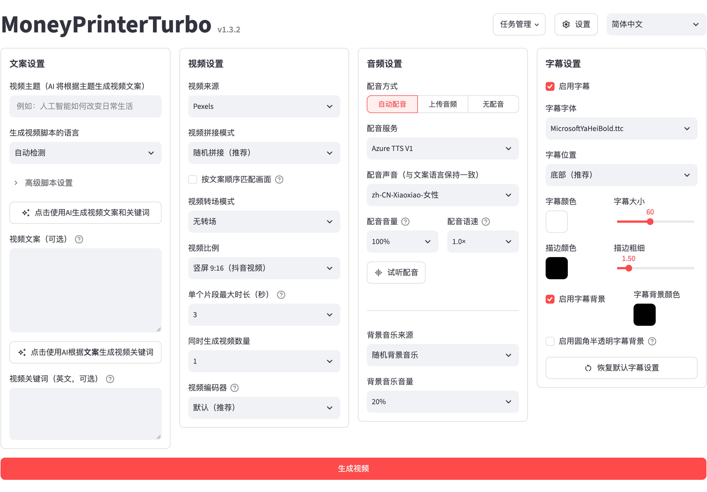
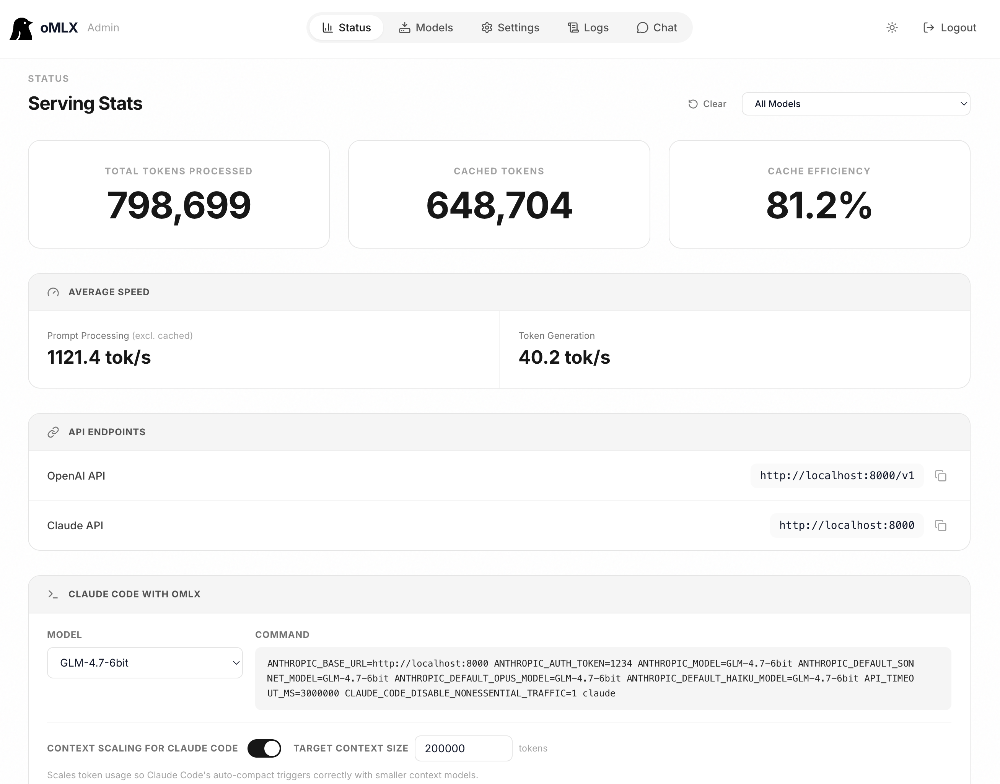

# GitHub 一周热点 · 第 10 期

> 📅 2026-08-24 ｜ 数据来源：GitHub Trending（本周）

> 本期周刊共收录 12 个项目。AI 领域以开发平台和本地推理工具为主，如 Modular Platform 整合了统一开发环境。开发工具方面，项目涵盖 Linux 发行版和硬件定制，例如 omarchy 优化了开发者工作流。AI 代理与工具集成部分，则聚焦于上下文数据库与记忆系统，以支持长期交互。

## AI 应用与开发框架

### [modular/modular](https://github.com/modular/modular)

- ⭐ 累计 Star：28,968
- 🔥 本周新增 Star：2,017
- 💻 Mojo
- 🔗 官网：https://docs.modular.com/

Modular Platform 是一个开源的 AI 开发与部署统一平台，整合了 Mojo 编程语言和 MAX 加速框架。它提供编译器、标准库、加速内核和推理服务器等核心组件，旨在简化 AI 工作流，让开发者能高效地构建和部署模型。

**简单说：** 这是一个为 AI 开发打造的“全家桶”，将编程语言、计算加速和模型部署打包在一起，帮助开发者更方便地构建和运行 AI 程序。

`#AI平台` `#Mojo` `#MAX` `#推理服务`

### [harry0703/MoneyPrinterTurbo](https://github.com/harry0703/MoneyPrinterTurbo)

- ⭐ 累计 Star：115,282
- 🔥 本周新增 Star：10,953
- 💻 Python

一个开源的一站式 AI 短视频生成工具，能根据主题或关键词自动生成视频脚本、匹配素材、生成字幕和背景音乐，并合成高清短视频。它支持多种主流 AI 模型和语音服务，并可一键发布到 TikTok 等社交媒体平台。

**简单说：** 你只需要输入一个主题，它就能帮你自动做好视频、配好音，然后一键发到 TikTok，省去了手动剪辑和找素材的麻烦。

`#AI视频生成` `#内容创作` `#短视频` `#自动化`

### [jundot/omlx](https://github.com/jundot/omlx)

- ⭐ 累计 Star：20,448
- 🔥 本周新增 Star：1,597
- 💻 Python
- 🔗 官网：https://omlx.ai

一个针对 Apple Silicon 优化的 LLM 推理服务器，支持连续批处理和 SSD 缓存以提升性能。它通过 macOS 菜单栏提供图形化管理界面，允许用户方便地在本地 Mac 上运行和管理多种 AI 模型。

**简单说：** 它让你的苹果电脑能轻松地在本地运行和管理大语言模型（如 Llama），通过菜单栏就能操作，性能好还不用花云服务器的钱。

`#Apple Silicon` `#LLM推理` `#macOS` `#本地运行`

### [anthropics/claude-plugins-community](https://github.com/anthropics/claude-plugins-community)

- ⭐ 累计 Star：929
- 🔥 本周新增 Star：341
- 💻 Python

这是 Claude Cowork 和 Claude Code 的官方社区插件市场（只读镜像）。它收录了经过安全审核的社区插件，用于扩展 Claude AI 编程工具的功能，用户可通过官方渠道或命令行安装。

**简单说：** 这是给 Claude 编程工具用的“应用商店”，里面都是社区开发的各种功能插件，都已经过安全检查，可以放心安装使用。

`#插件市场` `#Claude` `#AI编程工具` `#社区贡献`

## AI 代理与工具集成

### [volcengine/OpenViking](https://github.com/volcengine/OpenViking)

- ⭐ 累计 Star：32,475
- 🔥 本周新增 Star：3,447
- 💻 Python
- 🔗 官网：https://openviking.ai/

一个开源的 AI 代理上下文数据库，旨在统一管理代理的记忆、知识和技能。它采用虚拟文件系统存储上下文，支持分层加载以减少 token 消耗，并提供可观察的检索过程，帮助代理在长期交互中高效获取信息。

**简单说：** 它给 AI 代理（比如聊天机器人、自动化助手）配了一个结构化的“记忆库”，让它们能记住之前的事情，并像翻文件一样快速找到相关信息，解决了 AI 易忘的问题。

`#AI代理` `#记忆系统` `#上下文管理` `#RAG`

### [akitaonrails/ai-memory](https://github.com/akitaonrails/ai-memory)

- ⭐ 累计 Star：4,239
- 🔥 本周新增 Star：2,575
- 💻 Rust

一个为 AI 编码代理（如 Claude Code、Codex）提供长期记忆的解决方案。它能捕获会话中的关键信息，生成持久化的 Markdown Wiki，使得在不同 AI 编码工具之间切换时能无缝交接上下文，继续之前的工作。

**简单说：** 它让程序员在使用不同的 AI 编程助手（比如从 Claude 切换到 Codex）时，能自动记住之前聊过什么、做过什么决定，不用从头再解释一遍背景。

`#AI记忆` `#编码代理` `#会话交接` `#上下文共享`

### [apache/maka](https://github.com/apache/maka)

- ⭐ 累计 Star：2,339
- 🔥 本周新增 Star：810
- 💻 TypeScript

Apache 基金会孵化的一个本地优先的 AI 代理工作空间。它在用户的本地计算机上运行 AI 代理，并将所有交互（如模型消息、工具调用）记录为可恢复的追加日志。提供桌面应用、CLI 和评估工具，强调数据私有性。

**简单说：** Maka 让你能在自己的电脑上安全地运行和管理 AI 代理，所有的对话和操作记录都存在本地，不用担心数据泄露到外部。

`#AI代理` `#本地优先` `#运行时` `#数据私有`

## 开发工具与平台

### [basecamp/omarchy](https://github.com/basecamp/omarchy)

- ⭐ 累计 Star：29,104
- 🔥 本周新增 Star：3,151
- 💻 Shell
- 🔗 官网：https://omarchy.org

由 DHH 设计的美观、现代且固执己见的 Linux 发行版。它预配置了适合开发者的工具、终端和主题，并提供详细手册，旨在简化 Linux 的初始设置和使用体验。

**简单说：** 这是一个为程序员“装修”好的 Linux 系统，开箱即有好用的工具和漂亮的主题，省去了自己配置环境的繁琐步骤。

`#Linux` `#桌面系统` `#开发者工具` `#预配置`

### [AprilNEA/OpenLogi](https://github.com/AprilNEA/OpenLogi)

- ⭐ 累计 Star：14,905
- 🔥 本周新增 Star：4,993
- 💻 Rust
- 🔗 官网：https://openlogi.org

一个用 Rust 编写的原生应用，作为罗技 Options+ 的开源替代品。它允许用户通过 HID++ 协议自定义鼠标、键盘和摄像头的设置（如重映射按钮、调整 DPI），强调本地运行和隐私保护，无需账户登录。

**简单说：** 如果你用罗技的鼠标或键盘但讨厌官方软件，这个工具可以让你自由定制设备功能，所有设置都在本地完成，不上传数据，保护隐私。

`#罗技` `#硬件定制` `#开源替代` `#本地优先`

### [cordiverse/cordis](https://github.com/cordiverse/cordis)

- ⭐ 累计 Star：7,235
- 🔥 本周新增 Star：3,364
- 💻 TypeScript
- 🔗 官网：https://deepseek-harness.github.io/deepseek-harness/reference/cordis-primer

一个专注于“时空可组合性”的元框架（Meta-Framework），旨在提供构建模块化和可扩展应用系统的基础设施。

**简单说：** 这是一个用于搭建复杂应用的基础框架，特别关注组件如何随着时间动态组合和变化，适合开发需要高灵活性的系统。

`#元框架` `#模块化` `#可扩展性` `#TypeScript`

### [cursor/plugins](https://github.com/cursor/plugins)

- ⭐ 累计 Star：4,819
- 🔥 本周新增 Star：1,693
- 💻 TypeScript

Cursor 编辑器的官方插件仓库和规范。它定义了插件的开发标准，并提供了一系列官方或认可的插件，用于扩展编辑器的功能，例如集成外部服务、提升生产力等。

**简单说：** 这是 Cursor 这款代码编辑器的“插件中心”，你可以从这里找到并安装各种扩展，让编辑器变得更聪明、更符合你的工作习惯。

`#Cursor` `#编辑器插件` `#开发工具` `#生产力`

## 公共资源

### [public-apis/public-apis](https://github.com/public-apis/public-apis)

- ⭐ 累计 Star：469,193
- 🔥 本周新增 Star：9,381
- 💻 Python
- 🔗 官网：https://APILayer.com/?utm_source=Github&utm_medium=Referral&utm_campaign=Public-apis-repo

一个由社区共同维护和索引的免费公共 API 集合列表。它按类别（如动物、天气、金融）整理了大量 API 资源，并注明了认证方式、HTTPS 支持等信息，方便开发者查找和评估。

**简单说：** 这是一个“API 黄页”，列出了各种免费的公开接口服务，你需要什么功能（比如查天气、汇率），直接在这里搜索就能找到现成的 API。

`#API列表` `#免费资源` `#开发者工具` `#开源`
