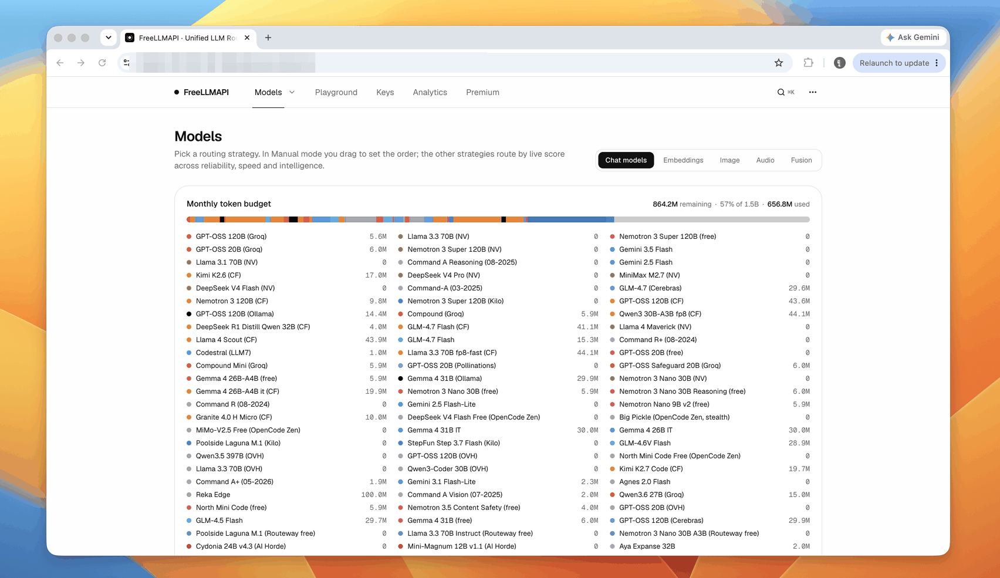
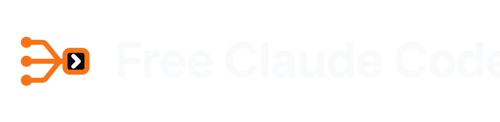
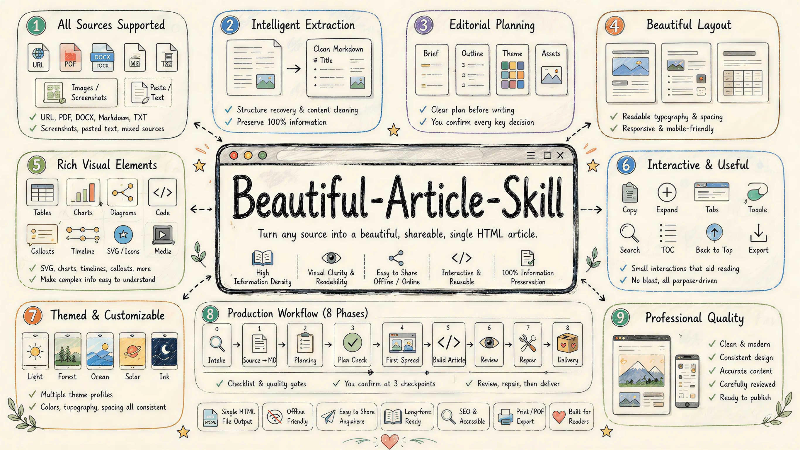
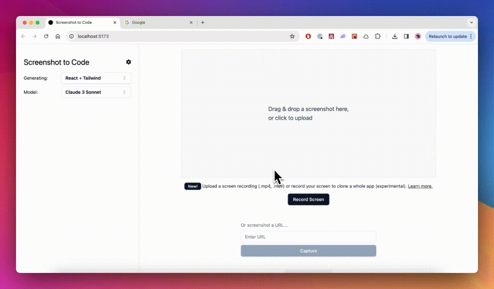

# GitHub 一周热点 · 第 11 期

> 📅 2026-08-31 ｜ 数据来源：GitHub Trending（本周）

> 本期周刊共收录 19 个项目。开发工具领域聚焦于插件生态与代码可视化，例如 Claude 插件市场和 Archify 工具。AI 领域以代理工作空间和模型聚合器为主，如 FreeLLMAPI 提供统一 API 访问。教育方向涵盖 AI 工程课程与互动课堂平台。

## AI / 大模型应用

### [freestylefly/awesome-gpt-image-2](https://github.com/freestylefly/awesome-gpt-image-2)

- ⭐ 累计 Star：25,702
- 🔥 本周新增 Star：13,413
- 💻 JavaScript
- 🔗 官网：https://gpt-image2.canghe.ai

这是一个针对 GPT-Image2 的工业级提示词工程项目，通过逆向分析 500 多个案例，提供了 20 多套结构化模板。项目旨在提升 AI 图像生成的稳定性和可控性，适用于代理和自动化工作流，覆盖 UI、图表、海报等多种场景。

**简单说：** 它是一个提示词代码库，帮助开发者通过标准化模板快速生成一致的图像，适合批量或自动化图像生成场景。

`#ai-image-generation` `#gpt-image-2` `#image-prompts` `#prompt-engineering` `#workflow-automation` `#agents`

### [apache/maka](https://github.com/apache/maka)

- ⭐ 累计 Star：4,202
- 🔥 本周新增 Star：1,973
- 💻 TypeScript

Apache Maka 是一个本地优先的 AI 代理工作空间，将模型消息、工具调用等事件记录为追加日志。它提供桌面应用、CLI 和评估框架，支持多种模型连接和沙箱工具执行，核心是运行时主机处理代理的执行与恢复。

**简单说：** 这是一个在本地运行 AI 代理的平台，所有操作都有记录，方便调试和重复使用，适合 AI 开发者构建和测试代理应用。

`#ai-agent` `#local-first` `#cli` `#desktop` `#event-sourcing` `#llm`

### [tashfeenahmed/freellmapi](https://github.com/tashfeenahmed/freellmapi)

- ⭐ 累计 Star：22,809
- 🔥 本周新增 Star：3,037
- 💻 TypeScript
- 🔗 官网：https://freellmapi.co

FreeLLMAPI 是一个开源 LLM API 聚合器，它聚合了 34 个免费提供商的 635 个模型端点，提供一个统一的 OpenAI 兼容 API 端点。通过智能路由、自动故障转移和加密密钥，简化多提供商管理，每月提供约 7.4 亿 token 的免费推理容量。

**简单说：** 它就像一个免费的 LLM 聚合器，让你用一个 API 访问多个免费模型，避免分别注册的麻烦，适合开发者快速测试 AI 应用。

`#llm` `#api-gateway` `#free-tiers` `#openai-compatible` `#routing` `#typescript`

### [MadsLorentzen/ai-job-search](https://github.com/MadsLorentzen/ai-job-search)

- ⭐ 累计 Star：38,542
- 🔥 本周新增 Star：5,348
- 💻 Python

这是一个基于 Claude Code 的 AI 求职应用框架，运行在本地机器上，旨在自动化求职申请流程。核心功能包括评估职位匹配度、定制简历和求职信、准备面试，通过结构化命令工作。框架编码了职业指导最佳实践，适用于高效管理求职过程。

**简单说：** 它用 AI 帮求职者自动定制简历和求职信，节省手动准备时间，适合想优化求职申请的人使用。

`#ai-agents` `#job-search` `#resume` `#cover-letter` `#interview-preparation` `#career`

### [K-Dense-AI/scientific-agent-skills](https://github.com/K-Dense-AI/scientific-agent-skills)

- ⭐ 累计 Star：39,317
- 🔥 本周新增 Star：4,309
- 💻 Python
- 🔗 官网：https://k-dense.ai

这是一个科学代理技能库，旨在将任何 AI 代理转变为研究助手。它包含 165 个验证过的技能和 100 多个科学数据库，覆盖生物学、化学、医学和药物发现等多个领域。兼容 Cursor、Claude Code 等多种 AI 代理平台，适用于自动化科学计算和数据分析。

**简单说：** 它帮助科学家和研究人员用 AI 自动处理实验数据、文献检索和复杂计算，就像给 AI 装上一套科学工具箱。

`#agent-skills` `#ai-scientist` `#bioinformatics` `#drug-discovery` `#scientific-computing` `#data-analysis`

### [Alishahryar1/free-claude-code](https://github.com/Alishahryar1/free-claude-code)

- ⭐ 累计 Star：51,952
- 🔥 本周新增 Star：4,324
- 💻 Python

Free Claude Code 是一个独立的开源工具，允许用户免费使用 Claude Code、Codex 等 10 种编码代理。它聚合了 50 个提供商，提供每月超过 13 亿免费 tokens，支持从终端、桌面、IDE 或手机访问，具备自动故障转移和语音输入功能。

**简单说：** 这相当于一个免费的 AI 编码助手聚合器，开发者可以用它在 VS Code 或终端里免费获得编程帮助，节省开发成本。

`#coding` `#AI` `#free` `#terminal` `#IDE` `#voice`

### [tinyhumansai/openhuman](https://github.com/tinyhumansai/openhuman)

- ⭐ 累计 Star：39,027
- 🔥 本周新增 Star：2,526
- 💻 Rust
- 🔗 官网：https://tinyhumans.ai/openhuman

OpenHuman 是一个开源的个人 AI 超级智能平台，本地优先设计，旨在为用户提供持久记忆和智能编排能力。它通过记忆树和 Obsidian Wiki 构建用户数据的结构化存储，支持自动同步和集成多种工具。项目能编排代理舰队和可视化工作流，实现复杂任务自动化，并内置深度研究功能。

**简单说：** 它就像一个智能管家，能记住你的所有信息并自动帮你处理任务和研究，适合想拥有私人 AI 的开发者和高级用户。

`#AI` `#local-first` `#memory-system` `#agent-orchestration` `#workflow` `#deep-research`

## 开发工具与平台

### [anthropics/claude-plugins-community](https://github.com/anthropics/claude-plugins-community)

- ⭐ 累计 Star：2,885
- 🔥 本周新增 Star：2,162
- 💻 Python

这是 Claude Cowork 和 Claude Code 的社区插件市场只读镜像，包含经过安全审核和批准的社区贡献插件。用户可以通过命令行安装插件来扩展功能，插件通过官方流程提交和审核，确保安全性和可用性。

**简单说：** 这是一个插件商店，专门给使用 Claude AI 编程工具的用户提供额外功能插件，都是社区开发并经过安全检查的。

`#plugins` `#claude-cowork` `#claude-code` `#marketplace` `#community`

### [tt-a1i/archify](https://github.com/tt-a1i/archify)

- ⭐ 累计 Star：34,757
- 🔥 本周新增 Star：18,103
- 💻 JavaScript
- 🔗 官网：https://tt-a1i.github.io/archify/

Archify 是一个代理技能，用于将代码库或系统描述转换为美观、可验证的交互式图表。它支持架构、工作流、序列、数据流和生命周期五种图表类型，生成独立的 HTML 文件。通过 AI 代理生成类型化 JSON IR，确定性编译并验证图表，适用于系统设计和代码可视化。

**简单说：** 它帮助开发者快速创建专业的系统图表，用于分享架构设计或分析代码流程，无需手动绘图。

`#agent-skills` `#architecture-diagram` `#code-visualization` `#developer-tools` `#system-design` `#diagram-as-code`

### [anthropics/claude-plugins-official](https://github.com/anthropics/claude-plugins-official)

- ⭐ 累计 Star：35,617
- 🔥 本周新增 Star：1,940
- 💻 Python
- 🔗 官网：https://code.claude.com/docs/en/plugins

这是 Anthropic 官方管理的 Claude Code 插件目录，提供高质量插件的集合。用户可以通过插件系统直接安装，插件开发者可以提交内部或外部插件。目录结构标准化，支持插件元数据、MCP 配置等，确保命名不可变以维护兼容性。

**简单说：** 这是一个官方插件商店，让你能轻松找到并安装增强 Claude Code 功能的工具，也方便开发者分享自己的插件。

`#claude-code` `#plugins` `#mcp` `#skills` `#marketplace`

### [cursor/plugins](https://github.com/cursor/plugins)

- ⭐ 累计 Star：6,280
- 🔥 本周新增 Star：1,503
- 💻 TypeScript

这是 Cursor 代码编辑器的官方插件仓库，包含其插件规范和大量预置插件。它提供了从代码开发辅助、团队工作流到第三方服务集成的广泛能力，帮助 Cursor 用户扩展编辑器功能。

**简单说：** 你可以把它想象成 Cursor 编辑器的“官方应用商店”，让你在写代码时就能直接操作 GitHub、日历、邮件等外部工具。

`#cursor-plugins` `#developer-tools` `#productivity` `#integrations` `#mcp` `#agent-workflows`

### [ConardLi/garden-skills](https://github.com/ConardLi/garden-skills)

- ⭐ 累计 Star：11,788
- 🔥 本周新增 Star：1,222
- 💻 CSS
- 🔗 官网：https://github.com/ConardLi/garden-skills

Garden Skills 是一个为 AI 编码代理（如 Claude Code、Cursor）设计的开源技能集合。它包含 Web 视频演示、Web 设计和 GPT 图像生成等多个生产就绪的技能，旨在自动化开发任务，适用于增强 AI 代理功能的前端和 Web 开发者。

**简单说：** 这个项目提供了一套工具，让 AI 编程助手能自动完成网页设计、生成演示文稿或图片，主要帮助使用 AI 工具进行开发的程序员节省时间。

`#agent` `#claude` `#gpt-image-2` `#rag` `#skills` `#web-design`

### [google/googletest](https://github.com/google/googletest)

- ⭐ 累计 Star：39,384
- 🔥 本周新增 Star：441
- 💻 C++
- 🔗 官网：https://google.github.io/googletest/

GoogleTest 是 Google 开源的 C++ 测试框架，集成了测试和模拟功能。它基于 xUnit 架构，支持自动测试发现、丰富断言和参数化测试等特性。适用于 C++ 开发者进行单元测试，被 Chromium、LLVM 等知名项目广泛使用。

**简单说：** 这是一个帮助 C++ 程序员编写和运行自动化测试的工具，就像 JUnit 为 Java 做的那样，能快速验证代码正确性。

`#C++` `#testing` `#unit-testing` `#mocking` `#xunit`

### [abi/screenshot-to-code](https://github.com/abi/screenshot-to-code)

- ⭐ 累计 Star：76,404
- 🔥 本周新增 Star：1,909
- 💻 Python
- 🔗 官网：https://screenshottocode.com

screenshot-to-code 是一个使用 AI 将截图、设计稿或屏幕录像转换为前端代码的工具。它支持多种技术栈，包括 HTML、Tailwind、React 和 Vue，并利用 Gemini、GPT 等模型进行代码生成。用户可以通过上传视觉内容快速获得可工作的代码，适用于前端开发和原型设计。

**简单说：** 这个工具可以让你把网页截图直接变成可用的代码，比如 HTML 或 React 组件，节省了从头写代码的时间。

`#AI` `#代码生成` `#前端开发` `#截图转换`

### [openai/codex](https://github.com/openai/codex)

- ⭐ 累计 Star：120,114
- 🔥 本周新增 Star：5,510
- 💻 Rust

Codex CLI 是 OpenAI 推出的轻量级编程代理，直接在用户终端运行。它可以通过 ChatGPT 账户或 API 密钥使用，提供命令行界面的 AI 编程辅助，适用于开发者在终端中进行编码、调试和任务执行。

**简单说：** 这是一个在命令行里运行的 AI 编程助手，帮你写代码、解决问题，就像在终端里有个智能伙伴一样。

`#CLI` `#编程代理` `#AI` `#终端工具`

## 系统与基础设施

### [AprilNEA/OpenLogi](https://github.com/AprilNEA/OpenLogi)

- ⭐ 累计 Star：17,908
- 🔥 本周新增 Star：3,406
- 💻 Rust
- 🔗 官网：https://openlogi.org

OpenLogi 是用 Rust 编写的本地优先应用程序，作为 Logitech Options+ 的替代品。它支持通过 HID++ 协议自定义罗技鼠标、键盘和摄像头的按钮、DPI 和 SmartShift 等功能，注重隐私，无需账户或遥测，可在 macOS、Linux 和 Windows 上运行。

**简单说：** 它帮助用户摆脱罗技官方软件的臃肿和隐私问题，自由配置罗技外设，尤其是在 Linux 上追求轻量解决方案的用户。

`#logitech` `#rust` `#local-first` `#mouse-remapping` `#privacy` `#hidpp`

## 教育与学习

### [rohitg00/ai-engineering-from-scratch](https://github.com/rohitg00/ai-engineering-from-scratch)

- ⭐ 累计 Star：51,289
- 🔥 本周新增 Star：3,720
- 💻 Python
- 🔗 官网：https://aiengineeringfromscratch.com

这是一个从零开始的 AI 工程学习课程，提供 523 节课和 20 个阶段，系统覆盖数学基础、机器学习、深度学习到自主代理工程。课程以实践驱动，每节课都产出可复用的构件，集成了 AI 辅导工具进行个性化指导，帮助构建生产级 AI 应用。

**简单说：** 这个课程通过动手实践帮助开发者全面学习 AI 工程，从理论原理到实际部署，适合想深入理解 AI 内部机制的程序员。

`#ai` `#ai-engineering` `#course` `#llm` `#agents` `#python`

### [THU-MAIC/OpenMAIC](https://github.com/THU-MAIC/OpenMAIC)

- ⭐ 累计 Star：24,135
- 🔥 本周新增 Star：2,085
- 💻 TypeScript

OpenMAIC 是一个开源 AI 驱动的多智能体互动课堂平台，能将任何主题或文档一键转化为丰富的课程内容，包括幻灯片、测验和互动模拟。平台支持 AI 教师与学生的实时讨论、白板绘画，并可通过多种 LLM 提供商灵活配置使用。

**简单说：** 这个工具帮助教师或内容创作者快速生成在线互动课程，让学生能像在真实课堂中一样与 AI 交互学习。

`#AI` `#教育` `#多智能体` `#互动课堂` `#课程生成` `#TypeScript`

## 其他项目

### [omacom/omarchy](https://github.com/omacom/omarchy)

- ⭐ 累计 Star：35,559
- 🔥 本周新增 Star：6,692
- 💻 Shell
- 🔗 官网：https://omarchy.org

Omarchy 是由 DHH 创建的现代、美观且个人化的 Linux 发行版。它通过详细手册和 CLI 工具，覆盖从基础导航、主题、热键到开发环境、虚拟机等全面配置。适用于追求开箱即用且高度定制化桌面体验的开发者。

**简单说：** 这是一个预装了常用开发工具和配置的 Linux 系统，让你不用花时间折腾，直接开始工作。

`#linux` `#distribution` `#cli` `#desktop` `#development`
