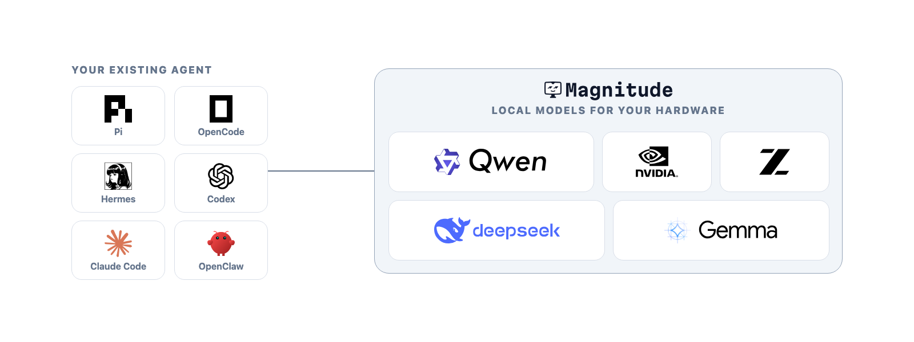
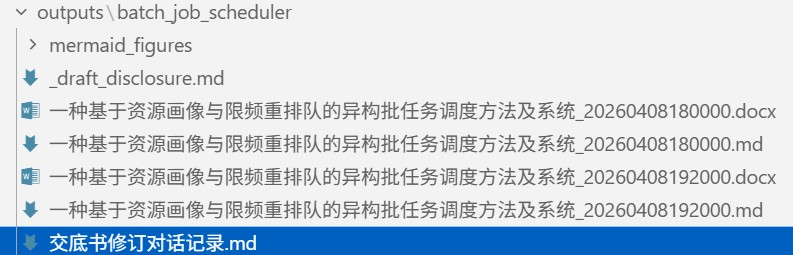
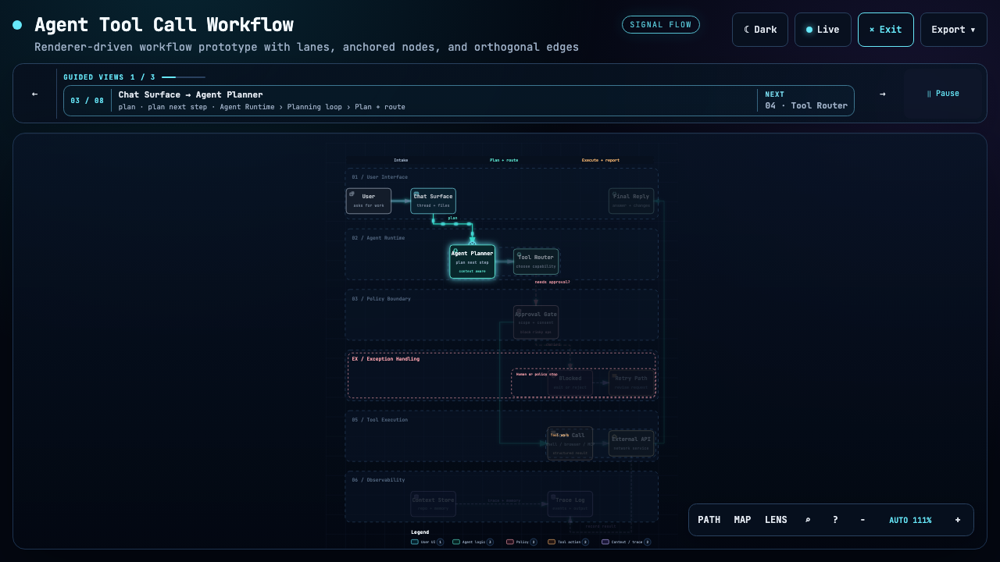
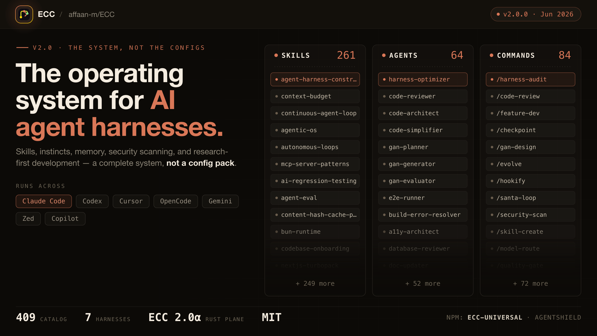
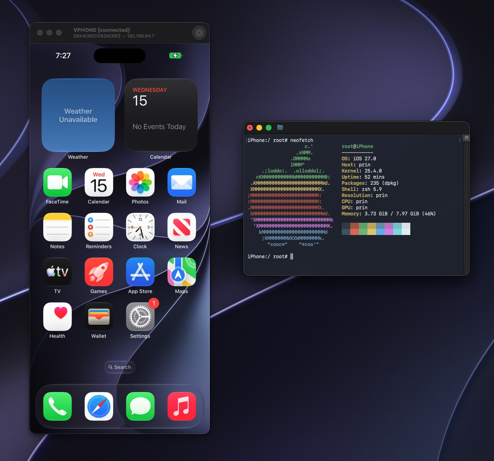

# GitHub 一周热点 · 第 12 期

> 📅 2026-09-07 ｜ 数据来源：GitHub Trending（本周）

> 本期周刊共收录 21 个项目。开发工具与库方面，项目多围绕 AI 编码代理工具和通用开发库，涉及代码可视化与工作流自动化。AI 平台与框架提供模型训练、推理部署及特定领域应用支持。AI 应用与工具则覆盖语音处理、科学研究和网页调试等实际场景。

## AI 平台与框架

### [magnitudedev/magnitude](https://github.com/magnitudedev/magnitude)

- ⭐ 累计 Star：3,678
- 🔥 本周新增 Star：1,961
- 💻 TypeScript
- 🔗 官网：https://magnitude.dev

Magnitude 是一个开源推理服务器，能自动分析硬件并推荐运行最优的本地 AI 模型。它支持与 Pi、OpenCode、Claude Code 等多种 AI 代理工具集成，提供免费、私有且可离线运行的解决方案。

**简单说：** 它就像一个智能管家，自动帮你配置和运行最适合你电脑的本地 AI 模型，省去手动选择和下载的麻烦，特别适合注重隐私和离线使用的开发者。

`#inference-server` `#local-models` `#ai-agents` `#hardware-optimization` `#open-source`

### [jingyaogong/minimind](https://github.com/jingyaogong/minimind)

- ⭐ 累计 Star：59,157
- 🔥 本周新增 Star：3,816
- 💻 Python
- 🔗 官网：https://jingyaogong.github.io/minimind

MiniMind 是一个开源项目，旨在让开发者以极低成本（约 2 小时，几元人民币）从零训练一个 64M 参数的微型语言模型。它覆盖了从数据处理、预训练、微调到强化学习的完整 LLM 训练链路，并提供了高级功能如知识蒸馏和工具调用。

**简单说：** 这是一个低成本的语言模型“训练套件”，让个人开发者和学生也能在自己的普通显卡上快速上手，动手实践大语言模型的训练全过程。

`#large-language-model` `#training` `#tutorial` `#pytorch` `#low-cost`

### [google-research/timesfm](https://github.com/google-research/timesfm)

- ⭐ 累计 Star：31,648
- 🔥 本周新增 Star：3,203
- 💻 Python
- 🔗 官网：https://research.google/blog/a-decoder-only-foundation-model-for-time-series-forecasting/

TimesFM 是 Google Research 开发的预训练时间序列基础模型。最新 3.0 版本支持多变量和单变量预测，能灵活处理协变量，在多个基准测试中表现最佳，可通过 PyTorch 等框架轻松集成。

**简单说：** 这是由 Google 开发的“时间序列预测专家”，提供了预训练模型，开发者可以直接用它来预测趋势、销量等时序数据，而不用从头训练。

`#time-series-forecasting` `#foundation-model` `#multivariate` `#pytorch` `#google-research`

### [pollen-robotics/microduck_rl](https://github.com/pollen-robotics/microduck_rl)

- ⭐ 累计 Star：1,823
- 🔥 本周新增 Star：1,122
- 💻 Python
- 🔗 官网：https://pollen-robotics.com/microduck

Microduck RL 为双足机器人 Microduck 提供强化学习训练环境，基于 mjlab 和 PPO 算法，支持在仿真中训练策略并导出到 ONNX 格式，最终部署到真实机器人，涵盖行走、摔倒恢复等任务。

**简单说：** 它帮助机器人开发者先在电脑模拟中训练机器人学习走路、翻滚等技能，再将训练好的“大脑”移植到实体机器人上，减少了真实硬件调试的麻烦。

`#reinforcement-learning` `#robotics` `#sim2real` `#bipedal-robot`

### [THU-MAIC/OpenMAIC](https://github.com/THU-MAIC/OpenMAIC)

- ⭐ 累计 Star：32,421
- 🔥 本周新增 Star：9,193
- 💻 TypeScript

OpenMAIC 是一个开源 AI 平台，能通过多代理系统将任意主题或文档一键转化为沉浸式互动课堂。它自动生成幻灯片、测验、模拟等，并由 AI 教师和同学进行实时讲解与讨论。

**简单说：** 它就像一个由 AI 智能体组成的“虚拟教学团队”，能帮你快速创建一门有讲解、有互动的在线课程，适合教育者和内容创作者。

`#education` `#multi-agent` `#interactive-learning` `#open-source`

## AI 应用与工具

### [debpalash/VoiceStudio](https://github.com/debpalash/VoiceStudio)

- ⭐ 累计 Star：19,865
- 🔥 本周新增 Star：7,513
- 💻 Python
- 🔗 官网：https://voicestudio.sh

VoiceStudio 是一款开源的本地语音处理平台，作为 ElevenLabs 的替代方案。它支持语音克隆、设计、视频配音、转录和有声书制作，覆盖 646 种语言，完全在本地运行以确保隐私和离线使用。

**简单说：** 这是一个在你自己电脑上运行的“全能语音工作室”，可以克隆声音、制作有声书，无需联网，保护隐私，适合需要大量处理音频的创作者。

`#voice-cloning` `#text-to-speech` `#local-first` `#dubbing`

### [K-Dense-AI/scientific-agent-skills](https://github.com/K-Dense-AI/scientific-agent-skills)

- ⭐ 累计 Star：43,294
- 🔥 本周新增 Star：4,718
- 💻 Python
- 🔗 官网：https://arxiv.org/abs/2609.00065

这是一个全面的科学代理技能库，提供 163 个即用型技能和 100 多个科学数据库访问接口，覆盖生物学、化学、医学等领域。它兼容多种 AI 代理平台，旨在将通用代理转化为能执行复杂多步骤科学工作流的研究助手。

**简单说：** 它相当于给 AI 代理安装了“科学实验插件”，让 AI 能帮你查询数据库、分析数据、进行模拟，特别适合需要自动化科研数据处理的研究人员。

`#ai-scientist` `#bioinformatics` `#drug-discovery` `#agent-skills`

### [handsomestWei/patent-disclosure-skill](https://github.com/handsomestWei/patent-disclosure-skill)

- ⭐ 累计 Star：7,816
- 🔥 本周新增 Star：2,093
- 💻 Python
- 🔗 官网：https://skillhub.cn/skills/patent-disclosure-skill

这是一个针对中国专利的技能工具，帮助研发人员挖掘专利点、编写各类专利交底书和申请文件，支持通俗解读专利和跟踪政策变化，并可通过 Obsidian 构建私有知识库。

**简单说：** 这个工具能帮你把技术成果快速写成专利申请文件，还能帮你理解和跟踪专利动态，是工程师处理专利事务的得力助手。

`#patent` `#obsidian` `#chinese` `#disclosure`

### [every-app/open-seo](https://github.com/every-app/open-seo)

- ⭐ 累计 Star：17,505
- 🔥 本周新增 Star：2,503
- 💻 TypeScript
- 🔗 官网：https://openseo.so

OpenSEO 是一个开源的 SEO 工具，提供关键词研究、排名跟踪、反向链接分析等功能，旨在替代 Semrush 和 Ahrefs。它集成 MCP 服务器，允许 AI 代理直接使用 SEO 数据，并支持自托管。

**简单说：** 这是一个开源、可自建的“SEO 分析平台”，功能类似 Semrush，还能让 AI 帮你自动执行 SEO 任务，适合需要低成本 SEO 工具的个人或团队。

`#seo` `#mcp` `#site-audit` `#ai-agent`

### [ChromeDevTools/chrome-devtools-mcp](https://github.com/ChromeDevTools/chrome-devtools-mcp)

- ⭐ 累计 Star：51,162
- 🔥 本周新增 Star：965
- 💻 TypeScript
- 🔗 官网：https://developer.chrome.com/docs/devtools/agents

Chrome DevTools for agents (`chrome-devtools-mcp`) 是一个 MCP 服务器，让 AI 编码助手（如 Cursor、Copilot）能够控制和检查实时的 Chrome 浏览器，提供性能追踪、网络分析、截图和自动化操作等能力。

**简单说：** 它是一个“桥梁”，让 AI 编程助手能像人类开发者一样打开浏览器、检查网页、分析性能和执行操作，主要用于调试和自动化。

`#browser` `#debugging` `#devtools` `#mcp-server`

## 开发工具与库

### [tt-a1i/archify](https://github.com/tt-a1i/archify)

- ⭐ 累计 Star：50,835
- 🔥 本周新增 Star：17,190
- 💻 JavaScript
- 🔗 官网：https://tt-a1i.github.io/archify/

Archify 是一个为 AI 编码代理设计的图表渲染系统，能将代码库或系统描述转换为美观、可验证的架构、工作流、序列、数据流等图表。它生成带有动画的自包含 HTML 文件，并支持多种导出格式。

**简单说：** 它能将复杂的代码结构或设计图快速转换成专业、好看的架构图表，方便开发者进行设计评审和团队沟通，尤其适合使用 AI 编程工具的团队。

`#architecture-diagram` `#code-visualization` `#agent-skills` `#diagram-as-code`

### [Gitlawb/openclaude](https://github.com/Gitlawb/openclaude)

- ⭐ 累计 Star：32,841
- 🔥 本周新增 Star：1,944
- 💻 TypeScript
- 🔗 官网：https://openclaude.gitlawb.com

OpenClaude 是一个开源编码代理命令行工具，支持多种云和本地大语言模型提供者。它提供统一的终端工作流，集成提示、工具调用、代理和流式输出，并包含 VS Code 扩展。

**简单说：** 它是一个让你在终端里方便调用各种 AI 模型来辅助写代码的工具，无论模型在云端还是本地，都能统一管理，提升编码效率。

`#ai-agent` `#cli` `#coding` `#terminal`

### [affaan-m/ECC](https://github.com/affaan-m/ECC)

- ⭐ 累计 Star：251,364
- 🔥 本周新增 Star：6,394
- 💻 JavaScript
- 🔗 官网：https://ecc.tools

ECC 是一个为 AI 代理工具（如 Claude Code, Cursor）提供性能优化的系统，集成了技能、记忆、安全等功能。它通过规划、测试、实现和审查的工程流程，帮助开发者提升代理的工作效率，并支持多种安装和配置选项。

**简单说：** 它就像给你的 AI 编程助手安装了“工作习惯”和“记忆”，让它能更自主、高效地规划和编写代码，解决 AI 工具配置和使用中的痛点。

`#ai-agents` `#developer-tools` `#productivity` `#configuration`

### [DietrichGebert/ponytail](https://github.com/DietrichGebert/ponytail)

- ⭐ 累计 Star：129,396
- 🔥 本周新增 Star：12,186
- 💻 JavaScript
- 🔗 官网：https://ponytail.dev

Ponytail 是一个 AI 代理技能插件，旨在指导 AI 生成更精简、必要的代码。它通过一套规则梯子，让代理在编码前评估必要性、复用现有代码，从而减少代码量、降低成本并提升运行速度。

**简单说：** 它就像一个“代码优化教练”，教会 AI 代理避免写多余代码，只生成最核心、最高效的实现，帮你省钱省时间。

`#ai-agents` `#developer-tools` `#prompt-engineering` `#yagni`

### [fmtlib/fmt](https://github.com/fmtlib/fmt)

- ⭐ 累计 Star：25,624
- 🔥 本周新增 Star：1,885
- 💻 C++
- 🔗 官网：https://fmt.dev

{fmt} 是一个现代的 C++ 格式化库，提供了比 C stdio 和 C++ iostreams 更快、更安全的替代方案。它实现了 C++20 的 std::format，API 简单且类型安全，以高性能著称。

**简单说：** 这是一个更快、更安全的“printf”，让 C++ 程序员在格式化字符串时不用担心缓冲区溢出，并且运行速度极快，被很多大型项目采用。

`#C++` `#formatting` `#high-performance` `#library`

### [colinhacks/zod](https://github.com/colinhacks/zod)

- ⭐ 累计 Star：43,862
- 🔥 本周新增 Star：277
- 💻 TypeScript
- 🔗 官网：https://zod.dev

Zod 是一个以 TypeScript 为核心的运行时数据验证库，允许开发者用简洁语法定义数据 schema，并能自动推断出对应的 TypeScript 静态类型，提供运行时和编译时的双重类型安全。

**简单说：** 它就像一个“数据模具”，帮你确保从 API 或用户输入等外部源收到的数据格式完全正确，同时自动生成对应的 TypeScript 类型，一举两得。

`#typescript` `#schema-validation` `#runtime-validation` `#static-types`

### [Lakr233/vphone-cli](https://github.com/Lakr233/vphone-cli)

- ⭐ 累计 Star：10,971
- 🔥 本周新增 Star：1,478
- 💻 Swift

vphone-cli 是一个命令行工具，用于在 Apple Silicon Mac 上通过 Virtualization.framework 启动和管理虚拟 iPhone。它自动化了固件下载、补丁应用和越狱流程，支持多种安全绕过级别。

**简单说：** 它能让你在 Mac 上运行一个虚拟的 iPhone，就像用虚拟机运行 Windows 一样，方便进行 iOS 应用测试或安全研究。

`#virtualization` `#iphone` `#vm` `#cli` `#macos`

### [majd/ipatool](https://github.com/majd/ipatool)

- ⭐ 累计 Star：10,968
- 🔥 本周新增 Star：893
- 💻 Go

ipatool 是一个 Go 编写的命令行工具，允许用户从 App Store 搜索、下载和管理 iOS、iPadOS 等设备的应用安装包（.ipa 文件），支持认证、搜索和版本查询。

**简单说：** 这是一个命令行版的“App Store 下载器”，让你能直接下载应用的安装包文件，主要用于安全研究或开发测试。

`#cli` `#ios` `#appstore` `#reverse-engineering`

### [tailscale/tailcat](https://github.com/tailscale/tailcat)

- ⭐ 累计 Star：6,548
- 🔥 本周新增 Star：2,467
- 💻 Go
- 🔗 官网：https://tailscale.com/tailcat

Tailcat 是一个类似 netcat 的点对点网络工具，但构建在 Tailscale 的数据平面上，利用 WireGuard 实现加密隧道。它无需 Tailscale 账户，通过 DERP 服务器进行连接发现，并支持端口转发和文件传输。

**简单说：** 它就像一个“加密版的 netcat”，让你不用配置复杂 VPN 就能在两台电脑之间安全地传输数据或命令，适合快速、安全的远程连接。

`#wireguard` `#p2p` `#cli-tool` `#networking`

## 网络与安全工具

### [punkpeye/awesome-mcp-servers](https://github.com/punkpeye/awesome-mcp-servers)

- ⭐ 累计 Star：94,485
- 🔥 本周新增 Star：1,326
- 💻 Unknown
- 🔗 官网：https://glama.ai/mcp/servers

awesome-mcp-servers 是一个收集 Model Context Protocol (MCP) 服务器实现的策展列表。MCP 是一个开放协议，允许 AI 模型通过标准化服务器与资源安全交互，该列表涵盖文件系统、数据库、API 集成等多种功能服务器。

**简单说：** 它是一个“MCP 服务器应用商店目录”，帮你快速找到能增强 AI 代理能力的各种工具和服务，是构建 AI 工具链的参考资源。

`#mcp` `#ai` `#tool-integration` `#resource-list`

## 学习资源与指南

### [Imbad0202/academic-research-skills](https://github.com/Imbad0202/academic-research-skills)

- ⭐ 累计 Star：46,573
- 🔥 本周新增 Star：2,334
- 💻 Python
- 🔗 官网：https://buymeacoffee.com/crucify020v

这是一个为 Claude Code 设计的学术研究技能套件，覆盖从文献调研到论文发表的完整管道。它通过多代理团队辅助研究、写作、评审和修订，并强调人类在循环中监督以避免 AI 错误。

**简单说：** 这就像一个智能学术助手，能指导你完成从找资料、写论文到审稿的全过程，帮你自动化繁琐步骤，但关键决策仍由你做主。

`#academic-writing` `#ai-research` `#literature-review` `#academic-pipeline`
