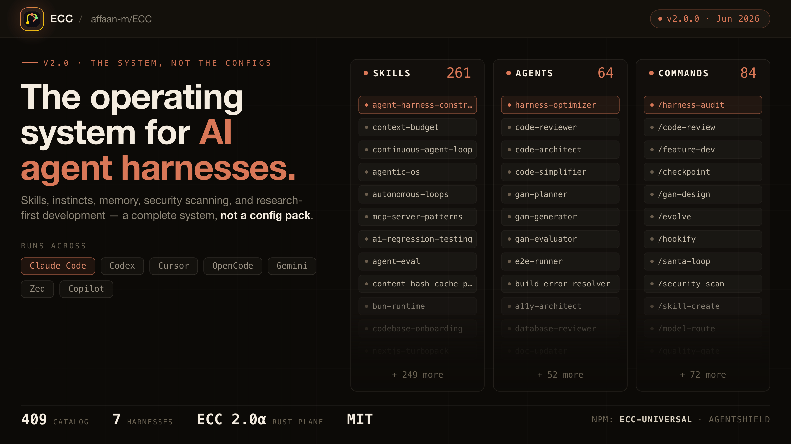
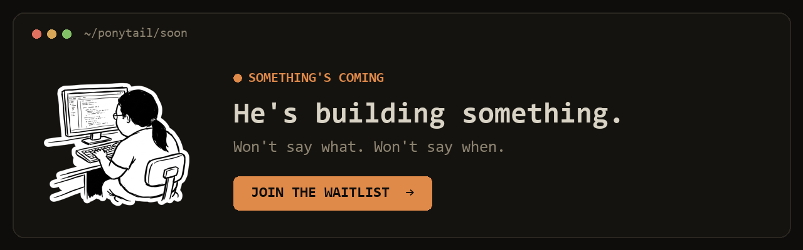
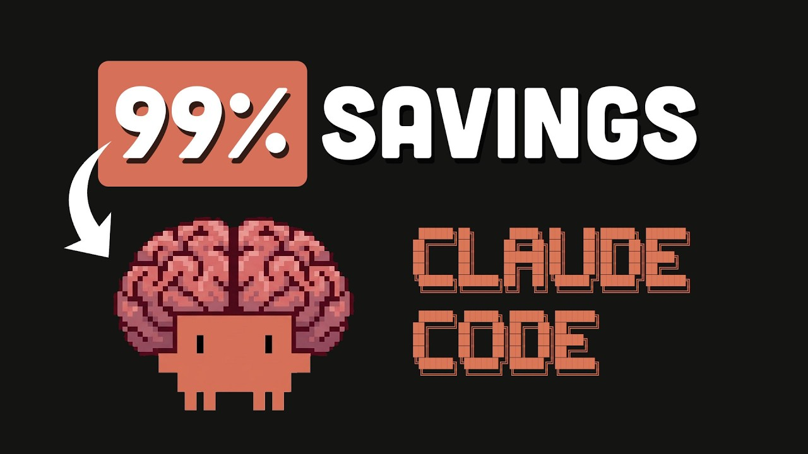
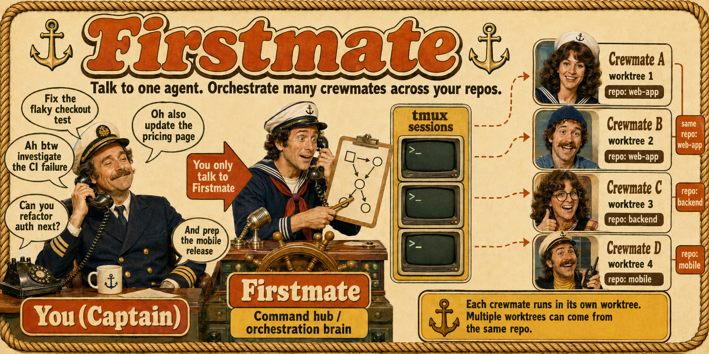
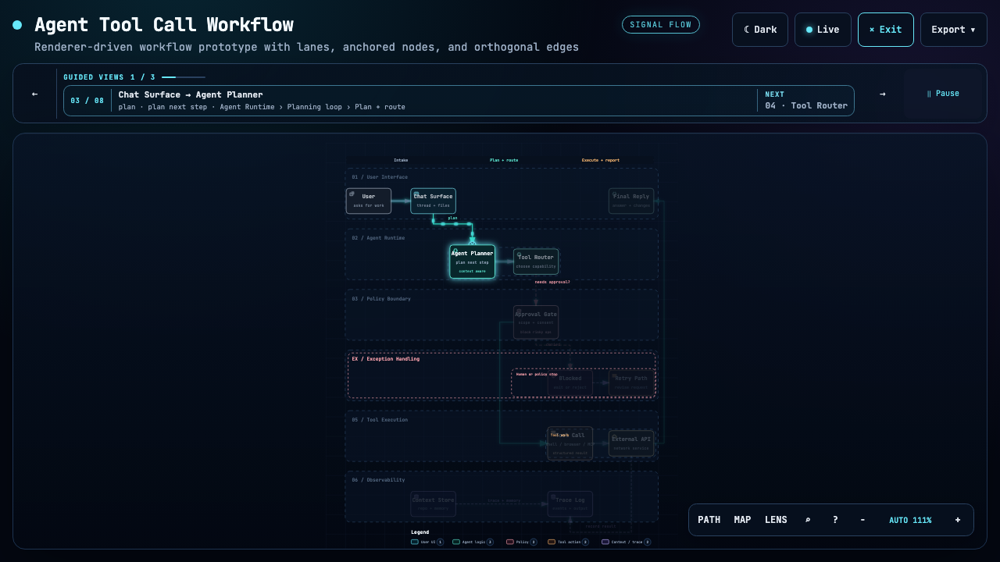
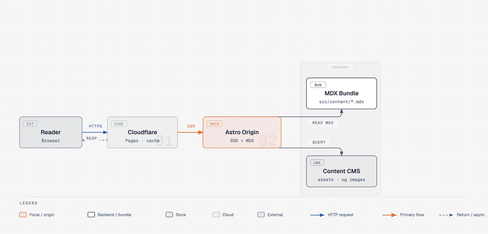
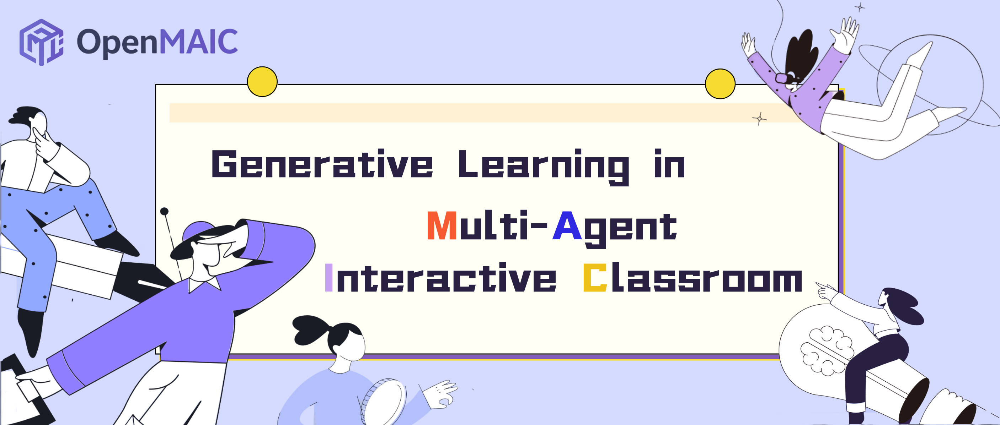

# GitHub 一周热点 · 第 13 期

> 📅 2026-09-14 ｜ 数据来源：GitHub Trending（本周）

> 本期周刊共收录 23 个项目。AI编码代理与工程领域重点关注技能开发和代理优化，例如通过上下文管理工具提升编码效率。AI技能库方向扩展至营销、CAD和文本处理等专业应用场景。浏览器与开发工具涉及浏览器集成与可视化，支持开发者扩展功能。

## AI 编码代理与工程

### [ayghri/i-have-adhd](https://github.com/ayghri/i-have-adhd)

- ⭐ 累计 Star：44,373
- 🔥 本周新增 Star：16,740
- 💻 Python

这是一个用于 Claude Code 的技能插件，旨在提供 ADHD 友好的输出格式。它通过 10 条规则约束 AI 助手的回复方式，使其行动优先、步骤编号、以具体下一步结束。适用于使用编程助手的开发者，帮助他们获得更高效、直接的回答，避免冗长冗余。

**简单说：** 这个技能让 AI 编程助手说话更直接，省略废话，开发者能更快找到答案和行动步骤。就像一个教练，让 AI 回答时更简洁、有条理。

`#adhd` `#claude` `#claude-code-plugin` `#developer-tools` `#productivity`

### [affaan-m/ECC](https://github.com/affaan-m/ECC)

- ⭐ 累计 Star：257,778
- 🔥 本周新增 Star：7,264
- 💻 JavaScript
- 🔗 官网：https://ecc.tools

ECC 是一个为 Claude Code、Codex、Cursor 等多种 AI 代码编辑器设计的代理工具性能优化系统。它包含代理、技能、命令、钩子和记忆等组件，提供从计划到改进的完整工作流程，帮助开发者提升 AI 辅助编码的效率、安全性和可重复性。

**简单说：** 它帮助开发者在不同 AI 代码编辑器中设置和优化智能代理，让代理更高效、安全，就像为编辑器安装增强插件包一样。

`#ai-agents` `#claude` `#developer-tools` `#llm` `#productivity` `#mcp`

### [DietrichGebert/ponytail](https://github.com/DietrichGebert/ponytail)

- ⭐ 累计 Star：137,370
- 🔥 本周新增 Star：8,444
- 💻 JavaScript
- 🔗 官网：https://ponytail.dev

Ponytail 是一个 AI 代理技能，旨在让 AI 编码工具像经验丰富的资深开发者一样思考，强调“最好的代码是根本没写的代码”。它通过一套阶梯式检查流程，在生成代码前评估是否必要，从而显著减少代码量、降低开发成本并提高效率。该技能可集成到多种主流 AI 开发工具中。

**简单说：** 这个工具让 AI 编程助手像一个懒惰的资深开发者一样工作，只写必要的代码，避免不必要的复杂设计。开发者可以用它来节省时间和减少代码维护成本。

`#agent-skills` `#ai-agents` `#claude` `#developer-tools` `#prompt-engineering` `#yagni`

### [mksglu/context-mode](https://github.com/mksglu/context-mode)

- ⭐ 累计 Star：22,637
- 🔥 本周新增 Star：2,102
- 💻 TypeScript
- 🔗 官网：https://context-mode.com

Context Mode 是一个针对 AI 编码代理的上下文窗口优化工具。它通过沙盒化工具输出将数据消耗减少 98%，并使用 SQLite 持久化会话内存，确保对话压缩后能通过搜索恢复关键信息。该项目支持 17 个平台，通过 MCP 和 hooks 强制执行高效路由。

**简单说：** 这个工具就像给 AI 编码助手装了一个“记忆整理器”，帮助它在长时间编程对话中避免上下文窗口被快速填满，从而让会话更连贯。

`#mcp` `#claude-code` `#copilot` `#context-mode` `#cursor-plugin`

### [obra/superpowers](https://github.com/obra/superpowers)

- ⭐ 累计 Star：286,211
- 🔥 本周新增 Star：4,068
- 💻 Shell

Superpowers 是一个为编码代理设计的完整软件开发方法论，基于可组合的技能框架。它通过自动触发的工作流程，让代理在写代码前先明确需求、制定详细计划，并采用测试驱动开发、子代理驱动开发等实践。适用于使用 Claude Code、Cursor 等 AI 编码工具的开发者。

**简单说：** 它实际上解决的是让 AI 编程助手在写代码前先思考清楚，确保设计合理，减少错误。类似于给 AI 安装一套标准操作流程。

`#ai` `#brainstorming` `#coding` `#skills` `#sdlc` `#subagent-driven-development`

### [humanlayer/skills](https://github.com/humanlayer/skills)

- ⭐ 累计 Star：4,001
- 🔥 本周新增 Star：1,004
- 💻 TypeScript

skills 是 HumanLayer 为 Claude Code 提供的技能集合，允许用户通过 npx 命令安装和调用各种预设技能。这些技能包括优化项目文档、调整 React 属性类型、构建迭代代理循环等，帮助扩展编码代理的能力。

**简单说：** 它为 Claude Code 添加了可安装的技能，让开发者能快速集成高级功能，就像给代理安装插件一样简单。

`#claude-code` `#skills` `#humanlayer` `#ai-tools` `#automation`

### [github/spec-kit](https://github.com/github/spec-kit)

- ⭐ 累计 Star：136,425
- 🔥 本周新增 Star：2,642
- 💻 Python
- 🔗 官网：https://github.github.com/spec-kit/

Spec Kit 是一个开源工具包，专注于规格驱动开发，帮助用户在编码前清晰定义项目规格。它提供了一套与 AI 编码代理集成的结构化工作流程，包括规格制定、技术计划、任务分解和实现。支持 Bug 修复和想法评估等扩展。

**简单说：** 这个工具让开发者在使用 AI 写代码之前，先用结构化方式描述需求和计划，从而提升开发效率和代码质量。

`#spec-driven` `#ai` `#development` `#engineering` `#spec` `#prd`

### [max-sixty/worktrunk](https://github.com/max-sixty/worktrunk)

- ⭐ 累计 Star：7,528
- 🔥 本周新增 Star：588
- 💻 Rust
- 🔗 官网：https://worktrunk.dev

Worktrunk 是一个用 Rust 编写的命令行工具，专为 Git worktree 管理设计，旨在简化并行 AI 代理工作流。它通过直观的命令让 worktree 操作变得像分支一样易用，并提供 hooks、LLM 提交消息生成等高级功能。适用于使用 Claude Code 或 Codex 等 AI 代理进行多任务开发的开发者。

**简单说：** 它让 Git 的 worktree 功能更容易使用，特别适合同时运行多个 AI 编码代理的开发者，避免工作目录冲突并提升效率。

`#agents` `#claude-code` `#codex` `#developer-tools` `#git` `#worktrees`

### [kunchenguid/firstmate](https://github.com/kunchenguid/firstmate)

- ⭐ 累计 Star：5,752
- 🔥 本周新增 Star：778
- 💻 Shell

firstmate 是一个代理发行版，允许用户通过一个主代理管理多个自主代理团队，并行处理编码任务如修复、调查和计划。每个代理在隔离的 git 工作树中运行，避免冲突，并监督直至完成，最终交付 PR、本地合并或调查报告。

**简单说：** 它通过一个主代理自动分配、监督和报告结果，解决开发者使用 AI 编码代理时难以同时管理多个并行任务的问题。

`#agent` `#coding` `#automation` `#git` `#parallel-tasks` `#developer-tools`

### [openai/skills](https://github.com/openai/skills)

- ⭐ 累计 Star：27,100
- 🔥 本周新增 Star：1,622
- 💻 Python

此仓库是 OpenAI Codex 的技能目录，但目前已弃用，建议转用 OpenAI Plugins 仓库。Agent Skills 是一种 AI 代理技能，包含指令、脚本和资源，用于执行特定任务，允许开发者创建可重复使用的技能。

**简单说：** 它就像一个 AI 代理的技能包仓库，让开发者共享和重复使用任务技能，但现在被新的插件系统取代。

`#codex` `#agent-skills` `#ai` `#plugins` `#skills`

## AI 领域技能库

### [coreyhaines31/marketingskills](https://github.com/coreyhaines31/marketingskills)

- ⭐ 累计 Star：50,003
- 🔥 本周新增 Star：2,678
- 💻 JavaScript
- 🔗 官网：https://marketing-skills.com

这是一个为 Claude Code 和 AI 代理设计的营销技能库，覆盖了 SEO 优化、付费广告投放、数据分析、客户留存和增长工程等多个关键领域。它提供了如 SEO 审计、广告创意生成、A/B 测试等具体技能，旨在帮助 AI 代理自动化执行营销任务。

**简单说：** 这个项目提供了一系列营销技能，让 AI 代理能自动处理从网站优化到广告管理的常见工作，帮助营销人员节省时间并提高效果。

`#claude` `#codex` `#marketing` `#ai` `#skills` `#seo`

### [earthtojake/text-to-cad](https://github.com/earthtojake/text-to-cad)

- ⭐ 累计 Star：15,596
- 🔥 本周新增 Star：1,054
- 💻 Python
- 🔗 官网：https://www.texttocad.dev

text-to-cad 是一个 AI 代理技能库，专注于 CAD、CAE 和 CAM 领域。它提供多种技能，支持从自然语言请求生成 CAD 模型、处理机器人描述文件、导出 STEP 等格式，并可集成到 Codex、Claude Code 等 AI 编码代理中。

**简单说：** 它让工程师和设计师能用文字指令快速生成 CAD 图纸或处理工程文件，就像给 AI 代理安装了专业技能一样。

`#ai-agents` `#cad` `#mechanical-engineering` `#robotics` `#text-to-cad`

### [blader/humanizer](https://github.com/blader/humanizer)

- ⭐ 累计 Star：47,678
- 🔥 本周新增 Star：3,673
- 💻 Python
- 🔗 官网：https://skills.sh/blader/humanizer

Humanizer 是一个 AI 技能，专门用于改写 AI 生成的文本，使其读起来像人类写的。它通过识别 25 种常见模式并进行针对性重写，而不改变原意，并能匹配个人写作风格。该技能适用于支持技能的 AI 代理，如 Claude Code 和 Claude Desktop。

**简单说：** 这个工具解决了 AI 生成文本机械、不自然的问题，把它改得更像人写的。用 AI 写文章或文档的人会用到它，让内容更生动、个性化。

`#ai-writing` `#writing-tools` `#agent-skills` `#prompt-engineering`

### [petergyang/no-ai-slop](https://github.com/petergyang/no-ai-slop)

- ⭐ 累计 Star：9,205
- 🔥 本周新增 Star：1,668
- 💻 Python
- 🔗 官网：https://creatoreconomy.so/p/use-my-no-ai-slop-skill-to-remove-20-ai-slop-patterns

No AI Slop 是一个 AI 技能，用于移除写作中的 AI 陈词滥调。它能检测并修复 20 多种常见模式，如二元对比、开场白等，同时保留作者的个人风格。

**简单说：** 当你用 AI 写作或编辑时，它会帮你清理那些千篇一律的表达，让文章读起来更自然、更像你自己。

`#ai-writing` `#text-editing` `#content-creation` `#natural-language`

## 图表与可视化生成

### [tt-a1i/archify](https://github.com/tt-a1i/archify)

- ⭐ 累计 Star：60,824
- 🔥 本周新增 Star：10,132
- 💻 JavaScript
- 🔗 官网：https://tt-a1i.github.io/archify/

Archify 是一个 Node.js 渲染和验证系统，用于将代码库或系统描述转换为交互式系统地图。它支持架构、工作流、序列、数据流和生命周期五种图表类型，生成自包含的 HTML 文件，包含动画和清晰导出功能。通过代理生成类型化 JSON 中间表示，Archify 确定性地编译为可视化图表。

**简单说：** 它让开发者通过聊天描述系统，自动生成漂亮的架构图，方便团队沟通和文档化。

`#agent-skills` `#architecture-diagram` `#code-visualization` `#developer-tools` `#diagram-as-code`

### [cathrynlavery/diagram-design](https://github.com/cathrynlavery/diagram-design)

- ⭐ 累计 Star：39,235
- 🔥 本周新增 Star：7,129
- 💻 HTML
- 🔗 官网：https://cathrynlavery.github.io/diagram-design/

这是一个为 Claude Code、Codex 等工具设计的图表生成技能，提供 39 种高质量图表类型，包括架构图、流程图、序列图等。它生成自包含的 HTML + SVG 文件，支持自动从网站提取品牌颜色和字体进行定制。适用于需要快速创建专业图表的开发者、写作者和内容创作者。

**简单说：** 它让你用自然语言指令快速生成漂亮的图表，不用再手动调整样式或纠结复杂工具。

`#diagrams` `#data-visualization` `#claude-code` `#agent-skills` `#svg` `#codex`

## 文档与知识处理

### [microsoft/markitdown](https://github.com/microsoft/markitdown)

- ⭐ 累计 Star：183,608
- 🔥 本周新增 Star：5,191
- 💻 Python

MarkItDown 是微软开源的轻量级 Python 工具，专为将各类文件和办公文档（如 PDF、Word、Excel）转换为 Markdown 格式而设计。它支持多种格式，包括图片、音频和 HTML，专注于保留文档结构，以便高效输入大语言模型和文本分析管道。

**简单说：** 这个工具将各种文档格式快速转成 Markdown，让 AI 模型能轻松处理内容，开发者可用它构建基于文档的 AI 应用。

`#markdown` `#microsoft-office` `#pdf` `#langchain` `#openai`

### [Tencent/WeKnora](https://github.com/Tencent/WeKnora)

- ⭐ 累计 Star：22,891
- 🔥 本周新增 Star：1,302
- 💻 Go
- 🔗 官网：https://weknora.weixin.qq.com

WeKnora 是一个基于 LLM 的开源知识框架，专注于企业级文档理解、语义检索和自主推理。它提供 RAG 快速问答、ReAct 智能体自主推理以及 Wiki 模式自动生成和维护知识库。支持多数据源接入、多 LLM 提供商集成，并可通过模块化架构进行私有化部署。

**简单说：** WeKnora 帮助开发者把散乱的文档变成一个可以智能问答和自动整理的知识库，适用于企业构建内部知识管理系统。

`#rag` `#llm` `#knowledge-base` `#agent` `#wiki` `#semantic-search`

## 教育与内容生成

### [THU-MAIC/OpenMAIC](https://github.com/THU-MAIC/OpenMAIC)

- ⭐ 累计 Star：36,485
- 🔥 本周新增 Star：4,202
- 💻 TypeScript

OpenMAIC 是一个开源的多智能体交互课堂平台，能将任何主题或文档快速转化为包含幻灯片、测验、交互模拟和项目式学习的沉浸式课程。它通过 AI 教师和同学进行实时授课、讨论与互动，支持从一键生成到代理工作台的多种课程创建模式。

**简单说：** 这是一个能让老师或内容创作者快速生成带互动讨论的在线课程的工具，就像拥有了一个由 AI 驱动的虚拟课堂助手。

`#AI` `#教育` `#多智能体` `#课堂生成` `#交互式学习` `#开源`

### [heygen-com/hyperframes](https://github.com/heygen-com/hyperframes)

- ⭐ 累计 Star：49,627
- 🔥 本周新增 Star：5,146
- 💻 TypeScript

HyperFrames 是一个开源框架，允许用户通过编写 HTML 和 CSS 来生成确定性 MP4 视频。它专为 AI 代理设计，提供技能系统支持多种视频创建工作流，如产品发布视频、解释视频和动态图形。用户可以通过命令行或 AI 编码代理使用，适用于自动化视频内容生产。

**简单说：** 这个项目让开发者用写网页的代码来生成视频，特别适合 AI 代理自动创建视频内容，比如营销视频或教程。

`#ai` `#animation` `#html` `#video` `#framework` `#typescript`

## 浏览器与开发工具

### [ChromeDevTools/chrome-devtools-mcp](https://github.com/ChromeDevTools/chrome-devtools-mcp)

- ⭐ 累计 Star：51,848
- 🔥 本周新增 Star：736
- 💻 TypeScript
- 🔗 官网：https://developer.chrome.com/docs/devtools/agents

Chrome DevTools for agents (`chrome-devtools-mcp`) 是一个 MCP 服务器，旨在让 AI 编码助手（如 Cursor、Copilot）能够控制和检查一个实时的 Chrome 浏览器。它利用 Chrome DevTools 和 Puppeteer，为 AI 提供了性能追踪录制、网络分析、截图和自动化浏览器操作等能力，适用于深度调试和自动化任务。

**简单说：** 它是一个让 AI 编程助手能像人类开发者一样打开浏览器、检查元素、分析性能和执行操作的“桥梁”工具。

`#browser` `#debugging` `#devtools` `#mcp-server` `#puppeteer`

### [bilawalsidhu/gods-eye-view](https://github.com/bilawalsidhu/gods-eye-view)

- ⭐ 累计 Star：31,969
- 🔥 本周新增 Star：12,931
- 💻 JavaScript
- 🔗 官网：https://maptheworld.ai/

God's Eye View 是一个浏览器中的交互式 3D 地球可视化工具，基于真实的公共数据提供实时地理空间智能。它集成了飞机、船只、卫星等跟踪功能，支持语音控制和多种视觉效果，使用 WebGL 和 Cesium 技术构建。项目开源，适用于开发者和地理信息爱好者探索全球数据。

**简单说：** 这是一个让开发者在浏览器中可视化全球实时地理数据的工具，类似于一个开源的卫星监控系统，可以追踪航班、船只和火灾等公开信息。

`#geospatial` `#3d-globe` `#flight-tracking` `#satellite-tracking` `#webgl` `#osint`

### [openai/plugins](https://github.com/openai/plugins)

- ⭐ 累计 Star：6,623
- 🔥 本周新增 Star：1,181
- 💻 JavaScript

这是 OpenAI 官方维护的 Codex 插件示例集合，提供 Figma、Notion、iOS 开发等多种插件示例。每个插件遵循标准结构，可通过 marketplace 集成到 Codex 中，支持 skills、.app.json 等组件。适用于使用 Codex 并希望扩展其功能的开发者。

**简单说：** 它提供官方插件模板，开发者可以参考来给 Codex 编辑器添加新功能，比如连接设计工具或管理项目笔记。

`#codex` `#plugins` `#openai` `#developer-tools` `#extensions` `#examples`
