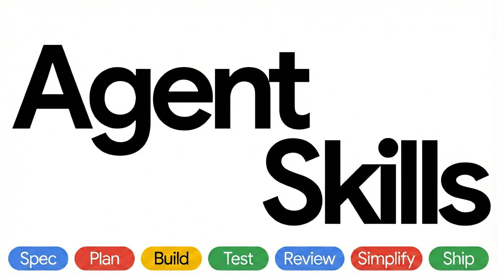
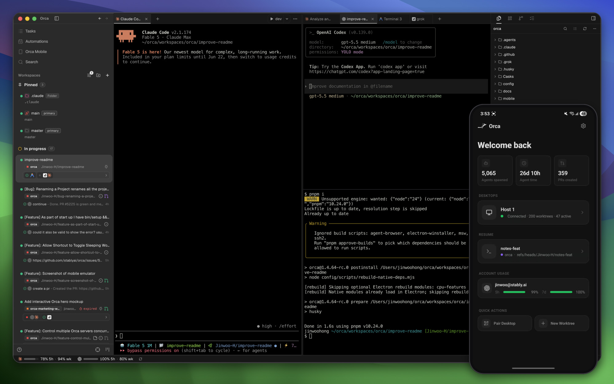
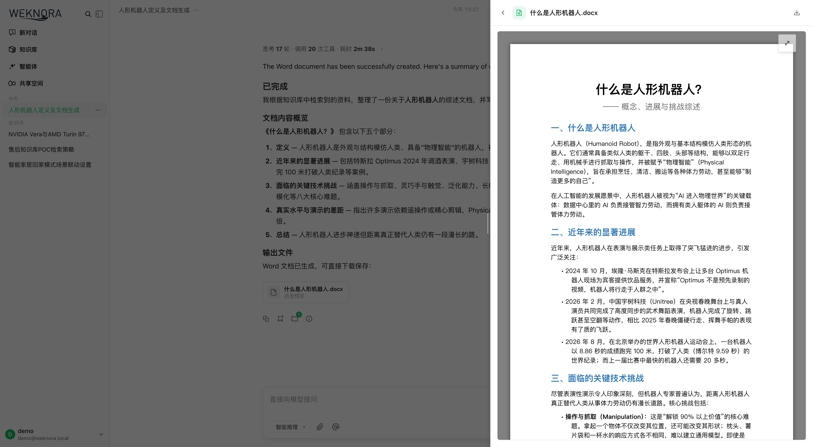
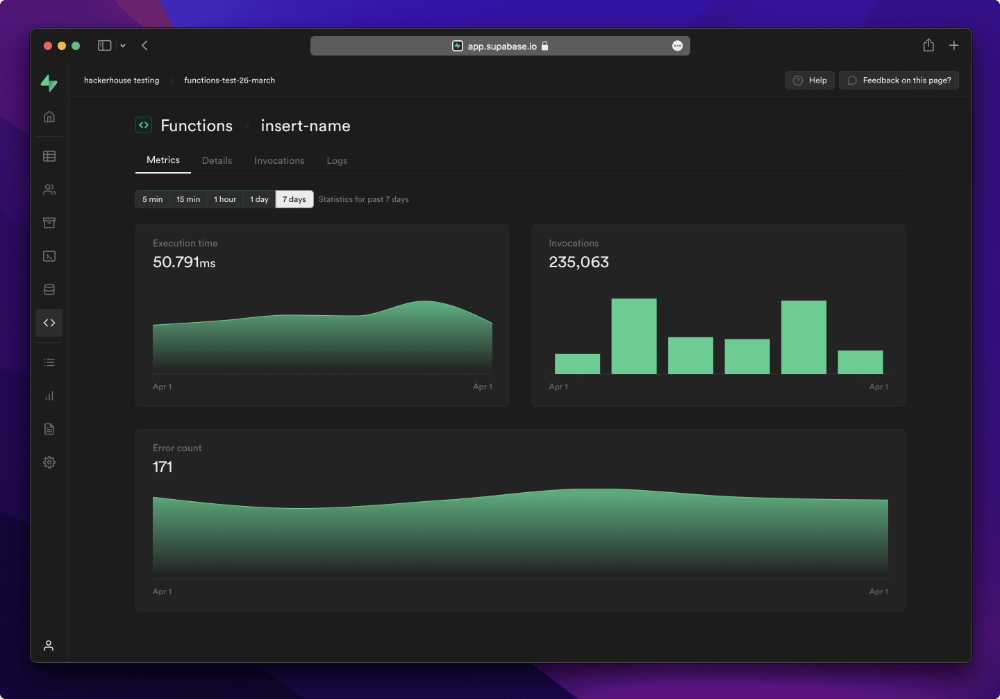

# GitHub 一周热点 · 第 14 期

> 📅 2026-09-21 ｜ 数据来源：GitHub Trending（本周）

> 本期周刊共收录 21 个项目。AI 编码代理与基础设施领域，项目关注代理工具开发、上下文优化及并行工作流管理；AI 大模型应用与知识平台方向，涉及代码审查、知识库构建和聊天接口；AI 写作与内容优化部分，聚焦文本自然度提升和风格化处理。

## AI 编码代理与基础设施

### [anthropics/claude-code](https://github.com/anthropics/claude-code)

- ⭐ 累计 Star：147,145
- 🔥 本周新增 Star：2,342
- 💻 TypeScript
- 🔗 官网：https://code.claude.com/docs/en/overview

Claude Code 是 Anthropic 推出的代理编码工具，以终端形式存在。它能理解代码库，通过自然语言指令执行常规编码任务、解释复杂代码、处理 Git 工作流，支持插件扩展，可在终端、IDE 或 GitHub 环境中使用。

**简单说：** 这是一个运行在终端里的 AI 编程助手，开发者可以用自然语言命令指挥它写代码、解释代码和操作版本控制。

`#coding` `#ai-agent` `#terminal` `#git` `#cli`

### [affaan-m/ECC](https://github.com/affaan-m/ECC)

- ⭐ 累计 Star：263,770
- 🔥 本周新增 Star：6,453
- 💻 JavaScript
- 🔗 官网：https://ecc.tools

ECC 是一个为 Claude Code、Codex、Cursor 等多种 AI 编码代理设计的性能优化系统。它提供了涵盖规划、测试、实现、审查、验证、记忆和改进的完整工程工作流，包含 68 个代理和 292 个技能，旨在优化上下文窗口使用并实现持续学习。

**简单说：** 它为各类 AI 编码助手提供了一套标准化的“高级工程技能包”，能帮助 AI 自动遵循规范的开发流程，减少重复工作，提升代码质量。

`#ai-agents` `#claude-code` `#developer-tools` `#llm` `#productivity` `#security`

### [addyosmani/agent-skills](https://github.com/addyosmani/agent-skills)

- ⭐ 累计 Star：97,718
- 🔥 本周新增 Star：3,986
- 💻 JavaScript
- 🔗 官网：https://skills.addy.ie

agent-skills 是一个为 AI 编码代理设计的生产级工程技能集合。包含 25 个技能，覆盖软件开发生命周期（定义、计划、构建、验证、审查、发布），以结构化 Markdown 工作流形式编码了高级工程师的最佳实践，可适配 Claude Code、Codex 等多种工具。

**简单说：** 这是一套预定义的“AI 编程规范清单”，强制 AI 编码代理像资深工程师一样，按照可验证的步骤进行编码、测试和审查，而不是偷工减料。

`#agent-skills` `#claude-code` `#codex` `#cursor` `#skills` `#best-practices`

### [mksglu/context-mode](https://github.com/mksglu/context-mode)

- ⭐ 累计 Star：23,774
- 🔥 本周新增 Star：1,242
- 💻 TypeScript
- 🔗 官网：https://context-mode.com

Context Mode 是一个优化 AI 编码代理上下文窗口的工具。它通过沙盒化工具输出（减少 98% 数据消耗）、使用 SQLite 持久化会话内存、并通过 MCP + hooks 在 17 个平台（如 Cursor、OpenCode）间强制执行高效路由。

**简单说：** 这个工具帮 AI 编码助手“整理内存”，防止长时间对话时因上下文窗口填满而丢失重要信息，让会话更持久连贯。

`#mcp` `#claude-code` `#copilot` `#context-mode` `#cursor-plugin` `#mcp-server`

### [stablyai/orca](https://github.com/stablyai/orca)

- ⭐ 累计 Star：73,663
- 🔥 本周新增 Star：5,841
- 💻 TypeScript
- 🔗 官网：https://onOrca.dev

Orca 是一个专注于编排多个并行编码代理的 AI 开发环境（ADE）。它允许用户运行如 Claude Code、Codex 等代理，每个代理在独立的 Git 工作树中工作，便于同时测试和比较结果，支持桌面、移动和远程访问。

**简单说：** Orca 帮助开发者像指挥交通一样，同时管理多个 AI 编程助手并行工作，用于高效开发或对比不同 AI 模型的结果。

`#ade` `#ai-agents` `#parallel-agents` `#orchestration` `#cli` `#mobile-app`

### [max-sixty/worktrunk](https://github.com/max-sixty/worktrunk)

- ⭐ 累计 Star：8,211
- 🔥 本周新增 Star：822
- 💻 Rust
- 🔗 官网：https://worktrunk.dev

Worktrunk 是一个用 Rust 编写的 Git worktree 管理 CLI 工具，专为并行 AI 代理工作流设计。它将复杂的 worktree 操作简化为类似分支操作的简单命令，并提供钩子、LLM 提交信息生成等功能。

**简单说：** 它是一个专为“同时跑多个 AI 编程助手”设计的 Git 管理工具，能轻松创建和管理多个独立的工作目录，避免它们互相干扰。

`#agents` `#developer-tools` `#git` `#worktrees`

### [cline/cline](https://github.com/cline/cline)

- ⭐ 累计 Star：68,892
- 🔥 本周新增 Star：1,167
- 💻 TypeScript
- 🔗 官网：https://cline.bot

Cline 是一个开源的自主编码代理，提供 SDK、IDE 扩展和 CLI 助手等多种形态。它能读取项目结构、协调代码修改、执行终端命令，支持计划/行动模式切换，并兼容多种主流 AI 模型。

**简单说：** 这是一个可以深度集成到开发流程中的 AI 编码代理，能自主处理调试、部署和集成等重复性任务，解放开发者。

`#coding-agent` `#sdk` `#ide-extension` `#cli` `#open-source` `#ai-tools`

### [Panniantong/Agent-Reach](https://github.com/Panniantong/Agent-Reach)

- ⭐ 累计 Star：83,865
- 🔥 本周新增 Star：3,690
- 💻 Python

Agent Reach 是为 AI Agent 提供互联网访问能力的工具层。通过统一的 CLI 接口，集成 Twitter、Reddit、YouTube、GitHub、Bilibili 等多个平台，无需 API 费用，自动管理接入方式并确保稳定可用。

**简单说：** 这个工具让 AI 助手能安全、方便地“上网冲浪”，读取或搜索各大平台的内容，开发者无需自己处理复杂的网络接口配置。

`#ai-agent` `#ai-search` `#cli` `#agent-infrastructure` `#automation` `#python`

### [anthropics/knowledge-work-plugins](https://github.com/anthropics/knowledge-work-plugins)

- ⭐ 累计 Star：25,285
- 🔥 本周新增 Star：1,298
- 💻 Python

这是 Anthropic 开源的一组 Claude 插件，旨在为知识工作者在 Claude Cowork 中创建针对特定角色（如销售、客服、产品经理）的工作助手。通过捆绑领域技能、工具连接器（如 Slack、Jira）、斜杠命令和子代理来定制 Claude 行为。

**简单说：** 它把通用的 AI 助手 Claude 变成了懂你具体工作职责的专家，能自动连接你团队的软件，帮你完成特定领域的任务。

`#plugins` `#workflow` `#MCP` `#knowledge-work` `#productivity`

## AI 写作与内容优化

### [blader/humanizer](https://github.com/blader/humanizer)

- ⭐ 累计 Star：50,644
- 🔥 本周新增 Star：3,045
- 💻 Python
- 🔗 官网：https://skills.sh/blader/humanizer

Humanizer 是一个 AI 技能，专门用于改写 AI 生成的文本，使其读起来更像人类所写。它能识别并针对性重写 25 种常见模式，而不改变原意，并支持匹配个人写作风格。

**简单说：** 这个工具解决了 AI 生成文本机械、不自然的问题，把它改得更生动、更个性化，让读者感觉不到是 AI 写的。

`#ai-writing` `#writing-tools` `#agent-skills` `#prompt-engineering`

### [petergyang/no-ai-slop](https://github.com/petergyang/no-ai-slop)

- ⭐ 累计 Star：10,828
- 🔥 本周新增 Star：1,819
- 💻 Python
- 🔗 官网：https://creatoreconomy.so/p/use-my-no-ai-slop-skill-to-remove-20-ai-slop-patterns

No AI Slop 是一个 AI 技能，用于检测和移除文本中 20 多种常见的 AI 陈词滥调（如二元对比、固定开场白等），在优化表达的同时保留作者的个人风格。

**简单说：** 当你用 AI 写作或编辑时，它会帮你清理那些千篇一律的“AI 套话”，让文章读起来更自然、更像你自己写的。

`#ai-writing` `#text-editing` `#content-creation` `#natural-language`

## AI 大模型应用与知识平台

### [alibaba/open-code-review](https://github.com/alibaba/open-code-review)

- ⭐ 累计 Star：38,427
- 🔥 本周新增 Star：15,504
- 💻 Go
- 🔗 官网：https://open-codereview.ai

Open Code Review 是一个起源于阿里巴巴、经过大规模验证的开源 AI 代码审查工具。采用混合架构（确定性工程 + LLM Agent），提供精确到行级的审查注释，内置多语言规则集，支持 OpenAI 和 Anthropic 模型。

**简单说：** 这是一个代码审查工具，能自动帮开发者找代码里的问题，给出具体的修改意见，减少人工审查负担，提高效率。

`#agent` `#code-review` `#code-review-assistant` `#harness` `#repository-level-context`

### [Tencent/WeKnora](https://github.com/Tencent/WeKnora)

- ⭐ 累计 Star：28,029
- 🔥 本周新增 Star：5,242
- 💻 Go
- 🔗 官网：https://weknora.weixin.qq.com

WeKnora 是一个开源的企业级 LLM 知识框架，能将原始文档转化为可查询的 RAG 系统、自主推理 Agent 和自维护的 Wiki。支持多源文档摄取、多种 LLM 和存储服务集成，提供 Web UI、API、CLI 等多种交互方式。

**简单说：** 它就像一个智能文档管家，能自动整理分散的文件，变成一个能回答问题和自动生成 Wiki 的 AI 知识库，适合企业内部知识管理。

`#llm` `#rag` `#knowledge-base` `#agent` `#wiki` `#golang`

### [danny-avila/LibreChat](https://github.com/danny-avila/LibreChat)

- ⭐ 累计 Star：44,490
- 🔥 本周新增 Star：1,600
- 💻 TypeScript
- 🔗 官网：https://librechat.ai/

LibreChat 是一个开源的、可自托管的 AI 聊天平台，旨在提供一个统一、注重隐私的界面来连接和管理多种 AI 服务（如 OpenAI、Anthropic、Google）。它提供 AI Agent、MCP、代码执行沙盒等高级功能，并内置多用户认证和管理面板。

**简单说：** 这是一个可以自己部署的、功能更丰富的 ChatGPT 替代品，让个人或团队能集中管理使用各种 AI 模型，特别注重数据隐私。

`#ai` `#chatgpt-clone` `#open-source` `#self-hosted` `#typescript` `#webui`

## 数据与知识管理

### [supabase/supabase](https://github.com/supabase/supabase)

- ⭐ 累计 Star：110,438
- 🔥 本周新增 Star：1,484
- 💻 TypeScript
- 🔗 官网：https://supabase.com

Supabase 是一个基于 Postgres 的开源后端即服务（BaaS）平台，提供托管数据库、认证授权、自动生成 API、实时订阅、边缘函数、存储及 AI 向量工具包，旨在为 Web、移动和 AI 应用提供便捷的后端基础。

**简单说：** Supabase 就像一个云端的后端“全家桶”，让开发者不用自己搭建数据库、用户登录等服务，直接专注于开发应用前端。

`#postgres` `#firebase` `#auth` `#realtime` `#ai` `#database`

### [microsoft/markitdown](https://github.com/microsoft/markitdown)

- ⭐ 累计 Star：185,951
- 🔥 本周新增 Star：2,521
- 💻 Python

MarkItDown 是微软开源的轻量级 Python 工具，专为将 PDF、Word、Excel、图片、音频等各类文件转换为结构化的 Markdown 格式而设计，专注于保留文档结构，以便高效输入大语言模型和文本分析管道。

**简单说：** 这个工具能快速把各种文档格式转成 Markdown，让 AI 模型能轻松阅读和理解文档内容，适合构建文档相关的 AI 应用。

`#markdown` `#microsoft-office` `#pdf` `#langchain` `#openai`

## 网络与安全

### [cilium/cilium](https://github.com/cilium/cilium)

- ⭐ 累计 Star：25,390
- 🔥 本周新增 Star：373
- 💻 Go
- 🔗 官网：https://cilium.io

Cilium 是一个基于 eBPF 的 Kubernetes 网络、安全和可观测性解决方案。它提供高效的 Layer 3 网络、基于身份的 L3-L7 安全策略、分布式负载均衡（可替代 kube-proxy），并集成 Hubble 工具提供深度监控。

**简单说：** Cilium 帮助 Kubernetes 集群“简化网络、增强安全”，就像给容器网络装上了智能防火墙和监控探针，适用于大规模容器部署。

`#ebpf` `#kubernetes` `#networking` `#security` `#observability` `#cni`

## Web 应用与客户端

### [home-assistant/core](https://github.com/home-assistant/core)

- ⭐ 累计 Star：90,894
- 🔥 本周新增 Star：480
- 💻 Python
- 🔗 官网：https://www.home-assistant.io

Home Assistant 是一个开源的智能家居自动化平台，核心原则是本地控制与隐私优先。由全球社区维护，采用模块化架构，可集成大量设备和服务，适合在树莓派等本地设备上运行。

**简单说：** 这是一个把家里的智能设备（灯、空调等）“统一管理起来”的开源软件，数据存在自己家，不用担心隐私泄露。

`#home-automation` `#iot` `#python` `#raspberry-pi`

### [bilawalsidhu/gods-eye-view](https://github.com/bilawalsidhu/gods-eye-view)

- ⭐ 累计 Star：39,664
- 🔥 本周新增 Star：8,111
- 💻 JavaScript
- 🔗 官网：https://maptheworld.ai/

God's Eye View 是一个开源的浏览器应用，在逼真 3D 地球上实时显示来自公共数据源的全球信息，如航班、卫星、地震活动等。支持语音控制和可视化定制，基于 WebGL 和 Cesium 构建。

**简单说：** 它就像一个增强版的实时地球仪，让你在网页上追踪全球的飞机、船只和卫星动态，数据都是公开的，适合地理信息爱好者。

`#geospatial-intelligence` `#satellite-tracking` `#3d-globe` `#webgl` `#osint` `#flight-tracking`

## 开发工具与自动化

### [heygen-com/hyperframes](https://github.com/heygen-com/hyperframes)

- ⭐ 累计 Star：51,967
- 🔥 本周新增 Star：2,546
- 💻 TypeScript

HyperFrames 是一个开源框架，用于将 HTML、CSS 和动画（如 GSAP）转换为确定性的 MP4 视频。支持 AI 代理通过技能系统自动规划并生成视频，提供 CLI 和云渲染选项，适用于自动化视频制作。

**简单说：** 这个工具让你用编写网页的方式（HTML/CSS）来生成视频，AI 代理可以直接调用它自动创建视频，适合需要批量或自动化视频生产的场景。

`#ai` `#html` `#video` `#rendering` `#animation` `#framework`

## 其他项目

### [ayghri/i-have-adhd](https://github.com/ayghri/i-have-adhd)

- ⭐ 累计 Star：49,262
- 🔥 本周新增 Star：5,249
- 💻 Python

这是一个为编码助手设计的技能插件，旨在优化输出格式，避免冗长解释和无关内容。它通过10条规则确保回答直接、行动导向，例如先给出下一步操作、编号步骤并提供具体时间估计。适用于需要清晰、高效编码指导的开发者，尤其是注意力容易分散的用户。

**简单说：** 它让 AI 编码助手的回答更直接、可操作，避免啰嗦和埋没答案，帮助开发者节省时间。

`#adhd` `#claude-` `#claude-code-plugin` `#claude-skills` `#developer-tools` `#productivity`
