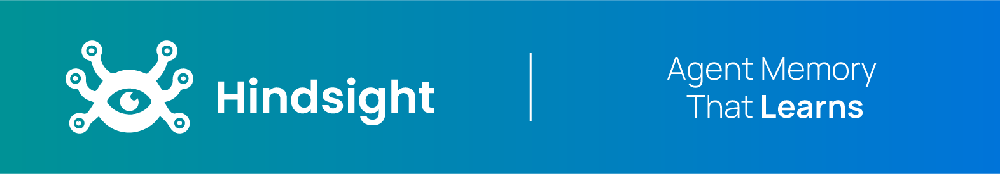
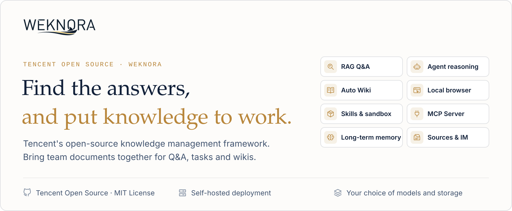
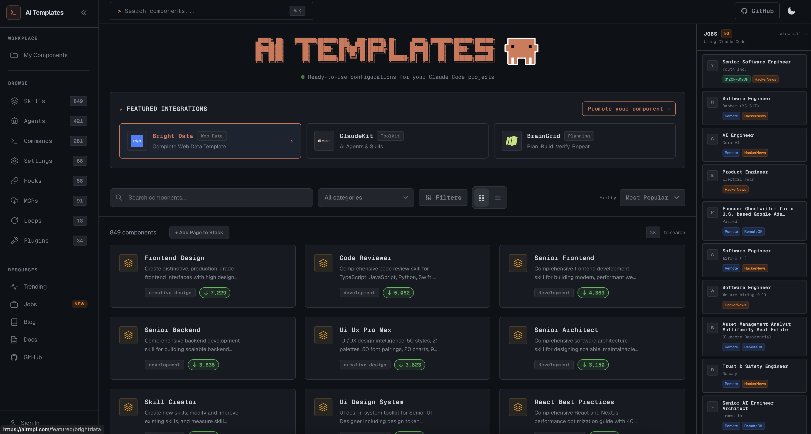
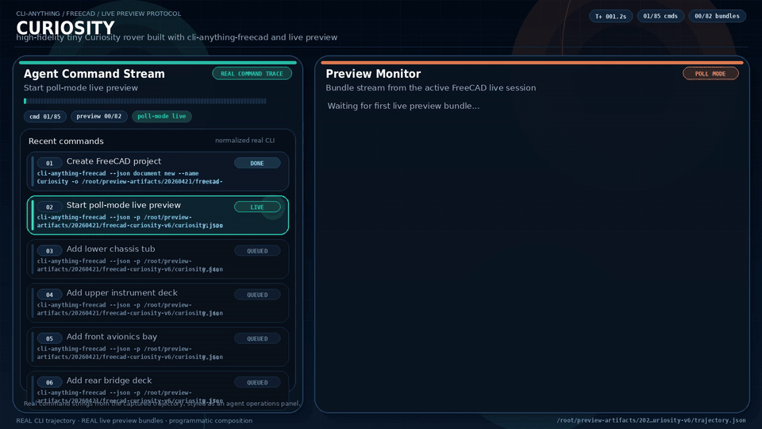
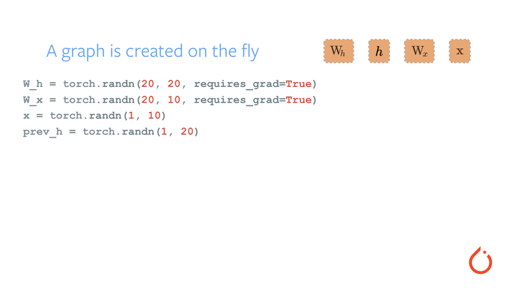
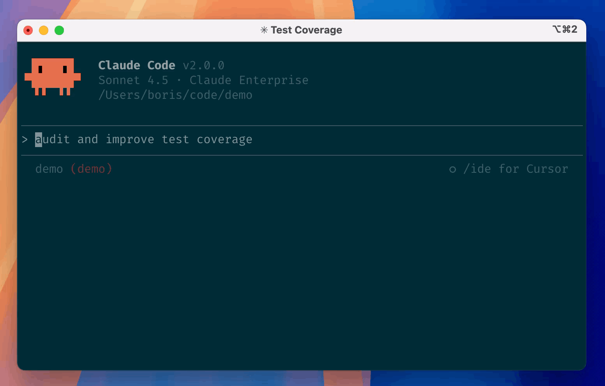

# GitHub 一周热点 · 第 15 期

> 📅 2026-09-28 ｜ 数据来源：GitHub Trending（本周）

> 本期周刊共收录 18 个项目。这些项目涵盖AI代理开发、知识管理与开发工具优化。AI领域聚焦代理记忆系统和多代理编排；开发工具侧重于代码审查与CLI生成；知识平台关注文档智能处理与团队协作。例如，Claude Code 提供终端编码助手，WeKnora 构建企业知识库。

## 其他项目

### [anthropics/financial-services](https://github.com/anthropics/financial-services)

- ⭐ 累计 Star：37,872
- 🔥 本周新增 Star：2,606
- 💻 Python

Anthropic 的金融服务 Claude 项目，提供一套参考代理、技能和数据连接器，用于投资银行、股权研究等金融工作流程。包含多个自包含的端到端工作流代理，如 Pitch Agent 和 GL Reconciler，可自动化从分析到报告的整个过程。支持通过 Claude Cowork 插件或 Managed Agents API 部署，并集成多种金融数据源的 MCP 连接器。这些是可定制的参考模板，旨在帮助金融服务团队提升效率。

**简单说：** 它实际上是一个金融领域的 AI 工具集，帮助分析师和银行家自动化重复性任务，如制作财务报告、检查数据一致性或准备会议材料。类似于为金融服务量身定制的自动化脚本包，用户可以根据自己公司的流程进行调整。

`#financial-services` `#claude` `#agents` `#plugins` `#mcp` `#automation`

### [paperclipai/paperclip](https://github.com/paperclipai/paperclip)

- ⭐ 累计 Star：90,051
- 🔥 本周新增 Star：7,364
- 💻 TypeScript
- 🔗 官网：https://paperclip.ing

Paperclip 是一个开源平台，用于管理和协调多个 AI 代理在工作中的团队。它提供任务管理、组织结构图、预算控制和治理功能，让团队可以自主运行 AI 代理并监控其工作。适用于需要运行多个 AI 代理进行业务操作的开发者或团队。
Paperclip 是一款开源应用，用于在工作场景中管理和编排 AI 代理。它协调如 OpenClaw 或 Claude Code 这样的代理，提供组织架构、预算、目标设置和治理功能。本地运行时自动管理嵌入式 PostgreSQL 数据库，支持配置项目和代理，适用于需要自动化工作流程的开发者或团队。

**简单说：** 这就像给 AI 代理开了一家公司，你可以分配任务、监控成本，让它们像员工一样工作。适合那些使用多个 AI 代理进行自动化工作的开发者。
Paperclip 像一个 AI 代理的管理平台，让你能像管理公司员工一样协调多个 AI 代理的工作。适合那些用 AI 代理处理任务但需要更好组织和控制能力的开发者。

`#AI agents` `#orchestration` `#task management` `#cost control` `#open-source` `#governance`

### [vectorize-io/hindsight](https://github.com/vectorize-io/hindsight)

- ⭐ 累计 Star：37,447
- 🔥 本周新增 Star：11,089
- 💻 Python
- 🔗 官网：https://hindsight.vectorize.io/

Hindsight 是一个专注于学习的 agent 记忆系统，旨在提升 AI 代理的长期记忆能力。它采用仿生记忆结构，通过保留、回忆和反思三个核心操作来组织记忆，在基准测试中表现优异。支持多种编程语言和平台，提供易用的 API 和丰富的集成，适用于各种 AI 代理开发场景。
Hindsight 是一个代理内存系统，旨在为 AI 代理提供学习和记忆能力。它通过隔离的内存库存储和管理记忆，支持多语言和内存防御，适用于需要个性化交互和自主任务执行的 AI 代理。

**简单说：** 它解决 AI 代理无法从过去经验中学习的问题，让代理能积累知识并改进决策，适合开发者构建智能聊天机器人或自动化工具。
它为 AI 代理装上记忆系统，帮助记住用户信息和历史，从而个性化响应和学习复杂任务，开发者构建聊天机器人或自主代理时会用到。

`#agentic-ai` `#agents` `#ai-memory` `#memory`

### [cloudflare/security-audit-skill](https://github.com/cloudflare/security-audit-skill)

- ⭐ 累计 Star：22,355
- 🔥 本周新增 Star：4,805
- 💻 JavaScript

这是一个编码代理技能，用于自动化安全审计。它通过多阶段流程，从侦察到报告生成，提供独立验证的机器可读发现，适用于需要对代码库进行深入安全审查的团队。

**简单说：** 它自动化安全漏洞发现过程，减少人工审计工作量，安全工程师或开发者用 AI 辅助进行代码安全扫描时会用到。

`#security-audit` `#coding-agent` `#vulnerability-discovery` `#automation` `#cloudflare`

### [Tencent/WeKnora](https://github.com/Tencent/WeKnora)

- ⭐ 累计 Star：30,631
- 🔥 本周新增 Star：2,705
- 💻 Go
- 🔗 官网：https://weknora.weixin.qq.com

WeKnora 是腾讯开源的基于大语言模型的知识平台，专注于企业文档理解、语义检索和推理。它将原始文档转化为可查询的 RAG、自主推理代理和自维护的 Wiki，三者共享同一知识库。平台支持多租户、广泛模型集成，可本地或私有云部署，适用于团队和企业进行知识管理。
WeKnora 是一个开源 LLM 知识平台，能将文档转化为可查询的 RAG 系统、自主推理代理和自维护的 Wiki。它支持代理操作本地浏览器、运行技能沙箱和管理工具箱，并提供可观测性工具监控流程。平台采用模块化架构，支持多种后端和客户端集成，适用于构建智能知识应用。

**简单说：** 它解决企业知识分散、检索困难的问题，通过 AI 实现文档智能问答和多步任务自动化，适合开发者用来构建内部知识库或客服系统。
WeKnora 帮助开发者将大量文档变成智能问答和自动化工具，就像配备了一个能理解资料并执行任务的 AI 助手，适用于构建企业知识库或 AI 代理的场景。

`#llm` `#knowledge-base` `#rag` `#agent` `#wiki` `#multi-tenant`

### [davila7/claude-code-templates](https://github.com/davila7/claude-code-templates)

- ⭐ 累计 Star：31,991
- 🔥 本周新增 Star：1,154
- 💻 Python
- 🔗 官网：https://aitmpl.com

这是一个用于配置和监控 Anthropic Claude Code 的命令行工具和模板集合。它提供 AI 代理、自定义命令、MCP 集成等组件，帮助开发者快速定制开发工作流。用户可以通过交互式界面或命令行安装和管理这些模板，还包括实时分析、聊天监控等额外工具。

**简单说：** 这个工具让使用 Claude Code 的开发者能轻松安装和管理各种配置模板，就像一个应用商店一样，省去手动设置的麻烦，特别适合需要快速集成外部服务的程序员。

`#claude` `#claude-code` `#cli` `#templates` `#ai-tools` `#development`

### [stablyai/orca](https://github.com/stablyai/orca)

- ⭐ 累计 Star：79,676
- 🔥 本周新增 Star：6,227
- 💻 TypeScript
- 🔗 官网：https://onOrca.dev

Orca 是一款面向并行代理管理的 AI 编排器（ADE），允许开发者使用自己的订阅运行任何编码代理，如 Claude Code 或 Codex，每个代理在独立的 Git 工作树中并行工作。它支持桌面、移动和远程运行时，提供移动伴侣应用用于监控和引导代理，并集成了终端分割、设计模式以及 GitHub 等工具。适用于需要高效多代理协作的开发团队。

**简单说：** 它就像一个 AI 编程任务管理器，可以同时运行多个 AI 编程助手在各自的代码分支上工作，你可以在手机上查看进度并选择最佳结果，类似于让多个程序员并行开发同一项目。

`#ai-agents` `#parallel-agents` `#orchestration` `#ide` `#terminal` `#mobile-app`

### [vercel/next.js](https://github.com/vercel/next.js)

- ⭐ 累计 Star：142,803
- 🔥 本周新增 Star：496
- 💻 JavaScript
- 🔗 官网：https://nextjs.org

Next.js 是一个基于 React 的框架，专为构建现代 Web 应用而设计。它支持服务器渲染、静态站点生成和混合模式，通过编译器优化和组件系统提升开发体验。项目与 Vercel 平台集成，适用于博客、电商等多种场景，帮助开发者快速构建高性能的通用应用。

**简单说：** 它是一个让 React 开发更简单的框架，可以自动处理页面在服务器或静态方式生成，适用于需要快速搭建网站的开发者。

`#react` `#nextjs` `#server-rendering` `#static-site-generator` `#hybrid` `#universal`

### [HKUDS/CLI-Anything](https://github.com/HKUDS/CLI-Anything)

- ⭐ 累计 Star：50,761
- 🔥 本周新增 Star：1,105
- 💻 Python
- 🔗 官网：https://clianything.cc/

CLI-Anything 是一个旨在通过生成命令行接口（CLI）使所有软件对 AI 代理可访问的项目。它提供了一个名为 CLI-Hub 的中心注册表，允许用户浏览、安装和管理社区构建的 CLI 包装器。该工具支持多种桌面和后端软件，如 GIMP、Blender 等，帮助 AI 代理执行复杂任务，如 CAD 设计和 3D 建模，适用于开发者和自动化软件交互的场景。
CLI-Anything 是一个跨平台的插件系统，旨在将软件自动转化为命令行接口，使其支持代理原生操作。它通过七个阶段的自动化流程，包括分析源码、设计命令、构建 CLI、测试和文档，为图形界面软件生成可编程的命令行工具。该工具适用于多种编码助手平台，如 Claude Code、Pi Coding Agent 等，帮助开发者快速创建和迭代 CLI。

**简单说：** CLI-Anything 让 AI 代理能像人类一样通过命令行控制各种软件，解决代理难以操作图形界面软件的问题，开发者可以用它来创建自动化工具或增强 AI 代理的能力。
这个工具让任何软件都能通过命令行控制，这样你就可以用脚本或 AI 代理自动操作软件，而不再需要手动使用图形界面。特别适合需要自动化软件操作的开发者。

`#CLI` `#AI agents` `#automation` `#software integration` `#command-line` `#harness`

### [pytorch/pytorch](https://github.com/pytorch/pytorch)

- ⭐ 累计 Star：103,425
- 🔥 本周新增 Star：320
- 💻 Python
- 🔗 官网：https://pytorch.org

PyTorch 是一个为 Python 优化的深度学习框架，提供 GPU 加速的 Tensor 计算和动态神经网络构建。它通过 tape-based autograd 系统实现自动微分，支持灵活修改网络结构，并深度集成 NumPy 等 Python 生态，适合研究者和开发者进行快速原型设计和高性能计算。
PyTorch 是一个基于 Python 的深度学习库，专注于张量计算和动态神经网络构建，并具有强大的 GPU 加速能力。当前材料主要介绍了如何从源代码构建 PyTorch、使用 Docker 镜像进行部署、构建项目文档以及处理持续集成中的错误。此外，还提供了丰富的学习资源、社区通信渠道和贡献指南。

**简单说：** PyTorch 帮助程序员用 Python 轻松创建和训练神经网络，尤其在使用 GPU 时能大幅加速计算，适合做人工智能研究和开发的人。
PyTorch 让机器学习工程师和研究人员能够用 Python 轻松构建和训练深度学习模型，特别适合需要 GPU 加速的 AI 项目，如计算机视觉和自然语言处理。

`#deep-learning` `#gpu` `#python` `#neural-network` `#tensor` `#autograd`

### [anthropics/claude-code](https://github.com/anthropics/claude-code)

- ⭐ 累计 Star：148,354
- 🔥 本周新增 Star：1,493
- 💻 TypeScript
- 🔗 官网：https://code.claude.com/docs/en/overview

Claude Code 是一个代理编码工具，运行在终端中，能理解代码库。它通过自然语言命令执行常规编码任务、解释复杂代码和处理 git 工作流。支持插件扩展，可在终端、IDE 或 GitHub 中使用。

**简单说：** 这是一个终端里的 AI 编码助手，开发者可以用自然语言指挥它完成代码编写、解释和版本控制任务，提高编码效率。

`#coding` `#ai-agent` `#terminal` `#git` `#cli`

### [affaan-m/ECC](https://github.com/affaan-m/ECC)

- ⭐ 累计 Star：268,447
- 🔥 本周新增 Star：5,175
- 💻 JavaScript
- 🔗 官网：https://ecc.tools

ECC 是一个针对 AI 代理工具（如 Claude Code、Codex）的性能优化系统，提供协调的工程流程和工具箱。它实现了从计划、测试、审查到记忆改进的完整开发循环，内置 68 个代理、292 个技能和安全扫描功能。通过安装一次，开发者可以将这些优化能力集成到现有代理中，提升代码质量和开发效率。
ECC 是一个 AI 代理性能优化系统，为 Claude Code、Codex、Cursor 等多种开发工具提供技能、规则和配置支持。它通过插件、脚本和手动安装方式灵活集成，支持低上下文安装、组件自定义和项目本地规则。系统旨在优化 AI 辅助开发的工作流程，适用于需要增强开发效率的开发者。

**简单说：** 它相当于给 AI 编程助手配了一个‘智能工程系统’，让它能自动规划、验证和改进代码，适合使用 Claude Code 等工具的开发者提高工作效率和可靠性。
ECC 解决的是 AI 开发工具配置复杂、性能调优困难的问题，开发者可以用它快速设置和优化各种 AI 代理，就像给编程助手安装升级包一样简单。

`#ai-agents` `#claude` `#developer-tools` `#llm` `#productivity` `#mcp`

### [rohitg00/ai-engineering-from-scratch](https://github.com/rohitg00/ai-engineering-from-scratch)

- ⭐ 累计 Star：59,372
- 🔥 本周新增 Star：3,850
- 💻 Python
- 🔗 官网：https://aiengineeringfromscratch.com

这是一个从零开始的 AI 工程学习课程，提供 523 节课程和 20 个阶段，覆盖从数学基础到代理工程的全面内容。它强调动手实践，每节课都产出可重用的工件，如提示、技能或代理，并支持 Python、TypeScript、Rust 和 Julia 等多种语言。课程旨在帮助开发者深入理解 AI 的内部工作原理，而不仅仅是调用 API，适用于想专业构建 AI 系统的学习者。
这是一个独立的 AI 工程学习课程，提供从基础数学到高级代理的完整路径。课程强调实践，通过交互式技能和测验进行教学，每节课都产出可安装的工具。它基于公开考试目标，包含 MCP 和 Agent 技能学习模块，并编译成六卷书籍。适合希望系统学习 AI 工程的开发者。

**简单说：** 这个课程帮助程序员从头学习 AI 的原理和实现，而不仅仅是使用现成工具，从而能够自己构建和部署 AI 应用。适合那些想深入 AI 领域、从基础开始并实际动手的学习者。
这个课程帮助开发者从零开始学习 AI 工程，通过动手构建实际工具来掌握技能，适合想转行或提升 AI 能力的程序员。

`#ai-engineering` `#course` `#from-scratch` `#llm` `#agents` `#machine-learning`

### [alibaba/open-code-review](https://github.com/alibaba/open-code-review)

- ⭐ 累计 Star：41,950
- 🔥 本周新增 Star：3,727
- 💻 Go
- 🔗 官网：https://open-codereview.ai

OpenCodeReview 是一个由阿里巴巴开源的 AI 驱动的代码审查 CLI 工具，源自内部大规模使用，服务于数万开发者。它采用确定性工程与 LLM 代理的混合架构，提供精确的行级评论和内置多语言规则集，如空指针、线程安全等。工具通过读取 Git 差异，将文件发送给可配置的 LLM 进行分析，并生成结构化审查反馈。适用于需要高效、准确代码审查的开发者和团队。

**简单说：** 这个工具就像一个智能代码审查助手，能自动分析代码变更并指出潜在缺陷，适合开发者在提交代码前进行自检或团队代码审查。

`#agent` `#agent-skills` `#code-review` `#code-review-assistant` `#harness` `#repository-level-context`

### [cloudflare/quiche](https://github.com/cloudflare/quiche)

- ⭐ 累计 Star：12,664
- 🔥 本周新增 Star：521
- 💻 Rust
- 🔗 官网：https://docs.rs/quiche

quiche 是 Cloudflare 开发的 Rust 库，实现了 IETF 标准的 QUIC 传输协议和 HTTP/3。它提供低级 API，让开发者处理 QUIC 数据包和连接状态，但需要自行管理网络 I/O 和事件循环。该项目已应用于 Cloudflare 边缘网络、Android 的 DNS-over-HTTP/3 以及 curl 的 HTTP/3 支持。

**简单说：** 这是一个帮助程序员在应用中快速集成 QUIC 和 HTTP/3 等现代网络协议的工具库，适合需要构建高性能网络服务或客户端的开发者使用。

`#http3` `#network-programming` `#protocol` `#quic` `#rust`

### [TencentCloud/Octop](https://github.com/TencentCloud/Octop)

- ⭐ 累计 Star：5,293
- 🔥 本周新增 Star：869
- 💻 Python
- 🔗 官网：https://octop.cloud

Octop 是一个开源的自托管 AI 助手平台，支持多用户和多代理架构，为团队、家庭和个人构建协作的智能环境。它通过单一进程运行 Web 仪表板、命令行和多种即时通讯集成，所有数据存储在本地，确保隐私安全。核心能力包括专家库、记忆系统、知识库和连接器，用户可以根据场景切换专业代理或共享资源。
Octop 是一个自托管的 AI 助手平台，支持多用户和多代理交互。它集成了多种即时通讯渠道如飞书、钉钉、微信和 Telegram，并通过 CLI 和 Web 界面提供管理功能。项目强调本地优先和数据隐私，适用于需要私有化 AI 部署的开发者和团队。

**简单说：** 它帮助开发者在本地部署一个智能助手，可以处理日常任务、自动化工作流程，并支持多用户协作，特别适合重视数据隐私的个人和小团队使用。
它就像一个本地版的 AI 管家，让你在自己的服务器上运行聊天机器人，连接不同的聊天工具，而不用担心数据泄露。开发者可以用它来搭建企业内部的智能助手。

`#agent` `#ai` `#local-first` `#long-term-memory` `#self-hosted` `#multi-user`

### [anthropics/knowledge-work-plugins](https://github.com/anthropics/knowledge-work-plugins)

- ⭐ 累计 Star：25,761
- 🔥 本周新增 Star：478
- 💻 Python

这是 Anthropic 开源的一组 Claude 插件，旨在为知识工作者在 Claude Cowork（或 Claude Code）中创建一个针对特定角色、团队和公司的工作助手。插件通过捆绑领域技能、外部工具连接器（如 Slack、Jira）、斜杠命令和子代理，来定制 Claude 的行为。开源了 11 个适用于生产力、销售、客服、产品经理等不同职能的通用插件，用户可以根据自身公司的工具栈和流程进行深度定制。

**简单说：** 它把通用的 AI 助手 Claude，变成了懂你具体工作职责（如销售、财务、数据）的专家，能自动连接你团队正在用的软件（比如项目管理、通讯工具），帮你更规范、更高效地完成特定职能的任务。

`#plugins` `#workflow` `#MCP` `#knowledge-work` `#productivity`

### [FxEmbed/FxEmbed](https://github.com/FxEmbed/FxEmbed)

- ⭐ 累计 Star：5,507
- 🔥 本周新增 Star：432
- 💻 TypeScript
- 🔗 官网：https://docs.fxembed.com

FxEmbed 是一个用于修复 Twitter 和 Bluesky 链接嵌入问题的工具。它支持增强预览功能，包括多图像、视频、投票和翻译，可在 Discord、Telegram 等平台使用。项目基于 Cloudflare Worker，支持自托管部署。

**简单说：** 当你在 Discord 分享 Twitter 链接时，预览可能不显示视频或图片，这个工具通过修改链接让预览更完整。适合经常在社群分享社交媒体内容的用户。

`#twitter` `#bluesky` `#embed` `#discord` `#telegram` `#cloudflare`
