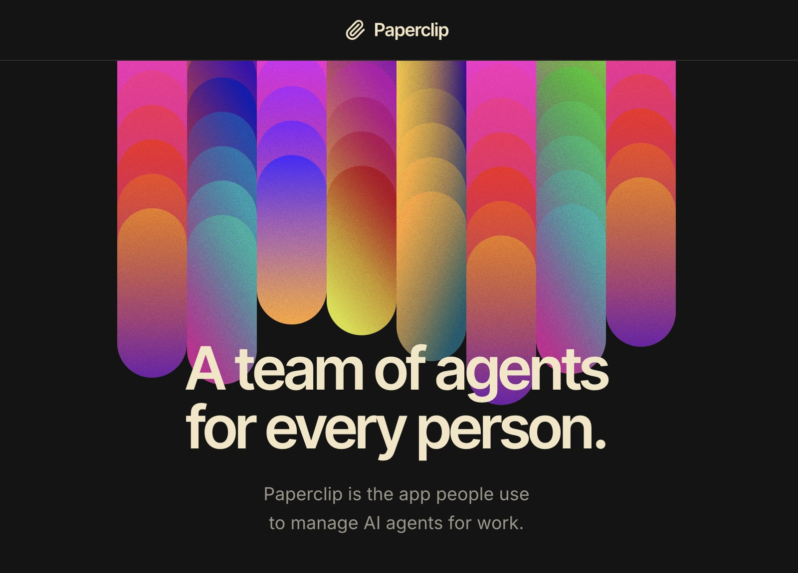
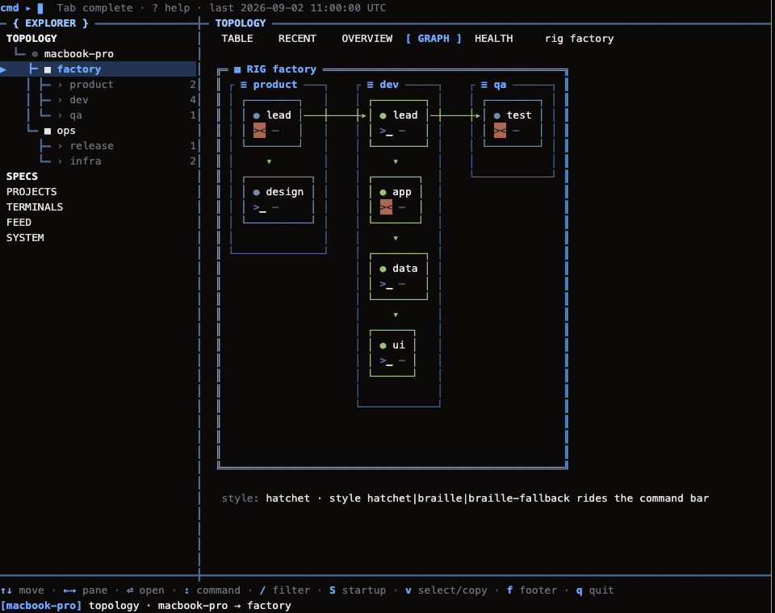
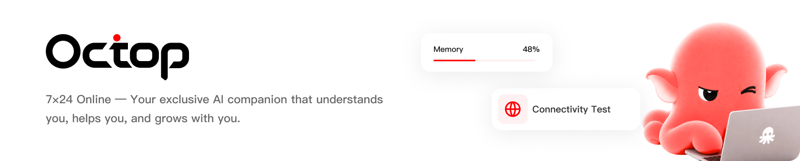
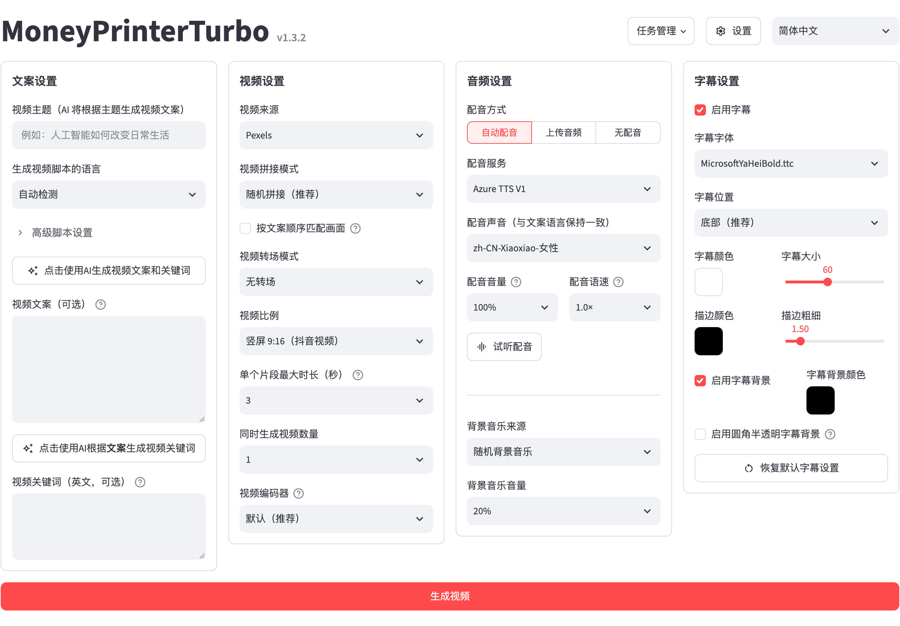
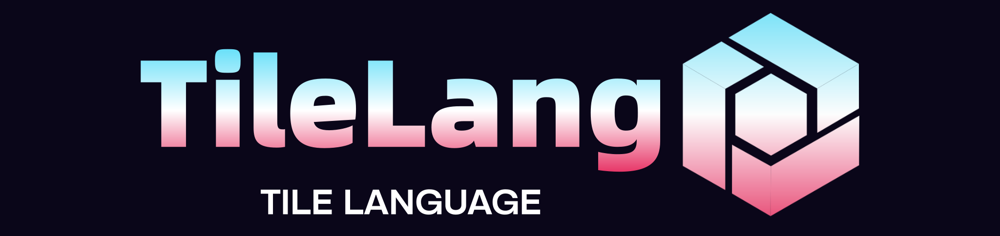
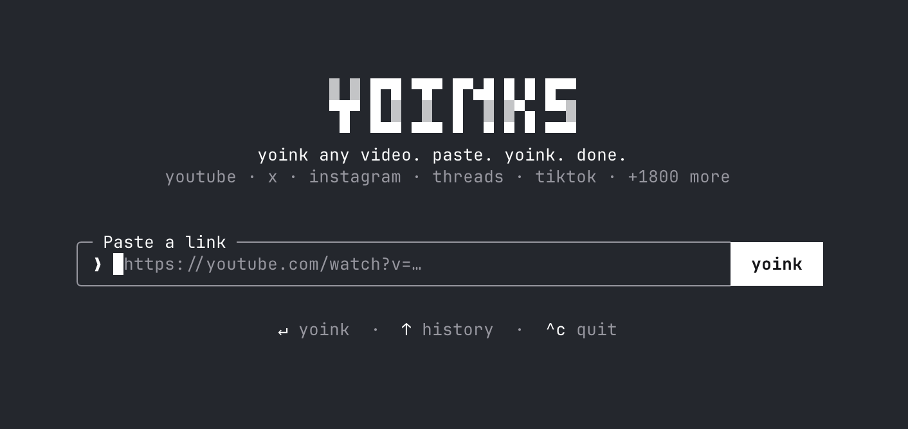
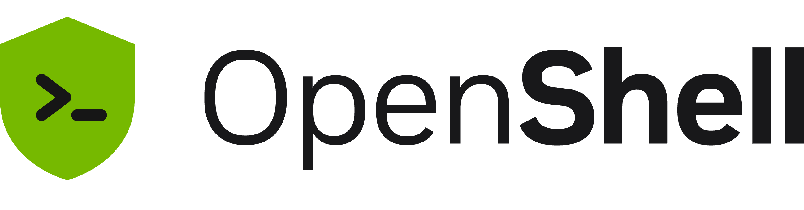
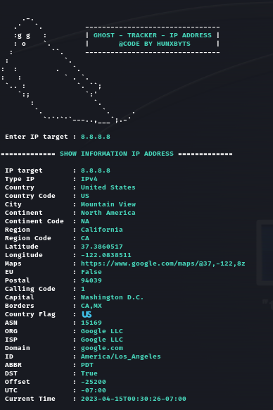
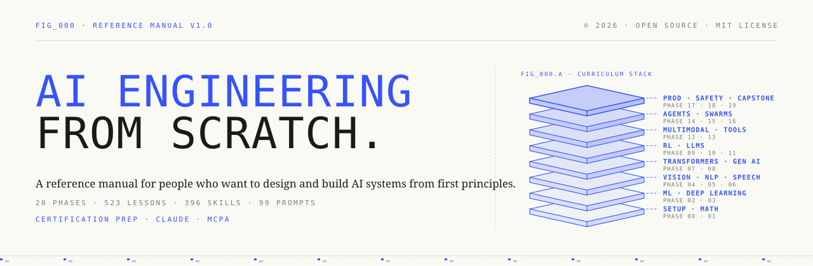

# GitHub 一周热点 · 第 16 期

> 📅 2026-10-05 ｜ 数据来源：GitHub Trending（本周）

> 本期周刊共收录 19 个项目。智能体方向集中在多 agent 编排与长期记忆，如组织化调度的 Paperclip 与记忆库 Hindsight；AI 开发工具则围绕可自托管的编码 harness、技能库和代理联网能力展开；多媒体方面，本地语音合成、HTML 渲染成片与短视频生成工具是主要关注点。

## AI / 智能体编排与记忆

### [paperclipai/paperclip](https://github.com/paperclipai/paperclip)

- ⭐ 累计 Star：97,225
- 🔥 本周新增 Star：8,732
- 💻 TypeScript
- 🔗 官网：https://paperclip.ing

Paperclip 是开源的 AI 智能体编排平台，Node.js 服务端加 React 界面，核心定位是把多个 agent 组织成一个可管理的「公司」。它提供任务管理、组织架构、Skill Studio 技能训练、审批治理与预算控制四大支柱，通过心跳机制唤醒 agent，并兼容 OpenClaw、Claude Code、Codex、Cursor、Gemini CLI 等多种运行时。支持 cron/webhook/API 触发任务、加密密钥与文件存储、可审计活动日志、组织包导出导入，内置嵌入式 PostgreSQL，可自托管并提供 OpenTelemetry/Sentry 观测。

**简单说：** 它像给 AI 员工开的「公司管理系统」：你给 agent 分配任务、设汇报关系和预算，干活过程可追踪、可审批、可随时叫停。适合同时开几十个 Claude Code 终端却管不过来的开发者，把散装脚本变成可管理的组织。

`#ai-agents` `#agent-orchestration` `#multi-agent` `#task-management` `#llm` `#typescript`

### [mvschwarz/openrig](https://github.com/mvschwarz/openrig)

- ⭐ 累计 Star：4,995
- 🔥 本周新增 Star：4,251
- 💻 TypeScript
- 🔗 官网：https://openrig.dev

OpenRig 是开源的多智能体编排框架，用 YAML（RigSpec）定义包含角色、拓扑与连续性策略的持久化 agent 团队，一条 `rig up` 命令即可在 tmux 中启动 Claude Code、Codex 等混合 CLI 会话。项目由本地守护进程、CLI、TUI 和 MCP server 构成，支持跨 agent 通信（`rig send`/`rig broadcast`）、会话发现与接管、拓扑快照恢复与运行中伸缩，并内置双人、四人流水线、产品团队等 starter rig。0.6.0 起仅支持 Node.js 22/24，`rig setup`/`rig doctor` 负责机器准备与诊断，原生 Windows 暂不支持。

**简单说：** 它像一个「AI 编码终端的项目经理」：你用 YAML 定义一个有 owner、checker 等角色的团队，一条命令拉起来，然后只跟 lead agent 沟通目标，它协调下面的 Claude/Codex 干活并汇总结果。适合想把零散编码终端组织成可持续协作小团队的人。

`#agent-orchestration` `#multi-agent` `#ai-coding` `#claude-code` `#tmux` `#self-hosted`

### [TencentCloud/Octop](https://github.com/TencentCloud/Octop)

- ⭐ 累计 Star：6,755
- 🔥 本周新增 Star：1,496
- 💻 Python
- 🔗 官网：https://octop.cloud

Octop 是腾讯云开源的自托管 AI 助手平台，面向家庭和小团队，强调多用户、多智能体与数据本地隐私。单一进程同时提供 Web 控制台、CLI、IM 渠道（飞书、钉钉、QQ、微信、Telegram、Discord 等）和 cron 定时任务，共享 `~/.octop/` 下的控制平面数据库。基于 Harness、Gateway、Memory、Browser 四组件的 Octop Harness 栈构建，含专家库与专家市场、16 种 MBTI 人格、AgentTeams、RAG 知识库、插件、ACP 双向对接（可委托 OpenCode/Claude Code）、浏览器自动化与终端 AI。支持脚本/PyPI/Docker/桌面客户端/FnOS NAS 部署，安全上强调多用户隔离、PII 脱敏与工具审批。

**简单说：** 它相当于装在自己电脑或家用服务器上的「多智能体版个人 AI 助手」：一个管理员账号全家/团队共用，每个人可配置不同的专家型角色，还能接入飞书、微信等聊天工具，数据全部留在本地。适合想自建私有 AI 助手的家庭、小团队和开发者。

`#ai-agent` `#local-first` `#self-hosted` `#long-term-memory` `#rag` `#im-integration`

### [vectorize-io/hindsight](https://github.com/vectorize-io/hindsight)

- ⭐ 累计 Star：45,524
- 🔥 本周新增 Star：10,623
- 💻 Python
- 🔗 官网：https://hindsight.vectorize.io/

Hindsight 是面向智能体的长期记忆系统，核心是「记忆库（bank）」概念：每个用户、智能体或项目拥有独立隔离的记忆存储，记忆内含世界事实、经验、观察与心智模型，通过 retain/recall/reflect 三个操作写入、检索与反思，recall 会并行执行语义、关键词、图谱、时间四种检索并融合重排。记忆库还带「性格特质」与多语言支持（输入语言全程保留），可选 Memory Defense 按 45 种模式扫描并脱敏或拦截密钥与 PII。兼容 25+ LLM 提供商与 60+ 集成，支持 Docker/pip/K8s/无服务器/托管云部署，生产环境可用 PostgreSQL + pgvector 或 Oracle AI Database 23ai 存储，并配 Prometheus 监控与生命周期 Webhooks，称在 LongMemEval 基准取得最优结果。

**简单说：** 它给 AI 智能体装了一套「会学习的记忆系统」：agent 自动记住用户和项目信息，需要时调出来，还能在后台整理成稳定知识，而不是每次对话从零开始。适合做长期陪伴型或项目级智能体的开发者。

`#ai-memory` `#agents` `#agentic-ai` `#mcp` `#retrieval` `#llm`

## AI 开发工具与智能体增强

### [pingdotgg/t3code](https://github.com/pingdotgg/t3code)

- ⭐ 累计 Star：25,202
- 🔥 本周新增 Star：1,304
- 💻 TypeScript
- 🔗 官网：https://t3.codes

t3code 是 pingdotgg 开源的 AI 编码智能体项目，定位为可自托管、模型无关的编码 agent harness，可运行于终端等环境，对接多种 LLM 提供商，属于与 Claude Code、Codex 同类的开源 AI 编码助手路线。仓库以 TypeScript 实现。

**简单说：** 它是一个开源的 AI 编码助手内核，让你不依赖单一厂商也能跑自己的编码 agent，可以换模型、改提示流程，甚至自己改代码。

`#ai-coding-agent` `#typescript` `#open-source` `#llm` `#harness`

### [pbakaus/impeccable](https://github.com/pbakaus/impeccable)

- ⭐ 累计 Star：76,357
- 🔥 本周新增 Star：4,242
- 💻 JavaScript
- 🔗 官网：https://impeccable.style

Impeccable 是面向 AI 编码代理的设计语言与技能集，源自 Anthropic 的 frontend-design，专门对抗模型生成界面的同质化套路（Inter 字体、紫蓝渐变、卡片嵌套、灰字配彩底等）。它提供 24 条共享设计指令（polish、audit、critique、bolder、quieter 等）与 comp-first / code-first 两种工作流，默认记录在 PRODUCT.md，通过 hook 安装后在 Claude Code、Cursor、Codex、Grok、Copilot、Trae 等工具中生效，并支持团队级 `.impeccable/config.json` 与 NDJSON 审计日志。另附独立 CLI 检测器 `npx impeccable detect`，用 61 条确定性规则扫描目录、HTML 或线上 URL，无需 LLM 和 API Key，支持 --json、忽略规则与豁免注释。

**简单说：** 它解决「AI 生成的前端千篇一律」的问题：在 AI 编码工具里装上这套设计规范后，AI 会用统一的设计语言审查和打磨界面。你还能用命令行单独扫项目或线上页面，找出紫色渐变、点击区域太小这类一眼假 AI 味的问题。

`#frontend-design` `#design-review` `#design-skills` `#claude-code` `#frontend` `#code-quality`

### [Panniantong/Agent-Reach](https://github.com/Panniantong/Agent-Reach)

- ⭐ 累计 Star：90,968
- 🔥 本周新增 Star：4,789
- 💻 Python

Agent Reach 是为 AI Agent 提供互联网访问能力的工具层，通过统一的 CLI 集成 Twitter、Reddit、YouTube、GitHub、Bilibili 和小红书等平台的读取与搜索，无需支付 API 费用。它自动管理各平台接入方式的选型、安装和维护，当某个接入失效时会自动切换到备选方案以保持稳定。面向使用 Claude Code、OpenClaw、Cursor 等 AI Agent 的开发者。

**简单说：** 它给 AI 助手装上了「眼睛」：让 agent 能直接上网读取内容、搜索信息，不用开发者自己折腾各平台接口配置，也不用付 API 费。

`#ai-agent` `#ai-search` `#cli` `#web-crawling` `#automation` `#agent-infrastructure`

### [alirezarezvani/claude-skills](https://github.com/alirezarezvani/claude-skills)

- ⭐ 累计 Star：27,609
- 🔥 本周新增 Star：1,024
- 💻 Python
- 🔗 官网：https://alirezarezvani.medium.com/

这是一个开源的 AI 编码智能体技能库，收录 388 个生产可用的 Claude Code skills、plugins 与 agent skills，覆盖工程、产品、营销、研究运营、合规、C 级咨询、金融、商业运营等 20 多个领域。每个技能以 SKILL.md 组织，配套 700+ 仅用 Python 标准库的脚本与 800+ 参考文档模板，无需额外依赖即可运行。原生支持 Claude Code、OpenAI Codex、Gemini CLI 等 13 种工具，并提供一键转换脚本将技能转为 Cursor、Aider、Windsurf 等 9 种工具的原生格式，同时区分 Skills（怎么做）、Agents（做什么）、Personas（以谁的视角思考）三种抽象并给出跨领域协作协议。

**简单说：** 它相当于给各类 AI 编码助手预装了一整套「专家经验包」，让 Claude Code、Codex、Cursor 能像架构师、SEO 专家、财务分析师一样干活。想让 AI 在特定领域更专业又不想从零写提示词的开发者，直接装现成技能即可。

`#claude-code-skills` `#agent-skills` `#ai-coding-agent` `#prompt-engineering` `#plugins` `#agentic-ai`

## 多媒体与内容生成

### [debpalash/VoiceStudio](https://github.com/debpalash/VoiceStudio)

- ⭐ 累计 Star：53,197
- 🔥 本周新增 Star：14,689
- 💻 Python
- 🔗 官网：https://voicestudio.sh

VoiceStudio 是开源、完全本地运行的 ElevenLabs 替代品，用 Python 实现，提供声音克隆、声音设计、视频配音、语音听写、转录与有声书制作，宣称支持 646 种语言。桌面端仅保留 Electron 应用（0.5.3 是最后一个 Tauri 版本），提供 macOS/Windows/Linux 一键安装脚本，可选 CUDA 或 Apple Silicon Metal 加速，无独显时也可用 CPU 构建运行。默认引擎为 k2-fsa/OmniVoice，同时提供本地 API、MCP 接口与可选远程 worker；许可证为 AGPL-3.0，模型各有许可，克隆声音需获得授权。

**简单说：** 它把 ElevenLabs 那类收费语音服务做成了能装在自己电脑上的免费开源应用：克隆自己的声音、给视频配音、转录音频、生成有声书，数据和模型都留在本机。

`#voice-cloning` `#text-to-speech` `#dubbing` `#transcription` `#local-first` `#audiobook`

### [heygen-com/hyperframes](https://github.com/heygen-com/hyperframes)

- ⭐ 累计 Star：56,799
- 🔥 本周新增 Star：3,096
- 💻 TypeScript

HyperFrames 是 HeyGen 开源的框架，把 HTML、CSS、媒体和可寻址动画确定性地渲染成 MP4 视频，既可本地用 CLI，也可通过 skills 交给 AI 编码代理，或作为托管创作流程的渲染内核。视频被定义为带 `data-*` 时间属性的 HTML 文件，动画可对接 GSAP、Lottie、Three.js、Anime.js、WAAPI 等可 seek 运行时，渲染时在无头 Chrome 中逐帧定位再由 FFmpeg 编码，输入相同则输出完全一致。内置 21 个可按需加载的 skills（产品发布视频、无脸讲解、PR 转视频、字幕、音乐卡点、幻灯片、Remotion 迁移等），配套 CLI、Catalog 组件、浏览器 Studio、AWS Lambda 分布式渲染与 frame.md 设计系统，许可为 Apache 2.0。

**简单说：** 它解决「用写网页的方式批量做视频」的问题：把视频当成一个 HTML 页面写好，命令行或 AI agent 一跑就能稳定出片，省去时间轴软件和剪辑流程。适合要自动化生成营销视频、图表动画、字幕特效的团队。

`#video` `#html` `#rendering` `#ai-agents` `#framework` `#deterministic`

### [harry0703/MoneyPrinterTurbo](https://github.com/harry0703/MoneyPrinterTurbo)

- ⭐ 累计 Star：128,474
- 🔥 本周新增 Star：2,291
- 💻 Python

MoneyPrinterTurbo 是一站式 AI 短视频生成工具，用户只需提供主题或关键词，即可自动生成脚本、匹配素材、生成配音字幕和背景音乐并合成高清成片，提供 AI Agent、WebUI、API、CLI 四种使用方式，支持批量生成与一键发布到 TikTok、Instagram 和 YouTube Shorts。模型层兼容 Kimi、OpenAI、Claude、Gemini、DeepSeek、通义千问、聚合网关及 Ollama 本地环境；素材层可调用 Pexels、Pixabay、Coverr 免费图库或 MiniMax H3、Seedance、WaveSpeed 等文生视频服务。配音集成 Edge TTS（免费无需 API Key）、Azure Speech、ElevenLabs、Fish Audio 以及自托管 Chatterbox、Kokoro 等，字幕支持 edge 时间戳与本地 faster-whisper，支持 9:16、16:9、1:1 三种画幅，可 Google Colab、Windows 一键包或 Docker 部署。

**简单说：** 它相当于一条自动化的短视频流水线：给一个主题就自动写文案、找素材、配音、加字幕、配乐并剪出成片，适合想批量产出短视频的创作者和开发者。

`#ai-video-generator` `#content-creation` `#video-automation` `#short-video` `#subtitles` `#text-to-speech`

## 数据 / 基础设施

### [tile-ai/tilelang](https://github.com/tile-ai/tilelang)

- ⭐ 累计 Star：8,368
- 🔥 本周新增 Star：839
- 💻 Python
- 🔗 官网：https://tilelang.com/

TileLang 是面向高性能 GPU/CPU/NPU kernel 开发的领域特定语言（DSL），用 Pythonic 语法编写 GEMM、Dequant GEMM、FlashAttention、LinearAttention 等算子，底层基于 TVM 编译基础设施。正演进为多后端编译器 TileLang-X，主仓库支持 NVIDIA CUDA（SM70–SM120）、AMD ROCm、华为昇腾 950、Apple Metal，另有 LLVM CPU、CuTe DSL、WebGPU 等实验性后端与多家国产芯片生态适配仓库。提供 LSP、TileLang Puzzles 练习、Pass Visualizer、IR Lower Trace 等调试工具，通过 @tilelang.jit 按输入形状特化编译，并持续针对 DeepSeek 系列算子、MXFP8/INT4 量化 GEMM、TMA/warp 特化流水线优化，基准显示在 H100、A100、MI300X 等平台表现出色。

**简单说：** 想在 GPU、CPU、国产 NPU 上手写高性能算子，直接写 CUDA/HIP 既难又费时；TileLang 让你用类似 Python 的简洁写法描述分块计算，编译器自动落到各硬件后端，是给做算子优化和推理框架的人用的工具。

`#gpu` `#kernel` `#dsl` `#compiler` `#tvm` `#code-generation`

### [Effect-TS/effect](https://github.com/Effect-TS/effect)

- ⭐ 累计 Star：16,975
- 🔥 本周新增 Star：702
- 💻 TypeScript
- 🔗 官网：https://effect.website

Effect 是用于在 TypeScript 中构建健壮、可维护、类型安全的生产级应用的库，核心能力涵盖类型化错误处理、依赖注入、结构化并发、调度、追踪以及统一的 Schema 校验。当前 4.x 是长期支持（LTS）版本，要求 TypeScript 5.9+、Node.js 18+ 且开启严格模式。仓库为 monorepo，除核心 effect 包外还包含同步发版的集成包：覆盖 Node.js/Bun/Deno/浏览器平台服务、十余种 SQL 客户端（PostgreSQL、MySQL、SQLite、ClickHouse 等）、多家 AI 模型提供商、React/Solid/Vue 前端绑定、OpenTelemetry 可观测性与 Vitest 测试工具。

**简单说：** 它相当于 TypeScript 版的「后端基础框架」，把错误处理、依赖注入、并发调度这些在大型项目里最容易出问题的部分用类型系统统一管起来，适合想让业务逻辑可测试、可长期演进的后端和全栈团队。

`#typescript` `#concurrency` `#error-handling` `#dependency-injection` `#observability` `#schema`

## Web / 客户端应用

### [vercel/next.js](https://github.com/vercel/next.js)

- ⭐ 累计 Star：143,175
- 🔥 本周新增 Star：477
- 💻 JavaScript
- 🔗 官网：https://nextjs.org

Next.js 是基于 React 的框架，专为构建现代 Web 应用而设计，支持服务器渲染、静态站点生成和混合模式，通过编译器优化和组件系统提升开发体验。项目与 Vercel 平台深度集成，适用于博客、电商等多种场景。

**简单说：** 它是一个让 React 开发更简单的框架，可以自动处理页面在服务器还是静态方式生成，适合需要快速搭建高性能网站的开发者。

`#react` `#nextjs` `#server-rendering` `#ssg` `#hybrid` `#web-framework`

### [pablostanley/yoinks](https://github.com/pablostanley/yoinks)

- ⭐ 累计 Star：4,387
- 🔥 本周新增 Star：2,361
- 💻 TypeScript

yoinks 是用 TypeScript 编写的终端视频下载工具，覆盖 YouTube、X/Twitter、Instagram、Threads、TikTok 等 1,800+ 站点。它运行一个全屏居中的终端 UI（基于 Ink，即终端版 React）：粘贴链接后进入格式选择器，用方向键或鼠标选择分辨率或仅音频 MP3，文件保存到 ~/Downloads 并在终端打印路径。底层由 yt-dlp 和 ffmpeg 支撑，首次运行自动下载独立版 yt-dlp 二进制（无需 Python），ffmpeg 优先用 PATH 中的、找不到时回退到内置 ffmpeg-static，主题跟随终端配色。

**简单说：** 它把「粘贴链接 → 选分辨率 → 下载视频」这套流程搬进了终端，替你避开视频网站下载页的广告弹窗和假按钮，适合想在命令行里存视频的用户。

`#terminal` `#video-downloader` `#yt-dlp` `#ink` `#tui` `#cli`

## 安全 / 运维

### [NVIDIA/OpenShell](https://github.com/NVIDIA/OpenShell)

- ⭐ 累计 Star：14,876
- 🔥 本周新增 Star：5,996
- 💻 Rust
- 🔗 官网：https://docs.nvidia.com/openshell/latest/

OpenShell 是 NVIDIA 用 Rust 开发的自主 AI Agent 运行时，核心思路是让 Agent 能读文件、装包、调 API、用凭证，但通过策略声明限制它实际能碰的东西。它在内核层拦截每次文件访问、系统调用和网络连接来强制执行沙箱策略，Agent 本身看不到真实凭证，只有发往被批准端点的请求才会被注入凭证；策略变更生效前还会经过形式化验证，标出可能放宽访问权限的高风险改动（如携带凭证访问新主机或调用新 API）并要求人工审核。系统由 gateway、supervisor、sandbox 组成控制面，支持 Docker/Podman/虚拟机、Kubernetes（Helm）以及 Python、TypeScript、Go、Rust 四种 SDK。

**简单说：** 它解决「让 AI Agent 能自由干活但又不乱来」的问题：你在策略里规定它能访问哪些文件和网站，沙箱和网关在系统层面卡死这些限制，防止泄露数据或凭证。适合想大规模跑自主 Agent、又必须考虑数据安全的团队。

`#ai-agents` `#sandbox` `#security` `#kernel-enforcement` `#formal-verification` `#rust`

### [HunxByts/GhostTrack](https://github.com/HunxByts/GhostTrack)

- ⭐ 累计 Star：17,023
- 🔥 本周新增 Star：1,778
- 💻 Python

GhostTrack 是基于 Python 的 OSINT（开源情报）/信息收集工具，提供菜单式界面，包含 IP Tracker、Phone Tracker、Username Tracker 等模块：IP 追踪可与 Seeker 工具配合获取目标 IP，号码与用户名模块用于查询相关公开信息。支持 Linux（deb）与 Termux 安装，依赖 git、python3 及 requirements.txt 中的 Python 包，当前版本 2.2。项目定位是教学/实验性质的信息收集工具。

**简单说：** 这是一个菜单式的 Python 信息收集小工具，把 IP、手机号、用户名的公开信息查询聚合到一个界面里，适合安全爱好者做 OSINT 练习；实际能拿到的信息取决于公开数据源，不保证精准定位。

`#osint` `#information-gathering` `#ip-geolocation` `#python` `#termux` `#cybersecurity`

## 学习资源 / 示例

### [rohitg00/ai-engineering-from-scratch](https://github.com/rohitg00/ai-engineering-from-scratch)

- ⭐ 累计 Star：63,957
- 🔥 本周新增 Star：4,904
- 💻 Python
- 🔗 官网：https://aiengineeringfromscratch.com

这是一套免费开源的 AI 工程从零到一课程仓库，共 20 个阶段、523 节课、约 342 小时内容，覆盖从数学基础、深度学习、Transformer、LLM 工程到 Agent、MCP、多智能体与生产部署的完整链路，使用 Python、TypeScript、Rust、Julia 四种语言实现。每节课遵循统一结构（概念讲解、从原始数学手写实现、再用框架实现、最终产出 prompt、skill、agent 或 MCP server 等可交付物），并通过 `npx skills add` 把课程安装为编码智能体中的 AI 导师，做定位测验、逐课教学与基于产物的反馈。提供 Claude 认证与 MCP Associate 认证备考路径，核心课程由 CI 编译成六卷电子书发布到 GitHub Releases，多语言 README。

**简单说：** 它把「学 AI」做成了一套带 AI 助教的完整课程：打开 Claude Code 或 Cursor，AI 导师先摸清你的水平再定制路径，每节课教你概念后让你动手写代码，最后产出能直接用的提示词、技能或 MCP 服务器，学完像攒了一套自己的工具库。

`#ai-engineering` `#llm` `#mcp` `#deep-learning` `#tutorial` `#ai-agents`

### [cs341-illinois/coursebook](https://github.com/cs341-illinois/coursebook)

- ⭐ 累计 Star：3,693
- 🔥 本周新增 Star：1,626
- 💻 TeX
- 🔗 官网：https://cs341.cs.illinois.edu/coursebook

Coursebook 是伊利诺伊大学厄巴纳-香槟分校 CS 341 课程使用的开源入门级系统编程教材，假设读者已学过一门编程语言课程并了解汇编指令，全书代码与讲解均使用 C 语言。它旨在标准化并改进 Angrave 原来的 wikibook 实验，在保持开放的同时提升严谨性，通过引用、脚注、扩展阅读和术语表增强内容可信度，提供 PDF、Markdown、HTML、Epub 等多种导出格式，配合 CI 自动构建。

**简单说：** 这是一本大学系统编程课程的免费教材仓库，用 LaTeX 写成，讲 Linux 下的 C 语言系统编程。想系统学系统编程的人可以直接读它的 PDF/HTML/Epub 版本，也可以给它提交内容修订。

`#system-programming` `#c` `#latex` `#linux` `#posix` `#textbook`
